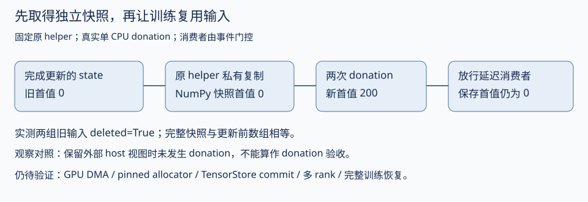

# Checkpoint内存：预算、写入分摊与训练停顿

上一章分清了保存交接与真正完成。这一章追问：为什么保存时host内存会升高，为什么同一份模型可能有少数rank成为写入瓶颈，以及减小staging预算会付出什么代价。结论来自固定源码和小型CPU检查，尚没有真实Hero写入计划、RSS或GPU切片测量。

## 1. Host byte budget控制的是在途快照，不是整个RSS

[HostByteBudget](https://github.com/marin-community/marin/blob/84869ae8c91ffe64e9f761c5bd714542eb1876e0/lib/levanter/src/levanter/utils/byte_budget.py)在一个event loop上累计in-flight bytes。非空时，新的请求若使总量超过limit，就等待释放；当前没有在途快照时，超出limit的单个请求允许独占进入，避免一个大请求永远无法开始。因此，这个limit是调度目标，不能当作绝对最大快照大小，更不能当作RSS硬上限。

原类直接在CPU asyncio中运行：limit=10时，6+6的第二个请求等待；释放后开始，peak为6。单个14字节请求在空预算下开始，peak为14，并阻塞后面的1字节请求。completion thread的release能唤醒等待任务；reserve中的异常也释放容量。这里的字节数是人工调度输入，没有分配14字节的模型快照，更没有测量RSS。

|量|源码中是什么|需要额外测量什么|
|---|---|---|
|`max_staged_host_bytes`|每个process的在途staging目标|实际配置、local process数量、超大请求|
|`gate.peak_bytes`|当前save在budget中累计的最大在途估算字节|各次stage是否按真实复制量计费，device slice结果|
|`_STAGED_BYTE_OVERHEAD=4`|日志估算host占用的乘数，源码说明仅用于reporting|实际copy/encode/cache/allocator占用；不能把4当已测出的恒定放大率|
|RSS|进程驻留内存，含训练基线、offloaded状态、快照、编码、缓存、allocator|当前RSS曲线、可达引用、allocator retained bytes和写入完成水位|

固定源码的默认target是32×512 MiB=16 GiB/process，cache pool soft limit为1 GiB，CPU copy concurrency为16。这些是代码声明，不代表已确认的Hero运行参数。四个local process若都用默认值，名义target合计64 GiB；源码的4倍日志估算对应256 GiB。这只是配置算术，不是节点实际峰值，也没有计入训练/offload基线；超大单请求和预算之外的内存还可能改变它。

## 2. 为什么预算小了，训练可能更慢

`issue_write`先acquire，再生成host snapshot。staging失败会release；正常路径将release挂到commit future的完成回调，无论成功或失败都释放。它不会仅因device-to-host复制结束就释放，因为TensorStore写入仍可能引用这份snapshot。

`asyncio.run(write_all())`需要把所有写入都安排完成才能返回。若一个process需要写的总量大于budget，后面的stage就要等前面的commit释放容量。所以“异步保存”仍可能在交接阶段等待一部分存储写入。减小budget可减少在途内存，但也可能延长训练暂停；增大budget则可能让保存更早交接，却提高与训练同时存活的host内存。[写入路径](https://github.com/marin-community/marin/blob/84869ae8c91ffe64e9f761c5bd714542eb1876e0/lib/levanter/src/levanter/tensorstore_serialization.py#L704)

此外，上轮manager任务若未完成，本轮数组serializer会先等待它；这个等待与本轮budget等待是两个阶段。诊断时分别记录previous-commit wait、stage wait、copy、local commit和global callback，不能把总save耗时全叫“拷贝慢”。

快照必须与训练之后可修改或donate的buffer分离。固定代码对pinned-host数组使用`np.array(..., copy=True)`；GPU路径转到pageable CPU array，再做私有NumPy快照，并删除临时JAX staging array。直接复用训练buffer看似节省一次copy，却需要证明写入完成前训练不会修改它。本轮只读这段代码，没有执行GPU DMA、真实buffer donation或切片。

## 3. 副本多，不代表所有副本都写一份

`plan_array_write`只依赖路径、全局shape、sharding与配置，让各process得到一致的计划。它统计同一shard index的副本数量，寻找可整除的轴，将每个shard拆给若干副本写。如果最大片段太小、没有合适整除轴、副本数不均匀或pinned-host切片不满足安全条件，则回到单writer。

|计划条件|原函数行为|工程含义|
|---|---|---|
|可安全整分，且每个writer片段达到minimum|按选中的副本数切分第一个可整除轴|分摊同一个逻辑shard，不复制成多份存储|
|小数组，或不能整分/安全切片|`crc32(path) % replica_count`选一个副本写整shard|小参数按路径分散，但不保证每个rank总字节绝对均衡|
|非JAX host array|process 0写，其他process不写|host叶子可能集中在process 0，需单独计数|
|writer数小于现有副本数|只让被选writer写对应区间|不能用总副本数平均估计每个rank的工作量|

原planning函数用人工sharding检查：shape=(8,4)，4副本，minimum人为设为1字节，得到四段[0,2)、[2,4)、[4,6)、[6,8)，完整且不重叠。这个fixture把四个副本都设为同一process可寻址，因此该process合计写128字节；没有把它冒充四台真实设备各写多少。使用默认minimum=16 MiB时，同样的小数组不切分，仅一个副本写。pinned-host一维向量也按源码安全条件回到单writer。

所以需要从实际state树生成按rank的write-plan直方图：总写入字节、最大的整shard、最大的snapshot、单writer/副本切分比例。仅看模型参数量或集群rank数，无法判断最忙rank是否超过预算。当前没有生成Hero真实计划，不能从这个fixture认定其writer不均衡已是生产瓶颈。

## 4. Chunk目标也有一个整分边界

`_capped_chunk_shape`先把轴长度至少设为1，再反复把最长的偶数轴减半，直到chunk达到目标或没有可减半轴。保持整分可让writer边界落在完整chunk上；代价是“max_chunk_bytes”的名字没有在所有shape下兑现为严格上界。

|人工输入，float32|配置目标|函数返回|实际chunk字节|
|---|---:|---|---:|
|(64,64)|1024|（16,16）|1024|
|(33,33)|1024|（33,33）|4356|

还有一个容易混淆的大小：chunk是存储对象的分块，而stage请求按整个writer region的字节量计费并生成快照；一个writer region可以含多个chunk。因此，减小`max_chunk_bytes`不会自动把host快照切成同样的小块，仍需查看实际writer region和stage请求大小。

第二项不是Hero实测，也没有使用默认512 MiB目标。它证明的是通用接口边界：全为奇数且无法继续整分时，函数会返回仍超目标的chunk。HostByteBudget又允许超大单请求独占进入，因此不能把这两个配置字段合起来当作绝对内存/单写入安全保证。

迁移到自己的模型时，应先报告实际plan里超过chunk目标或staging目标的条目。如果运行要求严格上界，可以选择发起写入前明确拒绝不满足约束的shape；若要支持部分边缘chunk，则需要重新证明副本writer不会共享同一chunk并验证最终覆盖。直接把奇数轴随意截小，可能破坏此前的writer边界契约。本轮没有给作者代码打补丁，也没有验证一种新的分块算法。

## 5. RSS没下降，要从引用与allocator两层查

生产早期保存后的writer RSS上涨，作者追到manager已等待future却仍保留引用；随后还讨论pinned BFC pool。它们分别涉及对象是否可回收和内存是否退还OS。[对应事故与纠正](ENGINEERING_GUIDE_ZH.md#1-保存后内存变高先区分内存还活着还是留在分配器)

固定序列化代码在所有local commit future结束后才调度heap trim；环境检测到jemalloc时跳过这条glibc trim路径。这个安排说明“commit未结束”与“已结束但allocator保留”要分开观察。trim不是清除活跃buffer引用的替代品；RSS曲线本身也不能证明future引用已经释放。

建议一次保存测量同时记录：每rank实际plan、budget peak、当前RSS、offloaded基线、commit future的数量/完成数、仍可达快照引用，以及保存交接/commit耗时。先用同一个state和固定写入后端比较budget档位，再选择满足内存余量的最快档位；不要在同一轮同时改副本切分、chunk、concurrency和allocator而把结果归给一个参数。

本轮17项检查包含原asyncio budget、配置默认值、原shape/replica规划与区域覆盖、整分失败边界；规划使用synthetic JAX类型与sharding，真实GPU/存储测量仍为空。[脚本](scripts/probe_checkpoint_memory.py) · [原值与作用范围](analysis/checkpoint_memory_probe.json)。它接续[保存提交管线](CHECKPOINT_COMMIT_ZH.md)，优先补实际writer布局和每rank内存证据，再决定是否调保存频率与budget。

## V106：保存快照怎样跨过下一次 buffer donation

把 V105 的共同快照问题带回 Hero 入口，先区分已有的保护。固定 main eee467… 的 GrugTrainState 包含 step、params、master_params、opt_state、ema_params 与 pending_qb_betas；主循环在 train_step 返回新 state 后，用 state 的完成更新数请求保存。train_step 的 JIT 明确声明 `donate_argnums=(0,)`，后续更新可以复用输入 state 的 buffer。已有状态时钟与恢复游标结论继续成立，本轮不把这些再算成新发现。

真正要问的是：保存交接返回后，写入者持有什么数据。原 `_transfer_shard_to_pageable_host` 对 host 分支使用 `np.array(..., copy=True)`；CPU 分支排队 host copy 后也生成私有 NumPy 数组；GPU 分支先转 pageable CPU，再生成私有 NumPy 数组，并删除中间 JAX staging array。后端可以长时间引用私有快照，而不依赖下一次训练可能 donate 的 buffer。这个复制是状态所有权边界，不能仅因看见额外 host 内存就删掉。[原 staging helper](sources/donation_snapshot_2026_10_07/lib/levanter/src/levanter/tensorstore_serialization.py)。

### 同步 staging 与异步 commit 分开

原 `_serialize_arrays` 的 `issue_write` 先取得 host byte budget，再 `await stage()`。它让 TensorStore 用 `can_reference_source_data_indefinitely=True` 写入复制后的数组；budget 到 commit future 完成才释放。`asyncio.run(write_all())` 返回后，已经遍历并 staging 该进程负责的 writes；之后才把 commit futures 加到 manager。这里的异步允许 commit 晚于交接，不是允许下一次训练先改原 buffer、再回来生成快照。

由于 budget 要到 commit 才释放，后续 shard 的 staging 可能等待前面的提交腾出预算。因此“异步保存”也不等于 on_step 恒定很快返回；其等待可发生在 snapshot 获取阶段。实际分片、写入速度、超大条目和 process 数仍决定内存/吞吐，不能由这段控制流直接给出 Hero 的延迟估计。

### 原单测名字与实际执行范围

上游 `test_pageable_checkpoint_staging_detaches_from_donated_jax_buffer` 创建真实 JAX CPU 数组并执行 helper，断言值相等且 `np.shares_memory` 为 False；测试体没有真正调用一次带 donation 的 JIT。这是有用的所有权断言，但不能把名字当作 GPU donation 或完整保存恢复的测试证据。[原测试](sources/donation_snapshot_2026_10_07/lib/levanter/tests/test_tensorstore_serialization.py)。

本轮补充控制使用原 helper AST 和原常量，执行真实 CPU JAX `donate_argnums=(0,)` 更新，以事件控制延迟消费者；没有导入完整 Levanter，也没有执行 TensorStore 写入。两组大小分别 8、4096。先 staging，消费者等待；随后真实 donation 更新两次，再放行消费者读取私有快照。另用明确的最小 `__array__` 适配器检查 host-memory 分支的复制，不把它叫真实 pinned allocator。

[逐项检查与版本](analysis/donation_snapshot_cpu.json) · [执行脚本](scripts/probe_donation_snapshot_cpu.py)。结果区分 JAX 输入实际是否 deleted、独立快照值与更新后状态值；没有真实 GPU DMA、多 rank、完整 GrugTrainState 或模型续训。CPU helper 通过也不足以确认 GPU 分支、所有 writer 入口或当时部署版本正确。

### 共同状态时刻与快照所有权不是同一个问题

V105 的人工跨库反例说明“各文件有效不代表同一状态切面”。这里保护的是“已经取到的快照，不被后续 donation 破坏”。两者都需要验收，但不能互相替代。完整训练还需证明：所有叶来自同一个已完成 state；异步消费者持有独立数据；完成标记在所有必需数组提交后发布；恢复模板没有漏掉 opt_state/master/pending 等字段；loader 从该 state 的时钟与历史 batch/mixture 声明继续。

优化保存内存之前，先测这些行为。减少 copy、延迟 staging、让训练提前继续，都可能改变所有权合同；没有 donation 后延迟读取与真实 restore 对照，就不能称为无损优化。当前 GPU/真实训练恢复证据仍缺，后续优先补这两项。

### 本地结果与一个会让测试失真的观察动作

JAX/jaxlib 0.11.1、NumPy 2.3.5 的单 CPU 环境中，10 项控制通过。两组实际 donation 的旧输入 `is_deleted()` 都为 True；两次更新后首值为 200，事件放行后的保存首值仍为 0，且完整数组相等。

首次实验保留 `np.asarray(x)` 视图来检查共享内存，结果旧输入没有 deleted，断言失败。最终脚本将它保留为独立对照：同一环境保留外部视图时输入未 deleted、更新值为 100；真正 donation 的两组在共享检查后释放视图，再执行更新。这个现象限定在本次 CPU/runtime，不推出所有平台都阻止 donation。它提醒测试者：观察 buffer 的方式也可能改变所有权。只写 `donate_argnums`、不检查实际失效，就可能误报测试覆盖。

这不是 Hero 配比优劣的新证据。它是解释恢复后 loss 变化的前置验收：先确认参数、优化器与游标对应同一保存状态，再比较固定域 loss。若恢复身份未确认，暂缓将跳变归因于数据顺序或配比。

## V129：异步manager与任务级失败

新增两份run artifact绑定的JAX依赖，执行原AsyncManager的10项控制。等待后列表/回调仍保留，列表替换释放旧受控payload；真实32字节TensorStore源数组却已回收，不能把受控Future结果当真实模型快照保留证明。未测RSS。[所有者、错误消费与真实后端边界](ASYNC_MANAGER_ZH.md)。
