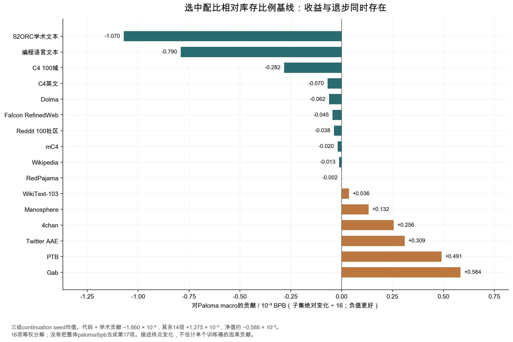
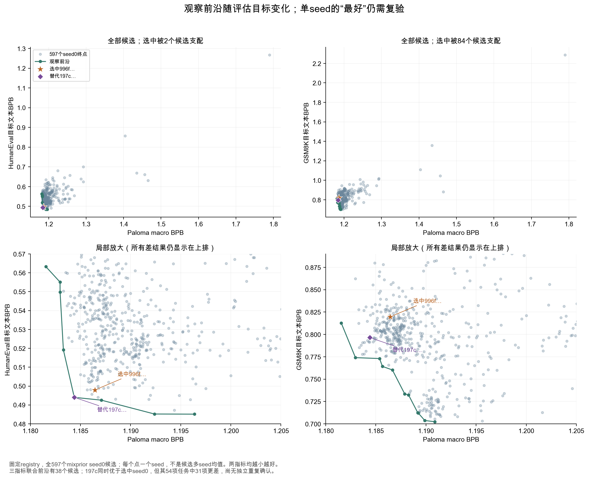

# 第四轮：这套配比值得学什么，哪些结论还不能照搬

我现在的判断是：**选中配比值得作为代码和学术文本方向的候选方案；公开实验不足以证明它是通用能力最优、数学能力安全、可以直接迁移到535B的配方。** 它相对旧配比的收益是真实的公开观测，但把简单的库存比例基线补上以后，收益的性质发生了变化：通用文本平均值的额外改善很小，代码和学术文本的改善更突出。

这也改变了我对“该怎样学这次预训练”的回答。最值得复制的是比较方法：把便宜但有竞争力的基线放进来，拆开平均值，核算每桶累计曝光，保留能力退步，并在更大规模上确认候选。200个权重可以作为实验起点，却不能替代这些步骤。

本章补查了4个原始W&B配置和6个恢复初期窗口，重新比较旧配比、库存比例基线和选中配比的三组continuation seed，并分析固定HF版本中全部597个seed0搜索候选。生产曲线仍沿用10月4日约05:38的归档；下面的BPB比较来自d512代理实验，不是535B正确率。BPB越小越好。

## 1. 补上简单基线，才知道搜索额外买到了什么

前三轮重点比较“旧Harrier配比”与最终选中的`996f489106c7b922`。这能回答新方案是否优于旧方案，却无法回答：需要复杂搜索才能得到多少收益？一个简单、可解释的方案是否已经很好？

这次把`proportional_baseline`的seed0、1、2补进来。它大体按各桶可用token库存分配抽样，带有很小的桶保底修正；因此各桶的名义重复曝光比较接近。它不是随机均匀分配200个桶，也不是按40个语义域平均分配。三组恢复后实验使用相同架构和记录预算，比较的是恢复后的方案；共同checkpoint之前的历史不应被当作各方案独立训练出的成绩。

| 固定评估，三seed均值 | 旧配比 | 库存比例基线 | 选中配比 | 选中相对比例基线 |
|---|---:|---:|---:|---:|
| Paloma macro BPB | 1.193383 | 1.186598 | 1.186012 | −0.0494% |
| 100种编程语言文本 BPB | 0.704489 | 0.691564 | 0.678921 | −1.8282% |
| HumanEval目标文本 BPB | 0.517601 | 0.537001 | 0.496723 | −7.5005% |
| GSM8K目标文本 BPB | 0.703881 | 0.768829 | 0.780208 | +1.4800% |

这里的HumanEval不是pass@1，GSM8K也不是答题准确率。它们衡量指定目标文本的概率。对这些文本预测得更好，是有价值的线索；是否能写出可执行程序、是否能算对最终答案，需要另做生成评估。

比例基线相对旧配比的macro改善，已经达到“旧→选中”观察差值的**92.05%**：

```text
(1.193382621 − 1.186597705)
÷ (1.193382621 − 1.186011950) = 92.05%
```

这是三个终点均值之间的算术关系。它不能解释成“92%的收益由库存分布造成”，也不能说明搜索没有用。旧配比到比例基线同时改了很多桶与阶段安排；没有因果分解实验。它的实际含义很具体：**如果只拿旧方案作参照，就容易把简单基线也能获得的改善，全部归给最后那套复杂权重。**

另一方面，比例基线的HumanEval BPB比旧配比更差，选中配比又把它明显拉回来。它在代码方面的额外价值不能被很小的macro差值抹掉。若训练目标明确偏向代码，这个差别足以让选中配比进入下一轮验证；若目标是平衡数学、代码和一般语言能力，就需要更谨慎地选择。

配置复核减少了一项不确定性：选中与比例基线三对run，以及下文的替代候选与选中seed0，在移除权重、运行标识、保存路径与恢复路径前缀后，其他记录配置相同；最终恢复fallback均指向同一个step393。六个窗口均从公开step393开始，连续记录到430，首个累计token数相同。终点macro也与registry一致。**这确认了记录中的可比性，尚未验证实际恢复的checkpoint内容、每次启动的代码SHA及token ID。** 不能把相同fallback路径等同于实际恢复文件已逐字节核对。

[均值与条件区间CSV](analysis/strong_baseline_comparison.csv) · [逐seed原值](analysis/strong_baseline_paired.csv) · [四组配置对照](analysis/strong_baseline_config_audit.csv)

## 2. 平均值在隐藏什么：代码、学术收益被其他文本退步抵消

Paloma macro由16个固定文本子集等权平均。整体`paloma/bpb`是另一个汇总口径，不能再作为第17个子集加进去。下面按实际16项重建macro，浮点误差小于2×10⁻⁷。

选中相对比例基线，16项中有10项均值改善、6项退步。最清楚的两项收益是编程语言文本和S2ORC学术文本，分别改善1.828%和1.774%。每项对macro的贡献是其绝对BPB变化除以16：

| 分解项 | 对macro BPB变化的贡献 |
|---|---:|
| 编程语言文本 | −0.000790201 |
| S2ORC学术文本 | −0.001070060 |
| 其余14项合计 | +0.001274522 |
| 16项净变化 | 约−0.000585739 |

前两项收益之和超过净收益，其他14项合计抵消了一部分改善。去掉代码这一项，剩余15项均值从1.219600变成1.219818，微幅变差0.0179%。这不意味着“所有非代码能力变差”：学术文本仍有改善，其他子集也有改善。它说明总体优势包含清楚的取舍。



因此我会把这套方案描述为**代码和学术文本收益较突出的配比**，并保留一般文本和数学的风险项。把它写成“全面提升”，会丢掉真正决定训练方向的信息。这个判断来自固定评估文本，尚不等同于代码推理、科研问答或数学解题能力的完整画像。

还有一个容易忽略的问题：等权macro本身已经表达了偏好。一个小子集与一个大子集可以得到相同的投票权；换成按token汇总的BPB，数值和收益幅度又不同。指标名称没有替团队作出产品决策。应先说明哪些任务必须保住，再决定哪些平均值可以用来搜索。

[完整16项贡献CSV](analysis/macro_contributions.csv)

## 3. 三seed告诉了什么，又没有告诉什么

选中相对比例基线的macro绝对差，三个seed依次为：

```text
seed0：−0.000030637
seed1：−0.000502825
seed2：−0.001223803
```

方向都向好，但幅度差得很大。三对均值为−0.000585755；在“配对差独立且近似正态”的假设下，常规t区间为[−0.002078449，+0.000906940]，跨过零。样本只有3对，候选又经过搜索选择；这个区间没有包含选择带来的乐观偏差。它应被看作敏感性检查，不能单独承担发布结论。

代码文本和HumanEval BPB相对比例基线在三对中都改善；GSM8K有两对退步、一对改善。相对旧配比，GSM8K则三对都退步。换了参照以后，陈述也必须跟着变：不能把“相对旧配比三seed数学退步”搬成“相对所有基线都三seed退步”。

这些seed是**共同恢复点之后的continuation标识**，并非三个独立随机初始化模型。数据顺序、随机数状态、优化路径可能参与差异；相同seed标签也不自动保证不同run逐token配对。记录配置中的`data_seed`没有单独固定值，本章没有重放这些随机流。

十个比例基线seed的macro标准差约0.000668，GSM8K BPB标准差约0.062685。这说明某些任务的seed波动很大，但不能把基线的标准差直接套成任何候选的置信区间。更好的确认方式是：把候选冻结，再使用未参与选择的重复实验和独立评估确认。

我对小幅macro优势的态度是：**有向好的迹象，还不足以把它当成稳定的额外通用收益；代码相关收益更一致，值得优先复验。** 后续若更多独立重复显示macro稳定改善，且能力保底通过，我会提高对它的信心。若收益只在参与搜索的评估文本上出现，就应重新检查选配比时的目标。

## 4. “最终选中”不等于在所有公开指标上最好

固定registry中的601条`mixprior_candidate`记录，有597条seed0、3条seed1和1条seed2。因此934条总观测不能理解成934次独立确认，也不能把每个候选都视为多seed均值。

我在597个seed0终点上做了一项简单检查：对于指定指标组合，一个方案是否存在另一个方案，在所有指标上都不差，且至少一项更好？这样的方案称为“被支配”；没有观察到支配者的方案位于该组合的观察前沿。这里比较的全部是BPB，越小越好。

| 只考虑这些指标 | 观察前沿上的候选数 | 支配选中seed0的候选数 |
|---|---:|---:|
| Paloma macro + HumanEval | 8 | 2 |
| Paloma macro + GSM8K | 11 | 84 |
| Paloma macro + HumanEval + GSM8K | 38 | 1 |

三指标同时比较时，替代候选是`197c9f5ceff6b9ee`：

| BPB，均为seed0 | 选中996f… | 替代197c… |
|---|---:|---:|
| Paloma macro | 1.186441 | 1.184385 |
| HumanEval | 0.497930 | 0.494022 |
| GSM8K | 0.819713 | 0.796459 |

这张表足以反驳“选中方案在这三项公开seed0指标上已经无可改善”。它不足以推荐197c直接上线。197c只公开了一个seed；同样查看54项任务，它有23项更好、31项更差。其中MedQA BPB恶化约10.36%，Belebele约1.81%，Include约1.57%，而MMLU-Pro改善约6.62%。语言汇总与组成项有重叠，23/31不是独立任务的多数投票。



这也不能据此断言作者选错了。完整选择目标、代理预测模型、约束和实际决策过程没有恢复；作者可能考虑了本章未纳入的条件，但我们不能替未知条件编理由。公开材料能支持的说法是：**“最佳”依赖指标、约束与重复验证，最终选中的哈希本身不是最优性的证明。**

对自己的实验，这个检查很实用。与其只列第一名，不如保存一小组取舍不同的候选：通用文本较好、代码较好、数学较稳、曝光更均衡。再花确认预算决定使用哪一个。看到一个单次结果在三指标上同时更好，也应把它作为待确认候选，而不是把观察前沿当成部署名单。

[597候选、三种指标组合CSV](analysis/observed_pareto_frontiers.csv) · [197c对全部指标的反例表](analysis/candidate_197c_counterexample.csv)

## 5. 小模型告诉你方向的可能性，大模型负责确认方向是否成立

第十一轮新增核对改变了这一节的比较边界：旧、新ladder在25%切换前的初始权重半L1差已约20.39%；代码CE/BPB在两个较小ladder上方向冲突。公开评估代码存在可复算的分批敏感机制，但尚未确认它就是历史run的执行版本或冲突根因。下面的方向表仍成立，应读成完整训练方案的观察比较。[新配置、评估反例与确认设计](SCALE_TRANSFER_ZH.md)给出逐项依据。

选中相对旧配比，在代码文本上的观察变化如下。这里先保持“相对旧配比”的参照，避免与上文“相对比例基线”的比较混在一起。

| 实验 | 编程语言文本BPB变化 |
|---|---:|
| d512代理，三seed均值 | −3.6293% |
| d768 ladder | +0.2775% |
| d1024 ladder | +0.0621% |
| d1536 ladder | −0.4630% |

更大ladder的macro已有改善记录，但代码收益的方向和幅度并不一致。**这不是控制变量充分的“规模导致收益逆转”实验。** 代理在约10%恢复点切换，ladder在约25%切换；部分系统与优化条件也有差异。它能证明的，是小模型的代码收益幅度不能保证原样迁移；它不能定位变化来自模型容量、切换时机、系统条件还是其他因素。

更关键的是：公开的大ladder没有在这里补上对应的比例基线。所以上文“92.05%的macro差值已由简单基线取得”只适用于这组d512终点，不能写成535B结论。

RegMix论文说明了为什么代理搜索仍然值得做：先用小模型学习配比与固定评估Loss的关系，再验证跨规模的排序相关性。论文在自己的数据、模型和评估目标上验证了这种办法。它并未保证任意数据、MoE架构或任意能力目标都可继承相同相关性。Marin需要自己的跨规模验证；代理搜索是在减少需要放大的候选数。[RegMix原论文](https://arxiv.org/html/2407.01492v2)

我会把有限预算分成“广泛筛候选”和“独立确认”两部分，并在实验前写清各自上限。确认预算至少要包含简单基线、最终候选和能力风险对照。是否值得多训一个更大模型，取决于剩余不确定性：如果math guardrail还未确认，就优先补数学评估；如果小模型收益明显但跨规模方向不稳，就优先做更大代理。继续堆seed0候选往往无法消除这两类疑问。

[冻结ladder终点复算](analysis/proxy_scale_effects.csv) · [原始配比研究记录](https://github.com/marin-community/marin/issues/9126)

## 6. 关于质量、配比与顺序，我现在更相信哪些解释

### 6.1 Q档提供质量线索，训练价值还取决于缺了什么

“高Q更多”是一个容易理解、却不完整的策略。第三轮的单seed代理里，只用Q4相对比例基线，macro反而恶化约9.24%。这不是说Q4没有用：单档方案同时拿掉了其他档的题材和表达，把有限预算集中到一部分库存，又改变重复曝光。实验检验的是这整套方案。

第四轮多了一项交叉证据：比例基线恢复后名义Q4占比约19.27%，选中方案约23.99%，旧方案约23.68%。Q4较少的比例基线已经取得大部分观察macro改善。因此不能仅凭Q4占比解释新旧方案的全部差异。

我的机制判断是：质量过滤可以减少坏文本，但如果过滤同时移除了有用的长尾覆盖，或者使某一类小库存被反复抽样，就可能抵消收益。这里的“可能”需要通过桶内内容、去重后的库存、held-out评估和曝光响应确认，不能仅靠标签。对自己的数据，至少要把以下四件事拆开记录：来源与题材、质量分数、有效独立库存、累计抽样量。缺少其中任何一项，单看比例都容易误判。

### 6.2 数学份额降低与数学BPB变差相关，但还没定位到纯效应

按registry的13.125T+3.75T名义恢复后预算，数学域c39平均权重从旧方案5.35%，降到比例基线2.08%，再降到选中方案1.70%。GSM8K三seed均值沿这个顺序变差。这是一条值得认真处理的线索。

但它不是三点拟合出来的因果曲线。三套方案其他199桶及阶段权重也有变化；c39包含的数学文本不等于GSM8K要求的完整推理训练信号。第三轮增加数学Q4的4x/6x/8x标签实验，GSM8K BPB也没有随曝光单调改善。因此“把数学加回某个固定百分比就一定修好”没有证据。

我会优先做一个有针对性的反事实：从选中方案出发，增加一小段数学曝光，明确从哪个供体域移出同样预算，保留该供体保底，其余安排不变。分别测试数学Q档内部扩充和数学来源覆盖扩充。若只有一种方式有效，就能进一步判断是总量不足、样本覆盖不足，还是重复同一库存的边际收益太低。评估同时看GSM8K目标文本BPB、实际解题正确率和代码退步，不把数学恢复当成没有成本的修补。

### 6.3 删域实验测的是“删除再分配”，应据此做局部交换

第三轮80个删域结果已经说明：删掉同一个域，用不同方式分配空出来的预算，结果可能不同。数学域删除的两个参照就显示了macro与GSM8K方向不一致。它们更适合回答“以某种替代策略减少这一域是否值得”，而不是给语义域贴上“有用/无用”的永久标签。

精心调配比时，操作单位应写成**从A移出多少token，给B增加多少token，在什么历史曝光下做，何时发生**。例如“数学增加”必须同时写出供体、Q档、计划轮数和保底。把局部交换结果累积起来，比一次大幅修改许多域更容易解释，也更容易复验。

### 6.4 顺序可能有作用，先排除“总量其实不同”

第三轮顺序配置用了2726/810的补偿比例，但公开历史对应2727/810的更新预算；registry名义13.125T/3.75T又是另一种模拟口径。同一对顺序方案，在前两种口径下累计曝光分别近乎相同和相差20,971.52 token，在registry口径下则相差2.523B。数字不一致的来源是预算定义，不是模型神秘地记住了不同顺序。

因此我目前不支持“数学统一后置”或“高质量统一后置”这样的通用处方。应先选定总训练预算、共同历史和每桶累计量，构造两种顺序，使总量一致；再逐块核对整数计数和checkpoint后的cursor。连续权重补偿只是第一步。真正的token顺序还包含桶内shuffle、文档packing和可能的重复/遗漏。

如果匹配累计量以后，末期增加某类数据确实改善该类能力，也还要观察其他任务及后续训练是否遗忘。一个末期评估点不能单独说明“先学通用再学专门”在整个训练期间最有效。

## 7. 如果是我自己的预训练，下一轮会怎样做

我会先把训练目标写成具体的选择标准。例如目标是代码助手，就可以把代码生成正确率和执行测试作为主指标，数学和语言覆盖作为退步限制；如果目标是通用模型，就要给数学、多语言和一般文本留下明确的最低要求。容忍多大退步由实际用途和评估重复性决定，不能看完结果再改。

然后做一轮范围有限、能回答问题的比较。下面是我建议的实验，不是已执行结果，也不包含所谓最优百分比。

| 要回答的问题 | 对照怎样设置 | 什么结果会改变决策 |
|---|---|---|
| 搜索比简单方案多买到什么？ | 旧配比、库存比例、选中配比；同checkpoint、预算、评估，至少3个预先规定的continuation重复 | 选中在实际主任务稳定更好，且guardrail通过，才进入更大规模 |
| 数学风险能否修复？ | 增加第4个“选中+数学局部交换”方案；供体与总量写清，累计曝光受库存上限约束 | 数学生成正确率恢复且代码损失可接受，保留修复候选；仅训练CE下降不算成功 |
| 收益是否来自参与选配比的评估？ | 搜索评估与确认评估分开；冻结候选后使用未参与选择的题目和重复 | 只在搜索指标上改善，就重新检查目标及评估泄漏 |
| 顺序是否值得复杂化？ | 对同一通过确认的累计配比做早高/晚高两种顺序，每桶总量及完整混合块计数匹配 | 末期及中间评估均显示一致优势，能力退步受控，才改生产顺序 |
| 小模型方向是否迁移？ | 更大代理仍保留比例基线、候选与关键风险对照 | 收益方向复现且幅度超过重复波动，才把候选送入大模型 |

前两项可以合成4套配比×3个continuation重复，共12次。这是一个便于起步的设计，不是统计充分性保证；如果任务波动很大，需要增加重复、扩大评估或缩小所宣称的效果。不要把12次跑完本身当成“配比已经确定”。顺序实验等累计配比选定后再做，避免配比总量和时序同时改变。

每个方案在训练前做容量检查。后续预算为B，桶i库存为Nᵢ，已有抽样量Hᵢ，允许累计曝光上限Eᵢ，则静态权重上界为：

```text
wᵢ ≤ (Eᵢ Nᵢ − Hᵢ) / B
```

若剩余容量为负，需要先处理已经超过目标的桶，而不是继续给它分配正权重。保底与容量上限冲突，或者全部剩余容量不足以容纳预算，当前计划就不可行。工具里的上限是用户制定的约束；本报告没有测出Marin每个桶的最佳重复次数。

我会同时保留两个预算口径。固定token预算回答“数据方案提高了多少学习效率”；固定训练时间回答“系统加速后，最终能达到什么质量”。如果一种kernel更快，只按固定token比较会漏掉它多训练的价值；如果EP策略改变了drop，只按墙钟比较又容易混入训练目标变化。两种预算可以并列，但需要各自的基线。

### 7.1 用边际交换回答“下一批token给谁”

对已选定的工作点，下一次调整可以用有限差分衡量：从供体A转移ΔT给接收域B，固定其他条件，观察确认集目标变化和guardrail变化，再除以ΔT。这个量描述的是**该历史、该预算、该供体下的一次交换**；换供体或换训练阶段，都要重新测。

数学桶自身验证Loss很高，不一定意味着应该加量。它可能包含更难文本，也可能是模型预测能力不足、样本有噪声或重复库存已接近收益平台。更有决策价值的是：增加它以后，独立数学评估是否改善；损失的通用/代码预算是否值得。桶自身Loss可用来定位问题，最终分配要看目标能力的响应。

若试了两档小增量，数学正确率没有提高，先检查来源、样本覆盖、污染和难度，不继续机械加倍。若数学改善但代码退步，则回到供体选择和任务权重。如果高Q扩充无效、扩大数学来源覆盖有效，就把下一轮预算用于覆盖，而不是提高Q4重复轮数。这些都是可被下一轮实验推翻的判断。

### 7.2 什么时候停止搜索

我会在开始时规定：候选冻结条件、确认预算、能力退步阈值和最大曝光约束。若新增候选的收益小于确认波动，而候选在独立评估没有稳定优势，就停止继续搜索seed0微小差值，把预算放到复验或数据审计。若取舍由目标决定，保留多个版本也是合理结果，不必强行找一个所有任务都第一的配方。

## 8. 工程问题给数据研究补上的一课

读完训练事故以后，我最重视的是：**一个可以复现的数据方案，必须同时描述权重、实际计数、样本位置、路由策略和评估路径。** JSON里的200个浮点数只覆盖其中一部分。

小桶的正权重可能在整块计数后变成零，余数又会集中到一个桶。序列长度或混合块大小变化，会改变累计样本位置；旧cursor在新设置下重算，可能前进也可能后退。EP策略改变token drop时，训练CE的有效目标也随之变化。若最后用dropless评估，就应明确训练和验证走的是不同路径。

这些机制解释了为什么同样叫“loss改善”，实际含义可以差很多：配比切换改变训练批次分布；EP改变丢弃；kernel改变速度；固定验证才比较同一评估对象。前三轮保留的200步窗口和完整块计算，是为了把这几件事分别核对。它们没有替代GPU复现，也没有把游标差解释成已经证明的重复token。

对自己的训练，我会把配比配置与这些运行信息一起归档：来源版本和有效库存；共同历史与实际恢复点；阶段边界的真实token预算；每块整数计数；数据顺序状态；EP容量/drop；固定评估的路由口径。以后看到曲线跳变，先定位是哪一层发生变化，再讨论质量和能力。

## 9. 最后我会怎样评价这次训练

这次公开记录的价值很高：它让我们看到一次大规模预训练如何在数据、MoE路由、kernel、checkpoint和基础设施之间不断处理取舍。它不是一份已经完成且所有决定都被因果验证的标准答案。18T尚未结束；未来cooldown、长上下文和最终生成能力还不能由当前快照代填。

对配比，我会留下三个明确判断：

1. **库存比例基线应该进入自己的实验。** 在这组d512实验里，它已达到接近选中方案的通用文本macro表现，成本低、曝光含义清楚。它仍有代码与数学短板，也不是天然最优。
2. **选中方案更值得按代码和学术方向继续验证。** 相对比例基线，代码相关BPB收益更一致；小幅macro额外优势和数学安全性还缺少确认。535B是否如此，需要生产级固定评估和生成结果。
3. **精心调配比，是管理替代关系、库存曝光和确认预算。** 每次增加都占用了其他数据的预算，每次后置都要核算总量，每个被搜索出来的微小优势都应接受独立复验。

我不会从这次研究给出“数学应占X%、Q4应占Y%”的确定处方。现有证据更适合帮助你建立一套能够发现并修正错误的实验过程。等自己的库存、目标任务、已有曝光和预算明确以后，才有依据缩小比例范围。

## 10. 本章的证据边界与可复算入口

全部计算读取固定HF revision `75c25718e2a7cf7a3b1b498b00479351f80345e0`的registry，原始Parquet已在第二轮归档。第四轮新W&B材料位于`sources/findings_2026_10_04/`，没有覆盖旧训练历史。[完整计算摘要](analysis/findings_audit.json)保留三组均值、16项贡献、seed分布、观察前沿、配置差与恢复窗口。

跨规模对照使用第一版归档的原始point-speedup CSV；论文方法仅用于解释代理搜索的适用边界。本章的比例基线分解、观察前沿和候选反例是本地重新计算，并非作者对选择过程的自述。没有恢复完整selector目标、代理模型和隐含约束，不能推断作者为何最终没有选择197c。

以下仍未执行：新的模型训练、535B生成评估、197c的独立重复、数学修复实验、严格token ID匹配的顺序重放。本章所有建议实验都与公开已完成实验分开陈述。

<!-- GENERATED_FINDINGS_TABLES -->
## 附录：54项任务相对比例基线的逐seed结果

全部为BPB。每个Δ按同seed的比例基线为分母，均值列使用三seed均值之比。语言平均与组成项不能当成独立的54次投票。

| 指标 | 比例基线均值 | 选中配比均值 | 均值Δ | seed0 | seed1 | seed2 |
|---|---:|---:|---:|---:|---:|---:|
| arc_challenge_0shot | 1.543586 | 1.532854 | -0.695% | -1.199% | -1.538% | +0.630% |
| belebele_arabic | 2.209108 | 2.337673 | +5.820% | +6.042% | +10.638% | +0.693% |
| belebele_bengali | 2.328206 | 2.162132 | -7.133% | -18.024% | -3.972% | +3.370% |
| belebele_chinese_simplified | 2.206566 | 2.288092 | +3.695% | -1.586% | +11.420% | +1.949% |
| belebele_french | 2.128225 | 2.211483 | +3.912% | -1.931% | +11.467% | +2.190% |
| belebele_german | 2.143242 | 2.331335 | +8.776% | +0.993% | +26.807% | -1.281% |
| belebele_hebrew | 2.258745 | 2.183095 | -3.349% | -12.901% | +3.387% | +0.787% |
| belebele_hindi | 2.231218 | 2.289793 | +2.625% | +1.343% | +1.249% | +5.556% |
| belebele_indonesian | 2.099811 | 2.210955 | +5.293% | +0.595% | +14.884% | +0.246% |
| belebele_japanese | 2.149490 | 2.503730 | +16.480% | +25.657% | +6.426% | +16.701% |
| belebele_korean | 2.095745 | 2.317418 | +10.577% | +9.578% | +17.146% | +5.001% |
| belebele_mean | 2.196307 | 2.279940 | +3.808% | +0.383% | +7.985% | +3.141% |
| belebele_portuguese | 2.143321 | 2.168189 | +1.160% | +2.156% | +0.666% | +0.647% |
| belebele_russian | 2.134076 | 2.188933 | +2.571% | -1.874% | +8.830% | +0.853% |
| belebele_spanish | 2.138086 | 2.180415 | +1.980% | -1.609% | +5.972% | +1.482% |
| belebele_swahili | 2.200429 | 2.274700 | +3.375% | +0.648% | +8.509% | +0.593% |
| belebele_thai | 2.161378 | 2.205541 | +2.043% | +0.804% | +2.099% | +3.332% |
| belebele_turkish | 2.230481 | 2.494661 | +11.844% | +12.765% | +7.184% | +15.603% |
| belebele_vietnamese | 2.268757 | 2.309530 | +1.797% | -5.256% | +15.033% | -3.584% |
| belebele_yoruba | 2.406638 | 2.381243 | -1.055% | -4.780% | -0.648% | +2.438% |
| boolq_0shot | 2.508777 | 2.790609 | +11.234% | -10.202% | +9.525% | +37.344% |
| copa_0shot | 1.797652 | 1.816864 | +1.069% | -0.274% | +2.713% | +0.771% |
| csqa_0shot | 3.802961 | 3.454227 | -9.170% | -16.502% | +0.804% | -11.230% |
| gpqa_0shot | 3.137258 | 2.550840 | -18.692% | +12.976% | -0.144% | -52.046% |
| hellaswag_0shot | 0.959776 | 0.962227 | +0.255% | +0.017% | +0.216% | +0.533% |
| include_arabic | 2.054557 | 2.056948 | +0.116% | -3.760% | +2.992% | +1.282% |
| include_bengali | 2.095822 | 2.097406 | +0.076% | +1.086% | -1.733% | +0.842% |
| include_chinese | 2.064450 | 2.067323 | +0.139% | -0.409% | +0.687% | +0.142% |
| include_french | 2.093369 | 2.073420 | -0.953% | -0.255% | -3.796% | +1.266% |
| include_german | 2.038538 | 2.015680 | -1.121% | +1.955% | -3.403% | -1.822% |
| include_hebrew | 2.108359 | 2.086287 | -1.047% | -2.837% | -3.066% | +2.862% |
| include_hindi | 2.135322 | 2.112698 | -1.059% | -1.938% | -2.633% | +1.458% |
| include_indonesian | 2.092305 | 2.076693 | -0.746% | -2.226% | -2.055% | +2.075% |
| include_japanese | 2.111966 | 2.108272 | -0.175% | +2.151% | -0.485% | -2.116% |
| include_korean | 2.079712 | 2.103353 | +1.137% | -2.234% | +1.047% | +4.673% |
| include_mean | 2.091179 | 2.081300 | -0.472% | -0.766% | -1.450% | +0.804% |
| include_portuguese | 2.136700 | 2.115303 | -1.001% | -2.681% | -3.979% | +3.726% |
| include_russian | 2.077011 | 2.056128 | -1.005% | -0.227% | -1.793% | -0.981% |
| include_spanish | 2.087009 | 2.077784 | -0.442% | +0.038% | -1.997% | +0.662% |
| include_turkish | 2.082224 | 2.084645 | +0.116% | +0.540% | -0.100% | -0.086% |
| include_vietnamese | 2.110341 | 2.087555 | -1.080% | -0.366% | -1.050% | -1.812% |
| lambada_0shot | 0.860793 | 0.862382 | +0.185% | +1.080% | -0.515% | -0.007% |
| lb_bbh_3shot | 1.702468 | 1.815566 | +6.643% | +6.979% | +11.967% | +1.534% |
| logprob_gsm8k_5shot | 0.768829 | 0.780208 | +1.480% | +4.675% | -0.845% | +0.496% |
| logprob_humaneval_10shot | 0.537001 | 0.496723 | -7.501% | -7.180% | -9.264% | -6.040% |
| medmcqa_0shot | 2.698498 | 2.813764 | +4.271% | +26.991% | +16.683% | -23.511% |
| medqa_0shot | 3.043754 | 3.334277 | +9.545% | +10.872% | +37.925% | -21.342% |
| mmlu_pro_5shot | 4.242032 | 3.974465 | -6.308% | -15.074% | -3.413% | +1.475% |
| musr_0shot | 0.764458 | 0.787177 | +2.972% | -6.308% | +0.331% | +15.099% |
| openbookqa_0shot | 1.967835 | 1.966359 | -0.075% | -0.287% | +0.620% | -0.561% |
| piqa_0shot | 1.281178 | 1.290504 | +0.728% | +0.624% | +0.459% | +1.101% |
| sciq_0shot | 1.562206 | 1.639693 | +4.960% | +9.930% | -0.452% | +5.692% |
| truthfulqa_mc1_0shot | 0.769885 | 0.768158 | -0.224% | +1.004% | -0.987% | -0.672% |
| winogrande_0shot | 0.447056 | 0.449790 | +0.611% | +0.823% | +0.436% | +0.576% |

[全部固定文本与任务均值CSV](analysis/strong_baseline_comparison.csv) · [逐seed原值CSV](analysis/strong_baseline_paired.csv)
