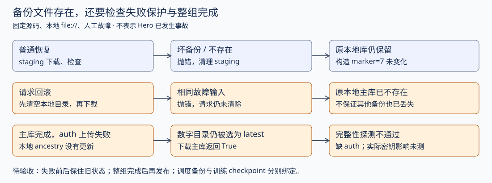

# 控制器的备份与恢复：正常路径通过，失败路径还要单独验收

这轮继续检查 Iris 控制器状态的持久化。对象仍是固定 main `eee467718515b2383fc3a433014afce4ab075b05`。**51 项原上游用例通过；另执行 12 项故障控制。** 故障控制显示，请求回滚与普通恢复的状态保护不同；主库单独上传后形成的目录，也可能被恢复流程当成最新备份。本章分析这些源码行为，没有把它们写成 Hero 已发生的事故。

这里的 controller checkpoint 保存作业、task、attempt、worker 等调度状态，并包含 auth 数据库。它不是模型参数、optimizer 和数据游标的训练 checkpoint。前一层恢复成功，不能替后一层作保证。

## 正常恢复具体验证到了哪一层

|原上游测试场景|本地执行得到的断言|仍没有覆盖的部分|
|---|---|---|
|应用失败一次后，关闭并重建控制器，继续同一任务|attempt 历史不变；作业最后成功；记录的 launch 只有 attempt 0、1，没有重复启动|真实 worker 是否重复运行、强制杀进程时的中断位置|
|控制器备份之后又提交新作业，再恢复该备份|备份中的作业保留，后来的作业查询为 not found|训练参数是否同时回到对应 step|
|活跃 task 恢复后，构造运行时丢失，再完成新 attempt|历史为 WORKER_FAILED、SUCCEEDED，作业成功|真实 GPU collective、checkpoint 加载与首个训练更新|
|备份过程中按批插入真实 SQLite 提交|源库继续变化；备份仍读到固定的 original 值，65 行完整，integrity_check=ok，无 WAL/SHM sidecar|远端对象传输和存储故障|
|重复打开已迁移数据库|schema 与迁移记录不变；不重复执行已登记 delta|未覆盖的历史 schema 与全部生产迁移数据|
|恢复旧数据库与 endpoint projection|只在备份之后新增的 endpoint 消失；旧 endpoint 重新加载|真实网络连接与 coordinator 重新联通|
|控制器重开后原 coordinator endpoint，再失败并注册替代地址|旧 endpoint 在重开后保留，随后转为新 attempt 的地址|真实 JAX rendezvous 是否完成|

这些测试使用上游原代码。journey 构造真实 Controller、数据库和本地日志栈，用手动时钟与 ScriptedTaskBackend 替代外部执行。`restart()` 是正常 stop 后重建对象；没有模拟 SIGKILL、电源故障或进程在文件替换中间消失。两批分别 49、2 项通过；第一批明确未选择两个周期 checkpoint/请求入口测试，保留默认安全 marker 排除。不是完整 Iris 测试集。[逐用例与原命令](analysis/controller_restore_native_tests.json) · [原 restart 测试](https://github.com/marin-community/marin/blob/eee467718515b2383fc3a433014afce4ab075b05/lib/iris/tests/journeys/test_restart.py)

## 为什么不能直接拷贝运行中的数据库

SQLite 使用 WAL 时，最新提交可能还在旁边的 WAL 文件中。主文件存在不表示包含全部提交；把它单独压缩上传，还可能丢失必要内容。当前 `ControllerDB.backup_to` 使用 SQLite backup API，先以实际读取固定 snapshot，再分批复制，让写线程继续提交；备份文件转为 DELETE journal mode，使文件不依赖 WAL/SHM sidecar。

上游并发测试没有用假 backup 返回值：它在 SQLite backup 的 progress 回调里插入真实提交，核对源与备份确实分离。这个检查比“备份文件大小非零”强，但测试数据是构造的 key/value 表，并非完整生产作业历史。[原 DB 实现](https://github.com/marin-community/marin/blob/eee467718515b2383fc3a433014afce4ab075b05/lib/iris/src/iris/cluster/controller/db.py) · [并发备份测试](sources/controller_restore_2026_10_07/lib/iris/tests/cluster/controller/test_db.py)

## 故障控制一：两条入口没有同样的状态保护

在临时目录中创建健康本地数据库，写入构造 marker=7，然后给远端设置坏 SQLite 文件或不存在的 checkpoint。调用原 `prepare_controller_state`；没有更改其函数体，也没有触碰用户数据库或运行中的集群。

|人工故障|普通显式恢复|请求回滚入口|能确认的行为|
|---|---|---|---|
|目标主库不是 SQLite|抛 DatabaseError，原两份文件 SHA256 不变，marker=7 保留|抛同类错误，原本地主库已不存在，rollout 仍 rollback_requested|回滚前的清空破坏了下载层提供的保护|
|目标 checkpoint 不存在|抛 ValueError，原两份文件 SHA256 不变|抛 ValueError，原本地主库已不存在，rollout 请求未清除|失败不会自动回到原本地状态|

普通下载在 staging 目录完成解压与检查，成功后才替换本地目录；失败会清理 staging。请求回滚 `_apply_requested_rollback` 却先 `rmtree(db_dir)`，再调用下载。于是，下载层即使按设计保留调用前的本地目录，也已没有旧数据库可保留。这是两层函数合同组合后的缺口。

测试确认的是文件和 marker 的结果，不是生产不可恢复数据损失。旧远端备份、被隔离的数据库或其他副本可能仍可救回；这轮没有取得它们。正常目录替换也不能被描述为覆盖任意中断点的事务：两个 rename 之间进程被杀的情形尚未测试。[原回滚入口](https://github.com/marin-community/marin/blob/eee467718515b2383fc3a433014afce4ab075b05/lib/iris/src/iris/cluster/controller/main.py)

## 故障控制二：“最新目录”不保证两份数据库都发布完成

保留原 SQLite 备份、zstd 压缩与本地 file:// 写入，仅让复制 auth 文件的调用抛人工 OSError。主库上传已完成，第二份文件失败。

|按原函数执行的阶段|实际观察|问题所在|
|---|---|---|
|写 checkpoint，第二份上传失败|函数抛错，本地 ancestry marker 没有更新|这项保护正确；不会把失败上传记为本地已发布祖先|
|查询 latest_checkpoint_epoch_ms|仍返回只含主库的那个时间戳目录|目录排序不包含整组文件已完成的证明|
|下载该 latest 到原健康目录|返回 True，marker 从 7 变为备份的 3，auth 文件不存在|True 的合同只证明有可用主库，不证明数据库对完整|
|立即调用 probe_database_dir|healthy=False，detail 为 auth.sqlite3 is missing|下载返回值与完整性探测的要求不一致|
|走启动 prepare，再构造 ControllerDB|prepare 未报错；构造后 auth 文件被创建，probe 转 healthy=True|文件结构重新健康，不证明原 auth 内容已恢复|

没有模拟凭据、旧签名密钥或真实登录流程；因此实际 auth key 丢失仍未知。也没有用 gcloud/GCS 路径验证传输。在当前完整函数的本地文件分支，部分发布可被选中、单主库恢复返回成功，这是已执行的结果，而不是仅凭代码推测。

源码的 `upload_checkpoint` 顺序上传主库、auth，全部成功后才写本地 ancestry；latest 通过数字目录寻找候选，下载对存在的文件做检查。它没有在本轮路径上要求 auth 必须存在，再返回整组恢复成功。源码里的健康探测却要求两份数据库均存在。评审时应按调用链检查，不能只分别看到“上传失败会抛错”“下载有 quick_check”，就推断端到端保证完整。[原 checkpoint 实现](https://github.com/marin-community/marin/blob/eee467718515b2383fc3a433014afce4ab075b05/lib/iris/src/iris/cluster/controller/checkpoint.py)

## 怎样修，怎样证明修好了

以下是待实施建议，没有改上游源码或部署。回滚应在有效备份已下载并验证后再替换原目录；失败前后比对原主库、auth 与关键记录，证明原状态仍可用。不能只检查“异常被正确抛出”。

发布应给一组备份明确完成条件：列出文件、校验和、格式版本与身份，全部上传后最后写完成记录；latest 仅从完成的候选选。恢复先校验组完整，再替换。要明确旧格式缺 auth 是否允许；若允许，必须作为可见的兼容或初始化决定，不能由“文件不存在就创建”悄悄替代恢复结果。

至少沿用本章坏主库、缺失目标、第二份上传失败这三个反例，还应补损坏 auth、传输中断、替换时中断、校验失败、最新候选不完整而旧候选完整的场景。选择旧候选是回退策略，需明确记录选中身份和丢失区间；不能静默制造看似连续的训练进度。

## 对预训练与数据配比的影响

控制器退回旧备份，可能让备份之后的提交记录消失，或让调度视图与仍在运行的外部任务不一致。本章原 journey 证明了“后写入的作业记录会消失”；它没有证明真实外部任务被取消或出现重复训练。要向下检查任务身份、launch 历史与 worker 观察，再连接训练 checkpoint 和数据游标。

训练与控制器使用两套备份身份，比较 loss 前应记录实际 controller 祖先、job/task/attempt、新训练恢复点、完成 token/update 和评估身份。这里的时间戳是调度备份身份，不是模型训练 step。若配比变更的提交或调度状态被回退，不能只凭当前配置解释恢复前后的曲线。是否真的发生这种混杂，需要真实执行记录。

**本章的结论是两个已复现的恢复合同缺口，和一组应补的验收条件。** 不是新的 Hero 事故数量，也不是修复已上线的报告。[12 项故障控制](analysis/controller_restore_faults.json) · [完整执行脚本](scripts/probe_controller_restore_faults.py) · [源码获取记录](analysis/controller_restore_acquisition.json)。

## V104：把修复建议变成可复查的候选

在研究仓库内生成完整原模块的候选副本，并执行 **22 项本地控制**。没有改上游 checkout。候选不再提前清空回滚目录；成功恢复后才将请求记为 ROLLED_BACK，第二次启动保留恢复之后的新本地写入，不再次回退。坏/缺失目标都保住原主库与 auth 的 SHA256。

发布协议增加最后写入的 `checkpoint.complete.json`。这份记录包含格式、epoch、主库和 auth 压缩文件的尺寸/摘要。第二份文件或完成记录上传失败时，不推进本地 ancestry；寻找 latest 时跳过未完成目录，已有完整旧候选仍能被选中。有目录却全无完成记录时明确报错，不能当成从未保存过状态。下载验证记录身份、整组文件和摘要，再执行 SQLite 检查；相同 epoch 再发布会被拒绝覆盖已有目录。

控制中既有缺 auth、错摘要，也有“摘要正确但主库或 auth 不是 SQLite”的反例。后者防止把摘要校验当成数据库有效性。完整配对 roundtrip、成功回滚只消费一次也得到检查，避免修失败路径时破坏正常恢复。[候选与逐项说明](candidates/controller_recovery/README_ZH.md) · [原代码到候选的补丁](candidates/controller_recovery/proposal.patch) · [22 项结果](analysis/controller_recovery_candidate_controls.json)。

**候选仍不宜部署。** 它明确拒绝旧格式，而旧格式迁移尚未实现；原 Controller.begin_checkpoint 等生产写入调用链也未接入候选。若只替换启动入口，旧写入者还会生成无完成记录的备份，形成新的恢复阻断。原生用例的 51 项通过属于原版本，不能移作候选的通过数。还须补同时发布、强制杀进程、云端传输及两个数据库共同快照的验收。

实时 main 已变为 `bb208b5ed52cd82c4e5f0213af8e0c52df7d5e96`，提交题为运行时依赖更新；checkpoint.py 与 main.py 完整下载后，同归档 eee467… 字节一致。本轮候选执行仍使用 eee467… 的冻结环境，不证明新依赖运行结果，也不证明实际部署版本。[当前源码绑定](analysis/controller_candidate_refresh.json)。

由此可提炼一条管线规则：源码中某个保护函数正确，不等于所有入口都遵守它；候选的某个调用路径通过，也不等于全部生产写入者/读取者已经更新。对训练 checkpoint、optimizer、数据游标同样应逐条追踪写入、发布、选择、恢复与调用方身份，而不是看到文件存在或 restore 返回 True 就继续归因 loss。

## V105：收紧 auth 风险判断，区分整组完成与共同快照

深入到当前 `ControllerDB`、迁移 0050 和认证入口后，确认 **当前 auth.sqlite3 已无业务表，控制面签名密钥来自配置 secret，而非该数据库**。挂载 auth schema 是为旧迁移 SQL 兼容。新建原 ControllerDB 后，实际查询也得到 auth 的业务表列表为空。这收紧了 V103/V104 的风险解释：缺文件仍违反当前 probe 的双文件要求，主库单独下载返回 True 的行为仍已复现；但不能据此推断当前签名密钥丢失。[删除旧密钥表的原迁移](sources/snapshot_semantics_2026_10_07/lib/iris/src/iris/cluster/controller/migrations/0050_drop_controller_secrets.py) · [原认证入口](https://github.com/marin-community/marin/blob/eee467718515b2383fc3a433014afce4ab075b05/lib/iris/src/iris/cluster/controller/auth.py)。

原上游两项认证用例通过，另 61 项未选择。配置 peers 而没有持久 signing_key 时要求报错；没有 peers 时允许临时密钥。同一持久 key 下重建两个认证对象，worker token 不同，旧新 token 都能在第二个对象下验证。这里没有重启真实控制器、访问生产 secret 或测试配置加载失败；只是把密钥身份与数据库文件恢复分开。[原命令、结果与输出](analysis/snapshot_auth_tests.json)。

### 已完成的文件也能来自不同状态时刻

原 `backup_databases` 先完成 main 的 SQLite snapshot 复制，再单独备份 auth。我们只在临时数据库里增加两张 `research_generation` 表；当前生产 auth 没有这些表。两张表起始均为 0。在原 main backup 完成之后、auth backup 之前，通过原 transaction 对两表提交 generation=1。这是确定性顺序交错，不是模拟操作系统线程竞争，也没有测试崩溃时多文件事务原子性。

|控制输入|备份的 main/auth|两个文件各自检查|它说明什么|
|---|---|---|---|
|原版本，无插入更新|0 / 0|都为 ok|安静窗口的对照|
|原版本，两次 backup 之间提交更新|0 / 1|都为 ok|单文件 snapshot 不自动提供跨文件共同切面|
|V104 候选，相同交错|0 / 1|都为 ok|候选并未改变 snapshot 获取顺序|
|候选把该组发布、校验摘要、下载恢复|仍为 0 / 1|probe healthy=True|完成记录保证组的字节和完整性，不验证构造的业务 generation 相等|

**8 项本地控制通过。** 两库活状态在更新后都是 1，而备份是 0/1；这不是复制损坏，因此 SHA 和 quick_check 不能识别这个构造的业务不变量。这个反例约束了候选保证的范围，但不建立当前 Iris 业务错误或真实训练状态错配。[执行记录](analysis/snapshot_semantics.json) · [完整脚本](scripts/probe_snapshot_semantics.py)。

不要把 SQLite 自身单事务原子性、单文件 snapshot、多文件顺序备份和整个发布协议混为一谈。SQLite 官方的原子提交说明还区分 rollback journal 与 WAL；本轮没有测系统崩溃，不能从成功提交推导断电时跨库原子性。[SQLite 官方说明](https://www.sqlite.org/atomiccommit.html)。

### 对模型、optimizer 与数据游标的可迁移结论

这轮不再给“缺 auth”扩大生产严重性。更有价值的规则是：首先证明多个组件之间确实存在需要保存的不变量，再测试获取快照的时刻是否能保住它。模型参数、optimizer 状态、schedule/update 计数与数据游标经常需要对应同一次完成更新，但这一点必须沿实际训练保存入口核对，不能把本轮人工 generation 当成 Hero 的训练事实。

已有 manifest 可以保存“完成更新身份 + 各组件状态身份”，但若采集时刻已经错开，事后写同一个 step 标签也不会修复。候选将来需要区分冻结状态时刻与异步序列化时刻；是否使用读屏障、不可变状态引用或版本验证重试，应按真实更新与 IO 路径决定。简单给所有备份加全局锁可能阻塞 heartbeat，既没有在本轮实现，也没有延迟测量。

本轮的下一步是回到训练 checkpoint 的原调用链，核对模型/optimizer 是否来自同一个 TrainState、异步保存持有什么引用，以及 loader 游标使用哪个完成更新时钟。当前未取得真实 Hero restore 的组件身份，继续保留 unknown。
