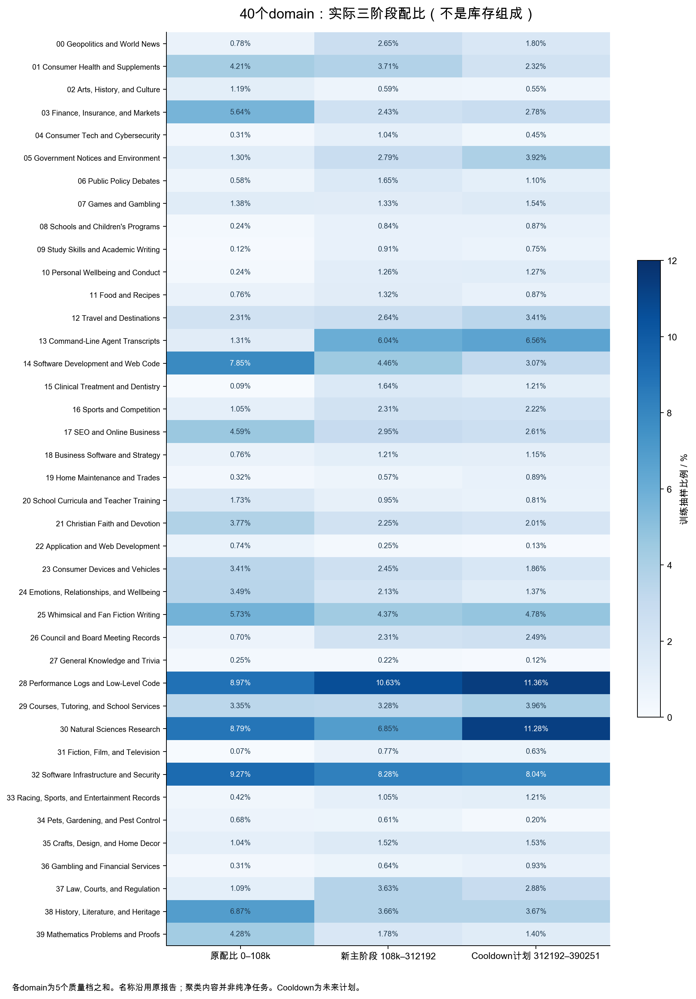
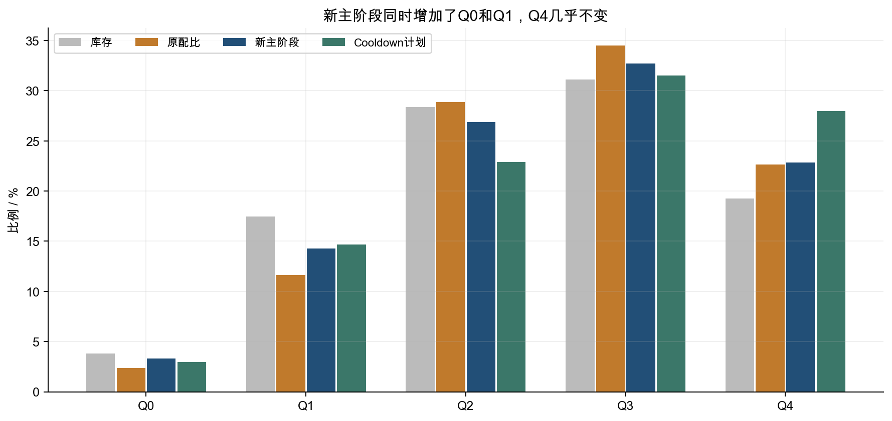
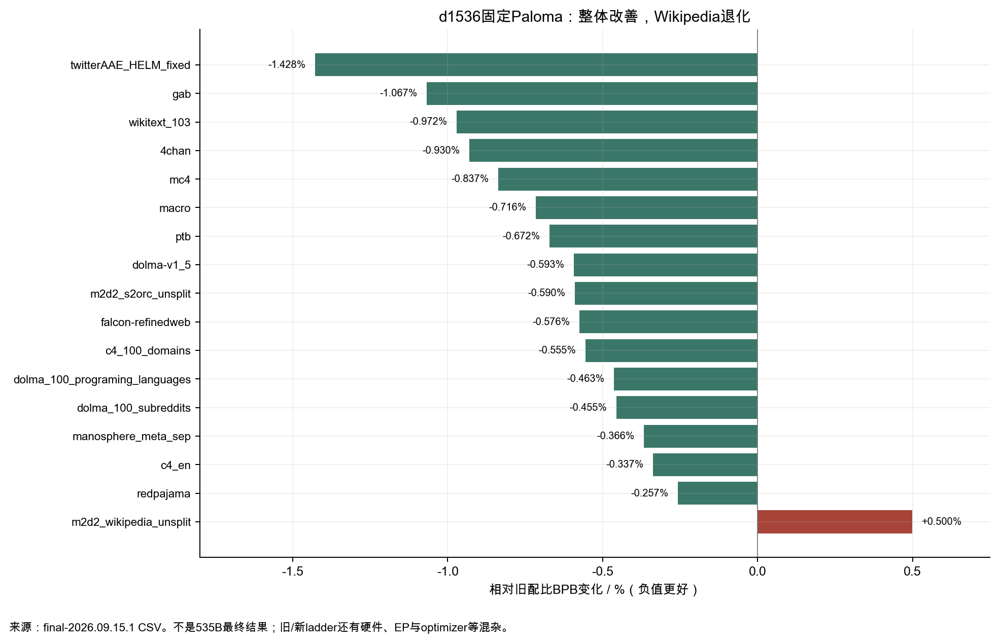

# 数据配比与顺序：从 Marin 的记录里能学到什么

V17补充：[质量评分深读](QUALITY_BUCKETS_ZH.md)核对BME字符窗口、评分词表与校准契约。q4是特定评分链路的桶标签；先做类型内内容审查，再用独立任务评估确认提高权重的收益。

V16补充：[去重与样本对齐](DEDUP_FILTERS_ZH.md)说明16来源fuzzy豁免如何改变可用内容，以及为何现有旧日期spec不能替代旧ladder的库存表。调整权重前，先核对去重政策、store与库存身份；否则桶权重相同也不保证来源曝光相同。

这篇把三个问题分开回答：Marin 实际用了怎样的配比；哪些 Loss 变化支持调整，哪些不能支持；如果换成你自己的模型和数据，怎样做一套能够验证、能够回退的调整。文中的“建议”是根据公开记录设计的实验方案，不是已经跑出的最优配方。

## 1. 先区分库存、抽样配比和训练顺序

公开页面展示的是约 **23.106T tokens 的候选库存**，不是训练时等比例吃掉全部数据。页面 URL 的 `revision=uniform-sampling` 描述组成报告的抽样版本；Hero 实际训练权重需要看配置中的 `data.train_weights`。仅凭页面饼图推测训练比例，会从第一步就算错。[组成报告](https://storage.googleapis.com/marin-public/held/harrier-k40-cluster-overview/2026.08.18/index.html?revision=uniform-sampling) · [实际配置快照](sources/wandb/hero-fa4sm100-nomask-step146k_meta.json)

数据被分成 40 个语义 cluster，每个再分 Q0–Q4 五档，总共 **200 个训练桶**。配置有 223 个名字，其中另外 23 个属于验证来源且训练权重为零。桶号如 `c13q4` 表示 cluster 13 的质量档 4，并不直接等同于一种干净的任务。对桶的解释至少需要四样东西：库存 token 数、实际训练权重、样本文本、固定验证结果。

对每个桶 i，记库存为 Aᵢ，阶段 s 的抽样比例为 wᵢ,s，该阶段训练 token 预算为 Bₛ。计划曝光量和曝光轮数分别是：

```
Tᵢ = Σₛ Bₛ × wᵢ,s
Eᵢ = Tᵢ / Aᵢ
```

**这里使用配置权重，不是加载器取整后的有效权重。**第二轮发现，K=49152时原配比有17个正权重桶在完整块上分到零条序列，余数集中到c30q4；新主阶段则已对齐计数格点。[取整机制与逐桶复核](DEEP_DIVE_ZH.md)另列有效比例。

Eᵢ=2 表示计划抽取量相当于该桶库存的两倍。它不是“每一篇文章恰好读过两次”：桶内 permutation、packing、续训 cursor、重复文档和切换跳过都会影响实际曝光。库存本身也只是这份 token store 的可用量，不是互联网某种知识的总量。

最新 4K 配置每步 **46,137,344 tokens**。按 390251 个计划 updates 计算，三个阶段如下。它们是配置预算，后两阶段中的未来部分尚未完成。

| 阶段 | Step 区间 | 计划 token 量 | 占整个预算 | 状态及含义 |
|---|---:|---:|---:|---|
| 原配比 | [0,108000) | 4.98283T | 27.675% | 已经过；保留初始配比 |
| 新主阶段配比 | [108000,312192) | 9.42088T | 52.325% | 当前处于此阶段 |
| 新 cooldown 配比 | [312192,390251) | 3.60143T | 20.000% | 配置里的未来计划 |

配比验证的scaling ladder以名义25%为切换点，另一个d512搜索swarm从10%的共同checkpoint继续；实际Hero在约27.675%才部署。把“小模型实验的阶段边界”抄成大模型已经执行的时间线，会掩盖这次延迟。[配比实验 #9126](https://github.com/marin-community/marin/issues/9126) · [实际切换 #9162](https://github.com/marin-community/marin/pull/9162)

## 2. 实际配比改变了什么

### 2.1 加了 Agent、法律、新闻，减少了一部分代码、数学和历史

下面是从 200 个实际权重求和得到的 domain 比例。表里的变化是**百分点**；比如 1.31%→6.04% 是增加 4.73 个百分点，也约为原来的 4.6 倍。这两种说法不能混用。

| Cluster | 页面名称的中文解释 | 原配比 | 新主阶段 | Cooldown计划 | 主阶段变化 |
|---|---|---:|---:|---:|---:|
| c13 | Agent 轨迹与交互 | 1.313% | 6.045% | 6.555% | +4.731 pp |
| c37 | 法律与司法文书 | 1.090% | 3.630% | 2.877% | +2.540 pp |
| c26 | 地方议会记录、公共服务 | 0.700% | 2.309% | 2.486% | +1.609 pp |
| c00 | 地缘政治、世界新闻 | 0.778% | 2.651% | 1.805% | +1.873 pp |
| c28 | 性能、底层编程 | 8.968% | 10.626% | 11.357% | +1.658 pp |
| c14 | Web应用与企业代码 | 7.851% | 4.464% | 3.072% | −3.387 pp |
| c03 | 金融、保险、市场 | 5.642% | 2.425% | 2.781% | −3.216 pp |
| c38 | 历史、文学与遗产 | 6.873% | 3.664% | 3.672% | −3.209 pp |
| c39 | 数学、教育与推理 | 4.281% | 1.782% | 1.404% | −2.498 pp |
| c30 | 自然科学研究 | 8.788% | 6.850% | 11.283% | −1.938 pp |

**可以确定的是他们改变了哪些桶，不能确定的是哪一个桶造成了改善。**一次同时改了 200 个权重，固定评估改善只支持这整个配比；没有“只加 Agent、其他都不变”的对照，就不能说 macro BPB 的改善由 Agent 数据造成。数学份额下降也不等于数学能力更强或更弱，Paloma 是文本分布评估，不是数学解题准确率。

一个容易漏掉的变化是 c30：主阶段降低，cooldown 又明显提高。阶段顺序不能只用一张最终饼图表达。同一份高价值数据提前使用与最后集中使用，效果取决于模型是否能学会、是否会遗忘、还剩多少更新、学习率是否已经太低；公开配比本身不提供这四项的单因素因果答案。



### 2.2 新配比并不是简单地“越高质量越多”

| 质量档 | 库存占比 | 原配比 | 新主阶段 | Cooldown计划 |
|---|---:|---:|---:|---:|
| Q0 | 3.814% | 2.351% | 3.335% | 2.942% |
| Q1 | 17.453% | 11.643% | 14.262% | 14.679% |
| Q2 | 28.356% | 28.855% | 26.872% | 22.898% |
| Q3 | 31.110% | 34.518% | 32.680% | 31.512% |
| Q4 | 19.267% | 22.633% | 22.852% | 27.968% |

新主阶段的 Q0、Q1 反而增加，Q4 只增加约 0.218 个百分点。Cooldown 的 Q4 才明显提高。这说明他们优化的是 **domain×quality 的组合**，并非按质量档单调调高。Q0 里可能有某些域欠缺的文本；Q4 里也可能有过度重复、模板化、任务不匹配的内容。分类器分数不是训练效用的直接测量。[分桶与质量说明](https://github.com/marin-community/marin/issues/8435#issuecomment-5336301526)



### 2.3 桶名称为什么只能当导航

本报告从原页面提取了 **200 桶、每桶两个公开样本**，保存为[样本索引](analysis/sample_texts.json)。人工抽看几个关键桶，能看出标签和实际内容之间的距离：

| 桶 | 公开样本里实际出现的内容 | 对调整配比的含义 |
|---|---|---|
| c13q0 | README、截图链接和工具介绍 | Agent 标签里也有项目介绍，不全是执行轨迹 |
| c13q4 | Python实现问题、梯度实现问答 | 质量高不代表具备多步工具交互监督 |
| c28q0 | 重复时间戳、Java enum片段 | 很容易预测的模板能拉低CE，但信息增量可能有限 |
| c28q4 | Python彩色日志类等代码 | 工程代码质量与解题代码质量需要不同验证 |
| c39q0 | 分数练习、网页碎片、SEO式内容 | 数学桶也可能混着噪声和重复习题 |
| c39q4 | 混合分数讲解、Fibonacci辅导 | Q4也可以是基础教学，而非高难推理 |
| c26q4 | 城市停车指引 | 聚类主题涵盖公共服务，并非只有议会会议记录 |
| c30q4 | 胶体等物理研究内容 | 学术文本Loss与实际科学问答能力需要另测 |

两个样本只能揭示“这个桶不纯”，不能估计杂质率。你自己的桶应按文档长度、来源和质量档分层抽样，随机抽足够文档；如果目标是估计约10%的污染率，100份样本的标准误仍约3个百分点，不能拿十篇精读当全桶质量证明。这里的数量是审计设计示例，不是 Marin 实际审计规模。

来源 legend 的比例/富集倍数也不是训练比例：某来源在桶内比全库存富集10倍，描述的是来源分布；它不表示该来源已经训练十遍。页面中的来源名、classifier Q档、运行权重、计划 epochs，分别回答不同问题。

## 3. 数据与 Loss 的关联：现有证据能走多远

### 3.1 为什么新配比的训练CE会升高

训练 CE 是对当前采样分布求平均。假设模型参数在切换一刻近似不变，桶 i 的 CE 为 ℓᵢ，则：

```
原平均：L旧 = Σᵢ w旧ᵢ × ℓᵢ
新平均：L新 = Σᵢ w新ᵢ × ℓᵢ
分布造成的瞬时差：ΔL分布 ≈ Σᵢ (w新ᵢ − w旧ᵢ) × ℓᵢ
```

只要增加了难预测的桶，新平均就可能上升。这个公式解释了机制，但当前资料没有同一 checkpoint 的完整 200 桶 ℓᵢ 与同一评估口径，因此本报告**没有把108k的约0.025 CE差值强行分解为Agent、法律等各自贡献**。这项分解需要额外评估，而不是画一张权重与Loss的相关图。

进一步把切换前后的学习分开：先在同一 checkpoint 用旧/新抽样权重重加权评估，测“分布效应”；再分别训练相同token量，在不变验证集上比较，测“学习效应”。生产线的前后曲线把两种效应、学习进度以及其他系统变更混在一起。

### 3.2 固定验证集上，哪些分布改善了

d1536 最终结果的 Paloma macro BPB 改善约0.716%，16个子集15个改善。Wikipedia分布反而恶化约0.500%。下图展示全部子集；负值表示更好。macro是子集宏平均，不代表按真实用户请求分布加权的质量。



代码子集在 d768、d1024 略差，在 d1536 转为改善；这是不同ladder上的观察方向，尚不能归因给规模。第十一轮核对发现，旧、新run切换前的初始权重已有约20.39%半L1差，代码CE/BPB也在两个较小ladder上给出相反方向；[完整配置与评估聚合检查](SCALE_TRANSFER_ZH.md)说明下一步应先统一测量与历史。d1536代码BPB改善约0.463%，比macro的改善小；不能把macro的“等效算力约20%”移植到代码能力。d512同checkpoint、三seed实验的Uncheatable代码改善支持继续尝试，但没有消除最终535B收益的不确定性。[实验细节和限制](https://github.com/marin-community/marin/issues/9126)

第二轮读取完整registry后发现：d512新配比的GSM8K任务BPB在三个seed上均退化，均值约+10.844%；HumanEval任务BPB均值约−4.034%，三个seed均改善。这些是文本BPB，不能换算为解题准确率或pass@1。数学域削减与退化同时发生，尚无单桶因果证据。[完整54项任务与选择偏差分析](DEEP_DIVE_ZH.md)

### 3.3 “等效算力提高20%”怎样算，为什么容易夸大

原配比拟合 BPB≈a·C^(−α)，若忽略不可约loss floor，α≈0.0400069，则让旧配比达到新BPB所需的算力倍数为：

```
倍数 = (0.925068 / 0.918442)^(1 / 0.0400069) ≈ 1.19684
```

这意味着该拟合下旧配比需要约多19.68%的算力；换成节省比例则是 1−1/1.19684≈16.44%。它不意味着吞吐提高20%，也不意味着所有能力提高20%。很小的loss变化经由较小的α会放大成很大的算力倍数；twitter子集的α更小，得到2.3×之类数值，更需要谨慎。加入非零floor后倍数还会改变，外推超出测量区间也会出错。[原始结果CSV](sources/mix_study_final-2026.09.15.1_final_results.csv)

## 4. 怎样为自己的模型精心调配比

### 4.1 第一步不是选百分比，而是固定目标与对照

先写清模型将服务什么：中文通用、代码、科学问答、Agent工具使用，还是长文理解。目标是不同能力的组合，只有macro文本Loss很难决定取舍。保留三个互补指标组：

1. **固定的文本验证组**：通用、语言、代码、数学/科学、目标业务域，按文档去污染，固定tokenizer、packing和长度。报告各组BPB/CE和一个事先定义的加权汇总。
2. **任务验证组**：目标任务的正确率、代码通过率、工具调用成功率等。用于判断文本Loss改善是否转化为用途；留一份最终盲测，不反复据此选配比。
3. **运行成本与状态**：tokens/s、每token FLOPs、drop、grad norm、数据加载等待、checkpoint可恢复性。更困难的数据可能让梯度或专家负载改变；不能把基础设施问题归给数据。

基线至少冻结：checkpoint及完整optimizer状态、代码SHA、依赖版本、kernel、router arithmetic、EP拓扑、批量token数、上下文长度、学习率schedule、loader种子和cursor。更换混合比例必然改变训练数据，但其余条件应保持相同。Marin旧/新ladder同时换了若干条件，正是我们需要更严格控制的地方。

### 4.2 先把200桶压成几个可解释的方向

200个自由权重直接搜索，代价大、代理容易过拟合。针对你的目的把桶归成约8–12组，可以按语言、来源、任务、质量与重复度组合；这个组数只是可操作的起点。分组前先审计真实样本，不按漂亮的cluster名直接合并。

对每组记录：库存Aᵢ、当前权重、截至当前已抽取token、目标验证表现、重复/模板率、文档长度分布、每token训练成本。权重使用**有效训练token**口径，不能把原始压缩字节、文档数、loss mask后的token数混作分母。极长文、短问答、代码文件在packing后的有效比例可能不同。

优先检验具有明确机制的假设。例如：

| 假设 | 应看到的证据 | 可以推翻它的结果 |
|---|---|---|
| 代码弱点来自模板数据过多 | 降低模板子桶后，固定代码BPB与通过率改善 | CE降低，但代码通过率无改善或恶化 |
| Agent不足来自缺少真实多步执行记录 | 增加含工具结果/失败恢复的记录后，多步工具验证改善 | 只提高README或问答Loss，没有工具成功率收益 |
| 科学文本学习不够 | 科学验证改善，同时通用组退化可接受 | 只是记住近重复论文，去污染测试无收益 |
| 高质量数据使用太早被遗忘 | 相同累计曝光下，晚期加入组最终目标任务更好 | 提前加入一直更好，或差异落在seed波动内 |

这比“代码30%、数学10%”更有用：知道为什么动，才知道看到什么结果时该停。

### 4.3 一次改变一个方向，并说清从哪里拿预算

比例之和为1，不能只说“加Agent”。比如把某组从5%试到7%，必须说另外2个百分点从哪个组拿，或者按怎样的规则从其他组共同扣除。否则比较中的第二个变量被藏起来。

给方向j定义一个总和为零的向量vⱼ，让候选配比w'=w+δvⱼ。选择δ应同时满足正权重、曝光上限、最小保留比例和预算约束。先试两个幅度，像±1个百分点只是示例；稀缺桶应更小，几乎零权重的桶不能机械做负方向。

**一个可复算的100B token例子。**目标桶库存只有1B，已有2B历史曝光；未来配比拟增加到5%，则新增5B曝光，累计7轮。如果你为这批数据设的审计上限是4轮，未来最多还能用2B，即未来平均权重不能超过2%。上限4是实验设计选择，不是普适常数，也不是Marin的8轮上限；真正上限应根据重复、记忆化、held-out差距和收益饱和来调整。

建议使用累计约束而非只看当前阶段：

```
已曝光tokenᵢ + Σ未来阶段 Bₛ×wᵢ,s ≤ 曝光上限ᵢ×库存Aᵢ
Σᵢ wᵢ,s = 1；wᵢ,s ≥ 0
```

Marin当前三阶段的最大计划曝光约6.741轮，发生在很小的 `c27q0` 桶，并非最大的高质量桶。`c13q0`也约6.737轮；它们的绝对token预算很小。曝光轮数高是审计线索，不自动意味着它们正在支配训练。反过来，c28q4库存约258.1B，却计划抽取约795.3B，约3.082轮，绝对影响很大，应该优先审计。

### 4.4 先做同checkpoint分叉，再做规模确认

下面是一套建议流程，预算按你的资源缩放，**不是要求每个模型都照这个数量执行**。

| 阶段 | 建议工作 | 要回答的问题 | 不通过时做什么 |
|---|---|---|---|
| 审计 | 检查来源、重复、污染、packing，固定评估 | 桶真的是想要的内容吗 | 修数据，不进入搜索 |
| 快速排除 | 相同checkpoint、每方向±扰动、等token续训 | 哪些方向有一致的目标收益 | 丢掉明显损害或成本过高的方向 |
| 确认 | 最佳少数候选，至少3个paired seeds | 改善是否超过波动 | 收集更多证据或保留基线 |
| 规模检查 | 更大代理与生产形态EP/长度 | 小模型排序会不会翻转 | 不向535B级别直接外推 |
| 顺序检查 | 相同累计桶曝光，交换先后次序 | 是配比收益还是阶段收益 | 保留较简单且稳定的顺序 |
| 部署 | 新run、完整handoff checkpoint、先并行对照窗口 | 语义、cursor、稳定性是否成立 | 回到旧checkpoint和旧配置 |

paired seeds指同一个seed下旧/新候选配对，不能只算两组独立均值。报告每seed的差值，再用seed之间的波动估计不确定性。若差异很小，3seed也可能不足；不要用一百万token点的数量冒充独立样本量。token、相邻steps以及同一文档高度相关。

规定接受条件要在看结果前完成。例如“目标组显著改善且通用组退化不超过某个容忍阈值、吞吐不低于某个成本阈值”。具体阈值应取决于业务和历史波动，本报告不伪造一套通用0.1%的标准。多个指标一起看时要防止挑最好看的那个，再把它写成唯一目标。

### 4.5 用验证变化决定下一轮，别用训练CE决定

建议保留一个响应矩阵：行是配比扰动方向j，列是固定验证域k，元素是等token预算后的 ΔLⱼ,k。把各列按你事先定义的目标权重汇总；同时保留各列，避免macro掩盖某个重要域退化。

这个矩阵回答“把预算从A移到B，哪些验证域受益或受损”。它是局部响应，不保证大幅变化仍然线性；也不能自动用于下一训练阶段，因为模型已经变了。只有通过确认的方向才逐步扩大，不要一步把1%改到20%。

如果你有按域梯度监控，可以分析训练域和验证域梯度的方向关系，帮助解释迁移；但这会增加计算与实现复杂度。DoGE研究的是这类代理模型上的双层优化。DoReMi使用代理模型调整域权重，RegMix用小模型实验预测配比表现。这些提供搜索方法，**不是Marin当前mix的名称，也不保证你的代理会迁移**。[DoGE原论文](https://arxiv.org/abs/2310.15393) · [DoReMi原论文](https://arxiv.org/abs/2305.10429) · [RegMix原论文](https://arxiv.org/abs/2407.01492)

## 5. 怎样安排数据顺序

### 5.1 把“总量”和“何时使用”分成两项实验

比较A方案前段广覆盖、后段目标域增加，与B方案全程固定混合时，要让两者的**累计每桶曝光相同**。否则最终结果不同，可能只是总共用了更多目标数据，而不是顺序更好。也要固定总token、optimizer schedule、checkpoint起点和长度；同token不同FLOPs时再补一个等算力比较。

可以先试三种候选：全程固定；先广覆盖后缓慢提高目标域；先增加目标域再恢复通用比例。比较每段的目标能力增益、通用遗忘、最终收益、验证波动和训练成本。若最后增加数据时学习率已经很低，目标域很难充分学习；需要一个单独的学习率对照，不能同时改LR后把收益归给顺序。

Marin的三阶段为我们提供一个“顺序值得研究”的例子：主阶段的科学份额下降，cooldown增加；高质量档最后提高；Agent连续提高。它没有证明所有模型都应该先低质量后高质量，更没有证明前期数学可以省掉。跨域迁移和训练能力随规模变化，小模型与大模型的最优次序可能不同。

### 5.2 切换后观察多久，取决于要观察什么

切换后的同checkpoint重加权评估可立即解释CE分布差。前200steps的生产对照更适合检查内核数值、drop、吞吐、cursor与checkpoint，并不够确认长期数据收益；704GPU、每步46.1Mtokens时，200steps也约9.23Btokens，但它仍只是特定进度附近的短窗。

学习效果应按“已训练多少额外token”和“多少次optimizer更新”观察，记录固定验证域的轨迹，并与未切换分支同期比较。不要只看生产CE回到切换前数值的时刻；回到旧数字不表示能力恢复，也不表示新配比已经学完。

### 5.3 上下文变长，会改变顺序，即便每步token数不变

\#9615里最重要的发现不是16K仅慢3.1%，而是修改 `max_seq_len` 会改变 loader 的数据流：IO块按固定token切成不同条数的sequence，块内shuffle依赖sequence数；混合block按sequence计数；续训位置也可能用旧sequence单位。4K→16K时，简单用相同步数乘新batch，无法保证读到相同的原始token位置。[完整数据流调查](https://github.com/marin-community/marin/issues/9615)

实际固定全局token量时，4K的batch11264变成16K的2816，旧49152条sequence混合block的边界对齐周期会改变。讨论中的方案会让108000的旧边界向108096对齐；这是阶段语义变化，不是GPU数学误差。直接改长度的重复2.85T、漏1.6T是讨论中的估计，不是本报告重放算出的结果。

第二轮按生产计数逻辑独立复算了两种较温和的迁移方案：195125步保留K=49152、历史边界移到108096，完整块绝对游标差约2.951B；缩K到12288、历史边界保持108000，约108.907B。后者还改变了有效配比。绝对差之和包含向前与向后偏移，不能直接写成重复token量。[公式、逐桶CSV与范围限制](DEEP_DIVE_ZH.md)

稳妥设计是存储每桶的原始token cursor、已消费permutation窗口和阶段身份，切换时明确映射；或者先按足够长的块生成稳定序列再切成短训练片段，使顺序尽量不依赖当前context。Marin当时仍在讨论具体实现，不能把这个建议写成已部署。为避开未完成窗口而跳过约50Btokens，是特定切换点的方案估计，不是任何训练的通用安全上界。

建议你在小型数据fixture上给原始token/文档编号，执行以下有意义的检查：不改长度的续训是否精确重放；4K→16K是否保留期望顺序；阶段边界前后是否出现重复/漏读；checkpoint落在shuffle窗口中间时如何处理；每桶实际采样比例是否与预算吻合。保存每次切换的审计文件，包含允许跳过的范围和理由。

### 5.4 长上下文需要两套验证口径

保留固定4K评估，能与历史曲线连续比较；另外增加16K或更长评估，测长文本能力。不要突然用16K的BPB替换4K历史曲线后声称模型变好，因为额外上下文本身就能让相同文本更好预测。

同时记录长度、文档segment mask、packing和MoE负载。长文里连续token可能选择相似专家，接收端容量更容易溢出。#9615单rack里drop从4K的1.86e−4增到16K的2.94e−3；当时QK scale也改变，所以不能把全部增加归给长度。单rack与11rack的分布/负载也不同。[长度与QK的对照计划](https://github.com/marin-community/marin/issues/9615)

## 6. 一份可以直接用于你项目的实验记录

每次调整先填写以下字段；跑完再补结果，不事后改假设。

```yaml
hypothesis: "目标代码域不足；把2个百分点从模板网页移至去重工程代码"
baseline_checkpoint: "不可变路径及manifest SHA256"
code_commit: "..."
data_manifest: "每桶来源、库存、去重、污染检查、tokenizer版本"
weights_before: "weights-v0.json"
weights_after: "weights-v1.json"
budget: {extra_train_tokens: ..., optimizer_updates: ..., estimated_flops: ...}
held_out: "固定文档ID/哈希；搜索验证与最终盲测分离"
controls: "optimizer state/LR、EP、kernel、router、长度、有效batch tokens固定"
paired_seeds: [0, 1, 2]
data_order: "各桶cursor与permutation窗口；切换时允许跳过范围"
primary_metric: "预先定义的目标验证加权损失"
guardrails: "事先定义的通用退化、成本和稳定性容忍范围"
rollback: "旧完整状态、旧配置、新run独立checkpoint树"
results: "逐seed、逐域差值；训练CE变化另列"
decision: "接受/继续确认/回退，写具体证据"
```

你能从这次公开训练学到的最实用的方法是：让配比变成有预算、有对照、有阶段身份的决策。先知道真实数据是什么，再看固定验证域的响应，最后才扩大权重和安排顺序。公开的三阶段比例适合用来提出候选假设；你的训练目标、语料库存与模型规模决定是否采用。

## 7. 完整配比与曝光附表

下面的附表由脚本从原始配置与库存自动生成。HTML另有200桶筛选器，可查各桶三个阶段比例、库存和计划曝光；[40域CSV](analysis/domain_weights.csv)、[200桶CSV](analysis/cell_weights.csv)、[计算摘要](analysis/summary.json)均保留精确值。

<!-- GENERATED_TABLES -->

### 7.1 40个语义域的全部比例

| ID | 中文导航（原始英文名保留在CSV/查询器） | 库存/T | 库存占比 | 原配比 | 新主阶段 | Cooldown计划 |
|---|---|---:|---:|---:|---:|---:|
| c00 | 世界新闻与地缘政治 | 0.6696 | 2.898% | 0.778% | 2.651% | 1.805% |
| c01 | 消费健康与补充剂 | 0.9418 | 4.076% | 4.206% | 3.713% | 2.319% |
| c02 | 艺术、历史与文化 | 0.1956 | 0.847% | 1.192% | 0.594% | 0.549% |
| c03 | 金融、保险与市场 | 1.0050 | 4.349% | 5.642% | 2.425% | 2.781% |
| c04 | 消费科技与网络安全 | 0.1741 | 0.753% | 0.313% | 1.044% | 0.446% |
| c05 | 政府公告与环境 | 0.6923 | 2.996% | 1.305% | 2.789% | 3.923% |
| c06 | 公共政策讨论 | 0.2029 | 0.878% | 0.580% | 1.648% | 1.097% |
| c07 | 游戏与赌博 | 0.2940 | 1.272% | 1.384% | 1.326% | 1.538% |
| c08 | 学校与儿童活动 | 0.1286 | 0.557% | 0.238% | 0.844% | 0.873% |
| c09 | 学习方法与学术写作 | 0.1631 | 0.706% | 0.120% | 0.911% | 0.747% |
| c10 | 个人健康与行为 | 0.2505 | 1.084% | 0.244% | 1.263% | 1.267% |
| c11 | 食品与食谱 | 0.2534 | 1.097% | 0.761% | 1.324% | 0.869% |
| c12 | 旅游与目的地 | 0.3866 | 1.673% | 2.309% | 2.643% | 3.412% |
| c13 | 命令行Agent记录 | 0.5893 | 2.551% | 1.313% | 6.045% | 6.555% |
| c14 | 软件开发与Web代码 | 1.5558 | 6.733% | 7.851% | 4.464% | 3.072% |
| c15 | 临床治疗与牙科 | 0.2879 | 1.246% | 0.091% | 1.642% | 1.213% |
| c16 | 体育与竞赛 | 0.3028 | 1.310% | 1.052% | 2.311% | 2.222% |
| c17 | SEO与网络商业 | 0.7151 | 3.095% | 4.588% | 2.948% | 2.614% |
| c18 | 商业软件与策略 | 0.2615 | 1.132% | 0.762% | 1.211% | 1.147% |
| c19 | 家居维护与手工业 | 0.2501 | 1.082% | 0.317% | 0.566% | 0.893% |
| c20 | 学校课程与教师培训 | 0.3660 | 1.584% | 1.733% | 0.950% | 0.812% |
| c21 | 基督教信仰与灵修 | 0.5149 | 2.229% | 3.772% | 2.252% | 2.008% |
| c22 | 应用与Web开发 | 0.0875 | 0.379% | 0.739% | 0.254% | 0.130% |
| c23 | 消费设备与车辆 | 0.6112 | 2.645% | 3.409% | 2.450% | 1.862% |
| c24 | 情绪、关系与身心健康 | 0.5704 | 2.468% | 3.494% | 2.130% | 1.369% |
| c25 | 幻想与同人写作 | 0.9292 | 4.022% | 5.734% | 4.366% | 4.777% |
| c26 | 议会与董事会会议记录 | 1.7382 | 7.523% | 0.700% | 2.309% | 2.486% |
| c27 | 常识与问答 | 0.0555 | 0.240% | 0.245% | 0.224% | 0.120% |
| c28 | 性能日志与底层代码 | 1.5653 | 6.774% | 8.968% | 10.626% | 11.357% |
| c29 | 课程、辅导与学校服务 | 0.7294 | 3.157% | 3.346% | 3.280% | 3.955% |
| c30 | 自然科学研究 | 1.2460 | 5.393% | 8.788% | 6.850% | 11.283% |
| c31 | 小说、电影与电视 | 0.1253 | 0.542% | 0.066% | 0.773% | 0.635% |
| c32 | 软件基础设施与安全 | 1.6257 | 7.036% | 9.274% | 8.278% | 8.040% |
| c33 | 赛车、体育与娱乐记录 | 0.5559 | 2.406% | 0.421% | 1.052% | 1.206% |
| c34 | 宠物、园艺与害虫防治 | 0.1248 | 0.540% | 0.676% | 0.610% | 0.201% |
| c35 | 手工、设计与家居装饰 | 0.4364 | 1.889% | 1.037% | 1.516% | 1.532% |
| c36 | 赌博与金融服务 | 0.1718 | 0.743% | 0.311% | 0.641% | 0.932% |
| c37 | 法律、法院与监管 | 0.6214 | 2.689% | 1.090% | 3.630% | 2.877% |
| c38 | 历史、文学与遗产 | 1.2299 | 5.323% | 6.873% | 3.664% | 3.672% |
| c39 | 数学问题与证明 | 0.4812 | 2.082% | 4.281% | 1.782% | 1.404% |

### 7.2 计划曝光轮数最高的十个桶

仅按当前三阶段计划计算；未来配比、长度与cursor改变会使实际曝光不同。极小桶的高轮数不能按绝对影响排名。

| 桶 | 中文导航 | 库存/B tokens | 计划抽取/B tokens | 曝光轮数 | 原配比 | 新主阶段 | Cooldown计划 |
|---|---|---:|---:|---:|---:|---:|---:|
| c27q0 | 常识与问答 | 0.1089 | 0.7341 | 6.741 | 0.00025% | 0.00610% | 0.00407% |
| c13q0 | 命令行Agent记录 | 0.1357 | 0.9145 | 6.737 | 0.00003% | 0.00814% | 0.00407% |
| c08q0 | 学校与儿童活动 | 0.3140 | 0.9898 | 3.152 | 0.00007% | 0.00814% | 0.00610% |
| c28q4 | 性能日志与底层代码 | 258.0648 | 795.2550 | 3.082 | 1.87118% | 5.41789% | 5.32023% |
| c27q4 | 常识与问答 | 2.7577 | 7.8723 | 2.855 | 0.04327% | 0.05290% | 0.02035% |
| c12q1 | 旅游与目的地 | 65.7360 | 176.1497 | 2.680 | 0.36588% | 1.05794% | 1.61743% |
| c34q1 | 宠物、园艺与害虫防治 | 14.1645 | 31.8479 | 2.248 | 0.07382% | 0.28890% | 0.02645% |
| c13q3 | 命令行Agent记录 | 285.9659 | 561.4436 | 1.963 | 0.64521% | 4.12191% | 3.91439% |
| c16q3 | 体育与竞赛 | 110.0649 | 213.8496 | 1.943 | 0.38436% | 1.54012% | 1.37736% |
| c07q3 | 游戏与赌博 | 69.9452 | 129.3102 | 1.849 | 0.48347% | 0.77311% | 0.89925% |

### 7.3 d1536固定Paloma的全部子集BPB结果

| 子集 | 旧配比BPB | 新配比BPB | 相对变化 |
|---|---:|---:|---:|
| macro | 0.925068 | 0.918442 | -0.716% |
| 4chan | 0.949362 | 0.940531 | -0.930% |
| c4_100_domains | 0.767146 | 0.762885 | -0.555% |
| c4_en | 0.806441 | 0.803724 | -0.337% |
| dolma-v1_5 | 0.747222 | 0.742789 | -0.593% |
| dolma_100_programing_languages | 0.437085 | 0.435061 | -0.463% |
| dolma_100_subreddits | 0.978935 | 0.974477 | -0.455% |
| falcon-refinedweb | 0.857198 | 0.852262 | -0.576% |
| gab | 1.512920 | 1.496775 | -1.067% |
| m2d2_s2orc_unsplit | 0.708041 | 0.703863 | -0.590% |
| m2d2_wikipedia_unsplit | 0.719863 | 0.723460 | +0.500% |
| manosphere_meta_sep | 1.014733 | 1.011015 | -0.366% |
| mc4 | 0.768466 | 0.762030 | -0.837% |
| ptb | 0.839576 | 0.833935 | -0.672% |
| redpajama | 0.663640 | 0.661936 | -0.257% |
| twitterAAE_HELM_fixed | 2.340258 | 2.306829 | -1.428% |
| wikitext_103 | 0.690203 | 0.683497 | -0.972% |


V87新增配比时间表验收：相同weight字典不代表相同阶段时长或重复预算。原Harrier构建按N重算边界、按数据块对齐，短实验可能跳过main；固定八轮spec检查不覆盖任意扩大后的raw预算。详见[阶段、预算与曝光](BATCH_CLOCK_ZH.md)。这是原函数host对照，不是真实训练重复率或推荐新配方。


V88将同head spec的连续曝光落实到原整数块与真实CPU末块排列。稀缺桶可能零曝光，集中余数长期改变预算；名义整数序列仍不是有效loss token。见[200桶整数账本](MIXTURE_RANGE_ZH.md)。


V89修正整数曝光解释：同一W&B权重在Python 3.9/3.12本地原函数下，cooldown有184个桶的quota不同。配置来源、求和语义与编译后的整数向量都必须绑定，不能将环境差异写成数据收益。见[归一化运行时](MIXTURE_RANGE_ZH.md)。
