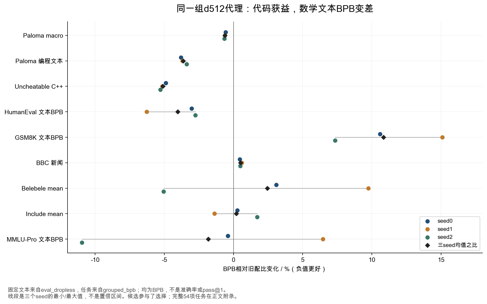
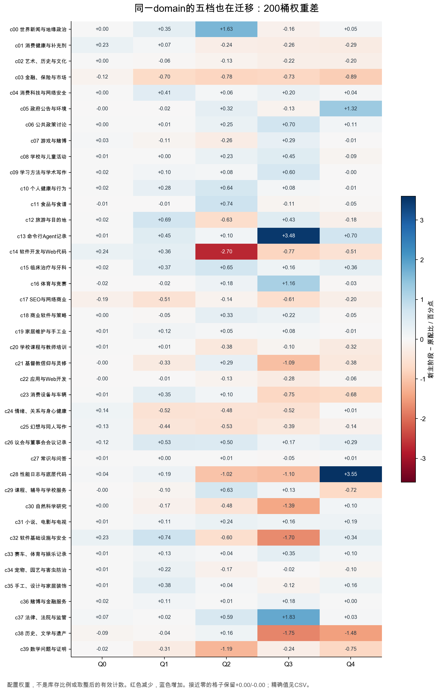
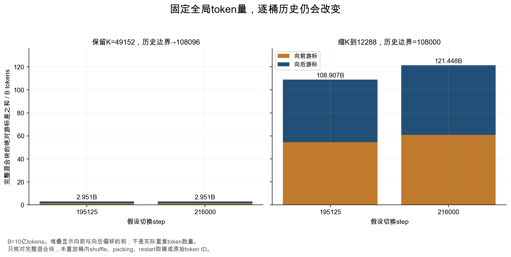

# 第二轮深挖：配比搜索的代价、数学退化与真正的数据游标

这次新增分析从三个疑点出发。原报告引用了六个 d512 run，新配比究竟是在多大的搜索中被选出来的？代码文本变好时，数学和其他任务有没有代价？长上下文讨论中的108.9B与2.95B究竟怎么算，能否独立复算？

本篇读取固定版本的完整 swarm registry，并执行归档加载器中两段计数函数。结果揭示了原来的汇总表没能说明的取舍。**新配比在六个小模型对照里的代码 BPB 改善相当一致，但 GSM8K 的 BPB 也在三个 seed 上一致变差；缩小混合块会改变取整后的实际配比，继而改变历史游标。**这些是代理实验和加载器层面的证据，尚不是535B最终能力结论。训练曲线仍沿用第一版的05:38快照，本篇没有把后来抓到的代码时间当成训练已前进的证据。

## 1. 六个run背后，是934条观测与915对不同权重

### 1.1 搜索范围可以数清，选中规则还不能完整复现

固定 HF revision `75c25718e2a7cf7a3b1b498b00479351f80345e0` 下，`h100-d512-from10pct-store-4d2e363d` 的 observations parquet 有 **934行、934个不同run名**。对两个阶段的完整权重做精确序列化和哈希，得到 **915对不同权重**。其中906对只出现一次，6对出现两次，2对出现三次，1对出现十次。多次出现只说明权重相同，不能自动算成独立seed验证；本篇分析的旧/新候选恰好各有三个明确seed。[固定registry](https://huggingface.co/datasets/marin-community/grug-moe-mix-swarm/tree/75c25718e2a7cf7a3b1b498b00479351f80345e0/registry/v1/swarms/h100-d512-from10pct-store-4d2e363d) · [本地逐run清单](analysis/swarm_inventory.csv)

| registry里的group | 观测行数 | 可以从名字读出的实验方向 |
|---|---:|---|
| mixprior_candidate | 601 | 候选配比；不能据名字还原其优化目标 |
| systematic_grid | 100 | 网格方案 |
| floored_ablation | 60 | 带floor的消融 |
| skew_swap | 48 | 偏置与交换 |
| semantic_domain_ablation | 40 | 语义域消融 |
| proportional_domain_ablation | 40 | 按比例的域消融 |
| core_design | 25 | 核心设计与对照 |
| proportional_baseline | 10 | 比例基线 |
| semantic_quality_ablation | 6 | 语义质量消融 |
| proportional_quality_isolation | 4 | 质量档隔离 |

这张表说明搜索并非只试了两种配方。它还不够说明“某个域消融的因果效果”：需要读取对应两阶段权重、确认其余方向怎么补偿，核对checkpoint、训练预算和评估版本。group名称只是索引。本次没有把934行变成934个独立因果样本。[复核摘要](analysis/swarm_audit.json)

作者在[#9126的swarm方法](https://github.com/marin-community/marin/issues/9126)中记录：六个run均从完成10%基线训练的step-393 checkpoint恢复、使用相同d512预算。六个已引用run在完整registry中逐字段匹配，observations的SHA256也与swarm manifest吻合。因此原来三seed对照不是从另一套实验拼来的。但这六个run属于用于选择配比的同一批资料。即便效果在三个seed上重复，也不能消除反复挑选候选带来的乐观偏差。**重复运行回答“这两个配方的差异是否稳定”；独立确认回答“搜索选出的配方离开这批选择数据后是否仍好”。**

公开registry保存了权重、任务BPB、训练末尾指标以及来源路径；本次取得的文件中未发现可完整复现候选选择的拟合模型、超参数、目标权重和搜索过程。`evaluation_suite=grug-hero-fsdp-krr` 这个名称也不足以证明最终选择是如何加权的。本报告不把猜测的surrogate算法写成作者实际做法。可以借鉴[RegMix的原论文](https://arxiv.org/html/2407.01492v2)所述“用小规模配比实验预测并筛选大规模配方”的思路；Marin这一候选的全部选择规则仍缺证据。

### 1.2 他们还保存了200×1000的内容特征，域标签不是全部输入信息

`content.parquet`有200行、1000列的token加权内容直方图，每行和在浮点误差内等于1。元数据记录了20,000的sample_size、100的range_len、seed=0、max_embed_tokens=2048及centroid/lookup哈希。它描述的是每个domain×quality桶在更细内容簇上的组成。两个桶即使标签不同，也可能共享大量内容；一个桶的Q3与Q4也可能对应不同主题。

但这里只能核实特征被归档，不能确认它怎样进入最终选择模型。内容特征根路径仍指向旧 `store_81e7e39a`，训练swarm指向重建后的 `store_4d2e363d`。后者增加了fuzzy-dedup豁免来源。registry另标明质量桶语义 `exact_match_to_historical=false`。本次核对发现200桶的库存数与生产spec **全部相等**；这说明库存口径对得上，却不能消除特征取样和历史语义的差别。迁移数据时，表面上同名、同大小还不是内容完全一致的证明。[特征和来源元数据](sources/deepening_2026_10_04/hf_content.parquet) · [重建说明](sources/harrier_mix_main.py) · [库存核对](analysis/swarm_audit.json)

## 2. 小模型怎么模拟十几万亿token的重复曝光

swarm元数据写的是 **14,835,253,248 physical tokens** 与 **16,875,000,000,000 simulated tokens**。两者相差约1137.49倍。前者是小实验实际训练量，后者是它模拟的剩余大训练预算；不能把16.875T写成每个d512实验真的训练了这么多token。该模型活跃参数约20.84M，总参数约597.61M，也不等同于535B模型的缩小倍数。[swarm元数据](sources/deepening_2026_10_04/hf_swarm.parquet)

16.875T对应18.75T参考预算扣除前10%；两个剩余阶段为13.125T与3.75T。14.835B则等于3537步×1024序列×4096，即3930步参考run剩余90%的训练量。这里的18.75T是配比模拟参考预算；当前Hero配置总量约18.005T。参考预算、物理小实验预算、生产计划预算要分别记录。

加载器的做法是先建立token序列、做桶内shuffle，再把每个桶截成原长度的实验/目标预算比：

```
r = 14,835,253,248 / 16,875,000,000,000 = 0.0008791261184
小实验桶长度 = floor(原桶序列数 × r)
```

MixtureDataset采用restart策略，某桶读完后可以继续循环。假设暂时忽略截断与packing尾部，小实验某桶训练量和库存都缩小r倍，曝光轮数便近似保持：

```
小实验曝光轮数 ≈ (r × 目标训练量 × 桶权重) / (r × 桶库存)
               = 目标训练量 × 桶权重 / 桶库存
```

这一步有明确目的：让小实验提前遇到稀缺桶反复曝光的后果。否则短实验几乎都处于首次读数据阶段，可能偏好一种到18T时已经过度重复的配方。代价也明确：**重复比例接近了，覆盖的独特内容大幅减少了。**代理可能对小切片的内容偶然性敏感；相同轮数不保证大、小模型记忆化程度、泛化或遗忘相同。[归档生产加载器的截取位置](https://github.com/marin-community/marin/blob/ad754c6d67555d6369a4a312ff7388e43cfd08c1/lib/levanter/src/levanter/data/text/datasets.py#L840)

当前Hero的配置 `experiment_budget` 与 `target_budget` 都是null；其训练FLOPs也超过Harrier代码的1e23阈值，生产使用未按此比例缩小的库存。因此“小模型看到的重复效应”是搜索辅助证据，不能当成生产实际已经读完某桶的证明。[实际配置](sources/wandb/hero-fa4sm100-nomask-step146k_meta.json) · [阈值与预算逻辑](sources/harrier_mix_main.py)

如果在自己的实验里使用这种模拟，至少要做两种代理对照：保持曝光轮数的小切片版，以及使用更大独特内容、接受较低轮数的版本。两者都支持的方向更值得扩规模。切片长度和有效配比要在取整后记录；很小的桶可能被截到零，不能只检查原始权重是否为正。

## 3. 代码改善的同时，数学任务BPB怎样变了

### 3.1 三个seed里的改善与退化同时存在

把六个run按名字里的seed0/1/2配对，固定dropless文本指标结果如下。变化采用三seed均值之比，负值更好；最后一列说的是三次差值的方向。

| 固定文本指标 | 旧均值BPB | 新均值BPB | 相对变化 | 三个seed方向 |
|---|---:|---:|---:|---|
| Paloma macro | 1.193383 | 1.186012 | −0.618% | 全部改善 |
| Paloma programming languages | 0.704489 | 0.678921 | −3.629% | 全部改善 |
| Uncheatable macro | 0.877434 | 0.864898 | −1.429% | 全部改善 |
| Uncheatable github_cpp | 0.603348 | 0.572521 | −5.109% | 全部改善 |
| Uncheatable bbc_news | 0.985231 | 0.990258 | +0.510% | 全部退化 |

同一registry还保存54项 `grouped_bpb`。这里的任务名不能转换为准确率：`logprob_gsm8k_5shot`衡量其评估文本的BPB，`logprob_humaneval_10shot`也不是代码执行的pass@1。没有生成、执行与判分结果，就不能从这些值推算解题成功率。[全部逐seed数据](analysis/paired_seed_tasks_bpb.csv)

| 任务BPB | 旧均值 | 新均值 | 均值变化 | seed0变化 | seed1变化 | seed2变化 |
|---|---:|---:|---:|---:|---:|---:|
| logprob_gsm8k_5shot | 0.703881 | 0.780208 | **+10.844%** | +10.589% | +15.090% | +7.333% |
| logprob_humaneval_10shot | 0.517601 | 0.496723 | **−4.034%** | −3.036% | −6.268% | −2.762% |
| mmlu_pro_5shot | 4.048721 | 3.974465 | −1.834% | −0.402% | +6.458% | −10.956% |
| medqa_0shot | 2.542674 | 3.334277 | +31.133% | +18.414% | +102.679% | −15.153% |

完整54行中，5行在三个seed上均改善，11行均变差，其余38行方向混合。部分行是语言平均与组成语言，这些不是54份独立投票；医学等高波动行也提醒我们不能只按均值排名。附录保留全部54行，避免只挑代码或数学说故事。



GSM8K三seed都变差，和c39数学域份额降低同时发生，值得把“数学是否受损”列为扩规模前的保留条件。但200桶、两个阶段同时改变，而且代理覆盖内容更少，所以这里**无法把10.844%的变化全归因于c39减少**。其他数据迁移、顺序和能力权衡都可能参与。更不能说535B的GSM8K准确率已经下降10.844%。

对代码/Agent模型，可以接受某些非目标文本指标退化，但应在实验前写明允许多少、以什么独立任务衡量。对于兼顾数学的通用模型，这组结果支持保留数学约束、增设解题评估和反向消融；它不支持直接照抄最终200桶权重。

### 3.2 收益超过seed波动，不等于已经通过独立检验

Paloma macro的三个配对绝对差值为 −0.006793、−0.007554、−0.007765 BPB，平均−0.007371。假定配对差值独立、近似正态，使用df=2的t区间，条件95%区间约为 **[−0.008641,−0.006100]**。三个结果相当一致，不能把它简单写成“都在随机波动里”。[逐seed固定指标与条件区间](analysis/paired_seed_fixed.csv)

这个区间仍有三个限制：只有三个差值，无法可靠检验正态假设；名字同seed不证明全部随机流相同；候选已经经过选择，区间没有计算挑选偏差。作为敏感性检查，若假设差值符号在零效应下可交换，用2³种符号翻转做双侧检验，三次同向的最小p也只有0.25。这不是作者做过的随机化试验，不能拿这个值证明“没收益”，只是说明n=3下不同统计假设能给出很不同的确信程度。

实际决策应是：把这组稳定的文本收益当作进入下一轮确认的理由，冻结候选，再用未参与选择的seed、checkpoint分叉和盲测集确认；任务保留条件要逐项核对。验证成本有限时，优先确认最影响产品的退化，而不是再为同一macro多画一张好看的平均曲线。

## 4. 域总比例隐藏了怎样的质量档迁移

把40域总和展开成200桶，可以看出看似相同的“增加某域”用了不同做法。下表使用配置权重，百分点变化以原配比为基准；加载器取整的区别在下一节。

| 桶 | 原配比 | 新主阶段 | 变化/百分点 | 含义 |
|---|---:|---:|---:|---|
| c13q3 Agent | 0.6452% | 4.1219% | +3.4767 | Agent增量主要落在Q3 |
| c13q4 Agent | 0.3001% | 0.9989% | +0.6988 | Q4也增加，但不是主要增量 |
| c28q4 底层编程 | 1.8712% | 5.4179% | +3.5467 | 最大单桶增量 |
| c28q2 底层编程 | 2.4053% | 1.3896% | −1.0158 | 同一域内部减少部分较低档 |
| c28q3 底层编程 | 3.8023% | 2.6998% | −1.1025 | 不能把域总增幅当每档都增加 |
| c37q3 法律 | 0.4119% | 2.2420% | +1.8301 | 法律主要增加Q3 |
| c37q4 法律 | 0.3473% | 0.3805% | +0.0332 | Q4几乎不变 |
| c39q2 数学 | 1.9673% | 0.7792% | −1.1881 | 数学主要损失之一 |
| c39q4 数学 | 0.9263% | 0.1790% | −0.7472 | 约减少80.67%的原有权重 |



c13的Q4绝对占比增加，域内Q4占比却从约22.85%降至16.53%。两个结论同时成立。对你自己的配比，既要看全局有效token比例，也要看域内质量构成；否则“增加高质量Agent”可能实际变成主要增加某类Q3项目文本。原页面两个样本已说明Agent桶包含README和代码问答，不能据标签推定新增了真实多步工具轨迹。

这些分解提供更具体的下一步实验方向：保持c13域总量不变，交换Q3/Q4验证轨迹质量；保持c28域总量不变，验证高档替换是否改善执行通过率；恢复部分c39q2/q4，从事先指定的非目标桶扣回预算，检查数学任务和代码是否出现可接受的折中。它们都是待验证假设。整包比较无法替代这些局部对照。

## 5. 配置里非零，不代表加载器真的抽到

### 5.1 49152条sequence如何分给200桶

生产revision `ad754c6d67555d6369a4a312ff7388e43cfd08c1` 的MixtureDataset先归一化权重，再算每块每桶序列数。正数转int32等同于向下取整；余数全部加给当前计数最大的桶。之后在块内随机排列这些固定数量的桶号。因此完整块上的配比不是无限精度概率采样。

```
Nᵢ = floor(K × normalize(w)ᵢ)
R  = K − Σᵢ Nᵢ
把R全部加给argmax(N)的桶
有效权重 = Nᵢ / K
```

[固定代码143–159行](https://github.com/marin-community/marin/blob/ad754c6d67555d6369a4a312ff7388e43cfd08c1/lib/levanter/src/levanter/data/mixture.py#L143) · [完整2400行计算表（含旧求和敏感性）](analysis/loader_quantization.csv) · [原函数执行结果](analysis/loader_probe_python312.json)

使用仓库指定的Python3.12、归档配置和K=49152，原配比有 **17个正权重桶分到0条序列**。98条余数给c30q4，其有效比例从4.803146%变为 **5.000814%**，增加约0.197668个百分点。新主阶段权重本来就在1/49152的格点上，余数为零、没有正权重桶被抹掉。未来cooldown在这次3.12执行中也没有余数。[计数摘要](analysis/loader_quantization.json)

本报告原有曝光表是**配置权重计划**，所以仍保留原值；现在另列有效完整块比例。原配比17个极小桶实际上没分到完整块样本，不意味着新主阶段也没用它们。比如c27q0原阶段为零，新主阶段获得3条/块。不能用全程6.74轮的计划值推断它前期已重复训练。

如果把K缩到12288，最小可表达正比例提高4倍：从约0.002035%变成0.008138%。新主阶段出现 **7个正权重桶归零**，81条余数全给c28q4，其比例从5.417887%变为 **6.070964%**，增加0.653076个百分点。K的改变不仅影响shuffle内存或切换对齐，也偷偷改变配方。

### 5.2 一次本地误诊怎样被排除

最初在Python3.9复算时，cooldown权重的普通求和为1.0000000000000002。归一化使不少本应为整数的K×w略低于整数，向下取整后产生183条余数，全给c30q4。如果仅凭这个结果就写“线上cooldown会漂移0.372个百分点”，结论会过头。

核对发现仓库 `.python-version` 指定3.12；Python从3.12改进了浮点 `sum`。本次用3.12.13和numpy2.0.2执行**归档代码的原归一化函数及原计数函数**，同一cooldown配置的和为1.0，余数为零。因而183只保留为旧运行环境下可复现的敏感性例子。W&B运行元数据另报告Python3.12.14，与仓库大版本一致；本地执行的是3.12.13，并未在其线上容器中重放，未来cooldown也尚未执行。[W&B版本元数据](sources/wandb/hero-fa4sm100-nomask-step146k_meta.json)[版本文件](sources/deepening_2026_10_04/python_version_production.txt) · [Python官方变更说明](https://docs.python.org/3/builtins/functions.html#sum) · [3.9本地对照](analysis/loader_probe_python39.json)

这对迁移实验很具体：记录运行时版本、字典顺序和最终整数计数，不能只比较JSON权重。修取整算法也应视为配比变更，保存边界和每桶游标；否则“修一个数值细节”会改变从checkpoint恢复后看到的数据。

## 6. 108.907B与2.951B，已经独立对上了

### 6.1 为什么改长度会改历史游标

当前4K每步11264条序列；固定token量改到16K后，每步2816条。阶段边界从step换成累积sequence索引，且必须落在K的整数边界。4K、K=49152时，阶段起点108000对齐；16K仍用49152时，108000不再对齐，向后取到108096才满足条件。

对于完整混合块，桶i的历史逻辑token游标是：

```
Cᵢ = sequence长度 × Σ已完成阶段/块 (完整块数 × 该阶段每块桶i的整数序列数)
```

不同长度/块大小配置都从global step重建历史，而不是直接恢复每桶实际已消费的token位置。因此即使总token量完全相同，每桶游标也可能不同。改K还会引入上一节的取整变化，误差随训练步数累积。

### 6.2 两种方案的逐桶差异

下面以4K生产配置为旧路径，16K配置为新路径。全部使用归档权重、整数计数和历史第一阶段；只计算**完整混合块**。这不是实际文档重放，也没有把桶内shuffle或有限库存的取模计入。[逐桶CSV](analysis/cursor_audit.csv) · [复算脚本](scripts/analyze_deepening.py) · [原讨论](https://github.com/marin-community/marin/issues/9615)

| 切换step | 16K的K | 新路径历史配比边界 | Σ绝对游标差/B tokens | 向前游标/B | 向后游标/B |
|---|---:|---:|---:|---:|---:|
| 195125 | 49152 | 108096 | **2.951348** | 1.475674 | 1.475674 |
| 195125 | 12288 | 108000 | **108.907479** | 54.453740 | 54.453740 |
| 216000 | 49152 | 108096 | 2.951348 | 1.475674 | 1.475674 |
| 216000 | 12288 | 108000 | 121.448448 | 60.724224 | 60.724224 |

原讨论在195125附近给出的约2.95B与108.9B，均被独立复算到相应数值。前一方案只有历史96步被归到另一阶段，差异在后续当前阶段保持不变；后一方案改变每个块的分配，差异随后续步数增长。在195125步，改K方案最大单桶偏移发生在c30q4，约+28.506B tokens；216000步最大改为c28q4，约+32.238B。

这里的108.907B是绝对差之和，包含54.454B向前和54.454B向后，不是108.907B“重复token”。向后游标有重复风险，向前游标有漏读风险；是否对应原始数据同一token，还取决于序列重新packing、桶内permutation、restart取模和窗口处理。若要确认实际数据损失，需要token ID或可审计的区间映射。

195125步两种长度路径各有29,360,128 tokens尚处于部分混合块，不在这张完整块表内；216000步两条路径恰好都没有部分块。所以完整块差异对上原估算，不等于全部加载器语义已验证。



### 6.3 工程调整顺序

从这些结果出发，迁移长度时应先冻结并记录有效整数配比，再明确历史边界怎样换算，最后处理桶内序列顺序。三个问题独立检查，不能通过“全局tokens相同”一次性带过。

优先保留混合块大小，能避免这一组权重被重新取整的较大偏移；但历史边界移动与内部sequence级shuffle仍要处理。更稳妥的长期实现是checkpoint保存每桶已消费的逻辑token游标、shuffle种子和窗口状态，长度切换按这些状态恢复。若明确选择跳过不完整窗口，把跳过区间写进审计文件，实际曝光预算据此更新。原讨论的固定1Mi-token I/O块、窗口跳过等仍是迁移方案；本报告没有宣称生产已部署16K。

## 7. 把这些发现落实成下一轮配比实验

对自己的模型，不建议从这份报告抄一个“Agent6%、数学2%”的比例。更有价值的是下面四项具体实验。每项使用固定checkpoint、optimizer状态、学习率、有效token预算和独立验证；候选冻结后再换未用于选择的seed确认。

| 要检验的问题 | 具体改动 | 必须一起看的结果 | 什么结果会否定假设 |
|---|---|---|---|
| 数学BPB退化来自数学预算削减吗 | 从预先指定的桶回收预算，分别恢复c39q2、c39q4；保留整包新配比作对照 | 数学固定BPB、真正解题准确率、代码通过率、通用验证 | 数学任务无改善；或恢复权重只降低模板文本Loss |
| Agent增量是轨迹收益还是文本替换 | 固定域总量，交换经审计的真实轨迹和README/问答来源 | 多步工具成功率、错误恢复、轨迹BPB | 只在项目文本BPB上获益，工具成功率无收益 |
| 代理是否被小切片内容偶然性支配 | 同配方换桶切片seed，比较模拟曝光与较大独特内容版 | 候选排序是否稳定、稀缺桶收益和记忆化差距 | 排名随切片反复倒置 |
| 长度迁移是否保持数据语义 | 在编号token fixture上跑旧路径/新路径，固定有效整数权重 | 每桶cursor、实际token ID覆盖、重复/跳过清单 | 全局预算一致但关键桶大幅回读或漏读 |

把最终选择写成一个有约束的问题更清楚：改善你预先指定的目标指标，同时满足通用、数学、代码等保留项及每桶累计曝光上限。允许退化的阈值来自产品和预算，不来自本报告的任意百分比。只在确认误差范围与选择偏差后，才把代理收益外推到更大模型；规模确认应该保留退化项，而不是只复核macro。

本篇新增证据到这里已经回答了三个起始疑点：搜索规模比六个run大得多；文本收益伴随可见的任务BPB代价；两种游标方案的数量能用生产计数逻辑复算。仍待确认的是完整选择器、独立盲测、535B任务收益和线上实际token重放，不能把它们填成已经完成的实验。

<!-- GENERATED_DEEP_TABLES -->
## 附录：54项任务BPB完整对照

这里全部是registry里的`grouped_bpb`，不是答题准确率。部分行是语言平均与其组成项，不能再把54行平均当独立macro。列中变化分别按每个seed的旧值作分母，汇总列使用三seed均值之比。

| 指标 | 旧均值 | 新均值 | 均值变化 | seed0 | seed1 | seed2 |
|---|---:|---:|---:|---:|---:|---:|
| arc_challenge_0shot | 1.505742 | 1.532854 | +1.801% | +3.376% | -0.809% | +2.893% |
| belebele_arabic | 2.112318 | 2.337673 | +10.669% | +13.504% | +17.310% | +1.433% |
| belebele_bengali | 2.404882 | 2.162132 | -10.094% | -0.341% | -0.651% | -25.002% |
| belebele_chinese_simplified | 2.111457 | 2.288092 | +8.366% | +10.993% | +14.936% | -0.412% |
| belebele_french | 2.084445 | 2.211483 | +6.095% | +1.886% | +14.725% | +1.670% |
| belebele_german | 2.147409 | 2.331335 | +8.565% | +1.442% | +26.531% | -2.082% |
| belebele_hebrew | 2.159602 | 2.183095 | +1.088% | +1.259% | +10.704% | -7.839% |
| belebele_hindi | 2.235632 | 2.289793 | +2.423% | +12.197% | +5.136% | -8.614% |
| belebele_indonesian | 2.096887 | 2.210955 | +5.440% | +0.497% | +17.792% | -1.738% |
| belebele_japanese | 2.182792 | 2.503730 | +14.703% | +30.693% | +8.428% | +5.138% |
| belebele_korean | 2.103286 | 2.317418 | +10.181% | +11.314% | +18.368% | +1.252% |
| belebele_mean | 2.225631 | 2.279940 | +2.440% | +3.097% | +9.737% | -5.055% |
| belebele_portuguese | 2.082693 | 2.168189 | +4.105% | +3.388% | +7.820% | +1.157% |
| belebele_russian | 2.083243 | 2.188933 | +5.073% | +3.555% | +13.064% | -1.232% |
| belebele_spanish | 2.067143 | 2.180415 | +5.480% | +0.935% | +13.157% | +2.442% |
| belebele_swahili | 2.611473 | 2.274700 | -12.896% | -24.507% | +4.872% | -16.365% |
| belebele_thai | 2.099350 | 2.205541 | +5.058% | +8.392% | +7.612% | -0.658% |
| belebele_turkish | 2.553841 | 2.494661 | -2.317% | +0.175% | -7.844% | +0.902% |
| belebele_vietnamese | 2.226209 | 2.309530 | +3.743% | +2.399% | +15.249% | -5.738% |
| belebele_yoruba | 2.698693 | 2.381243 | -11.763% | -9.530% | -3.279% | -20.915% |
| boolq_0shot | 2.337118 | 2.790609 | +19.404% | -2.412% | -0.625% | +85.082% |
| copa_0shot | 1.796570 | 1.816864 | +1.130% | -0.155% | +0.599% | +2.970% |
| csqa_0shot | 3.513143 | 3.454227 | -1.677% | -26.650% | -4.099% | +30.990% |
| gpqa_0shot | 3.053380 | 2.550840 | -16.458% | +4.174% | -10.261% | -40.235% |
| hellaswag_0shot | 0.960747 | 0.962227 | +0.154% | +0.037% | +0.138% | +0.287% |
| include_arabic | 2.080453 | 2.056948 | -1.130% | -2.046% | -0.240% | -1.107% |
| include_bengali | 2.087904 | 2.097406 | +0.455% | +1.344% | -3.407% | +3.519% |
| include_chinese | 2.062426 | 2.067323 | +0.237% | -1.184% | -0.512% | +2.445% |
| include_french | 2.066041 | 2.073420 | +0.357% | +0.394% | -2.008% | +2.736% |
| include_german | 2.059030 | 2.015680 | -2.105% | +1.500% | -6.432% | -1.144% |
| include_hebrew | 2.100660 | 2.086287 | -0.684% | -1.051% | -0.624% | -0.384% |
| include_hindi | 2.079289 | 2.112698 | +1.607% | +3.318% | -0.134% | +1.636% |
| include_indonesian | 2.078966 | 2.076693 | -0.109% | -1.596% | -1.387% | +2.685% |
| include_japanese | 2.068139 | 2.108272 | +1.941% | +2.429% | -0.740% | +4.163% |
| include_korean | 2.077640 | 2.103353 | +1.238% | -0.845% | -1.307% | +5.991% |
| include_mean | 2.077282 | 2.081300 | +0.193% | +0.267% | -1.369% | +1.701% |
| include_portuguese | 2.096324 | 2.115303 | +0.905% | -0.051% | -1.780% | +4.545% |
| include_russian | 2.062518 | 2.056128 | -0.310% | +0.303% | +0.084% | -1.318% |
| include_spanish | 2.045542 | 2.077784 | +1.576% | +1.018% | +0.584% | +3.148% |
| include_turkish | 2.097408 | 2.084645 | -0.609% | +1.657% | -2.790% | -0.583% |
| include_vietnamese | 2.096897 | 2.087555 | -0.445% | -1.108% | +0.349% | -0.590% |
| lambada_0shot | 0.865726 | 0.862382 | -0.386% | -0.027% | -1.206% | +0.076% |
| lb_bbh_3shot | 1.739421 | 1.815566 | +4.378% | +11.179% | -0.337% | +3.394% |
| logprob_gsm8k_5shot | 0.703881 | 0.780208 | +10.844% | +10.589% | +15.090% | +7.333% |
| logprob_humaneval_10shot | 0.517601 | 0.496723 | -4.034% | -3.036% | -6.268% | -2.762% |
| medmcqa_0shot | 2.496934 | 2.813764 | +12.689% | +20.567% | +29.668% | -10.087% |
| medqa_0shot | 2.542674 | 3.334277 | +31.133% | +18.414% | +102.679% | -15.153% |
| mmlu_pro_5shot | 4.048721 | 3.974465 | -1.834% | -0.402% | +6.458% | -10.956% |
| musr_0shot | 0.814476 | 0.787177 | -3.352% | -8.117% | -10.113% | +8.266% |
| openbookqa_0shot | 1.975019 | 1.966359 | -0.438% | -0.449% | +0.476% | -1.342% |
| piqa_0shot | 1.266125 | 1.290504 | +1.925% | +1.948% | +1.483% | +2.346% |
| sciq_0shot | 1.672190 | 1.639693 | -1.943% | +1.052% | -9.263% | +2.802% |
| truthfulqa_mc1_0shot | 0.768190 | 0.768158 | -0.004% | +2.907% | -2.603% | -0.190% |
| winogrande_0shot | 0.445815 | 0.449790 | +0.892% | +0.913% | +0.903% | +0.859% |

[完整逐seed差值与条件区间CSV](analysis/paired_seed_tasks_bpb.csv) · [固定文本逐seedCSV](analysis/paired_seed_fixed.csv)
