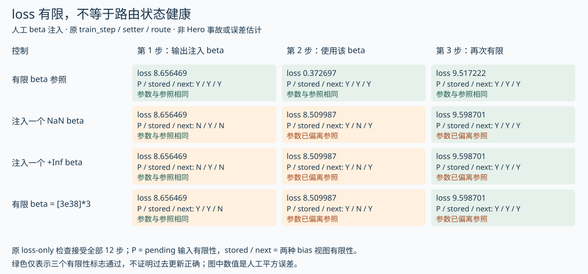

# loss有限，为什么更新仍可能损坏

上轮确认日志存在阶段与视图差异。这轮继续检查训练循环的失败边界：明确的数值检查只看`train/loss`；它不能替代对更新、状态或几何约束的验收。先发生更新异常，后发生loss变化的案例尤其容易被这种检查漏掉。

核对固定来源[train_hero_ep.py](sources/scale_2026_10_05/train_hero_ep.py)中的主循环try/except/else/finally。新增[17项控制流探针](scripts/probe_failure_loop.py)，执行原AST片段，替换训练步、callbacks、checkpointer、JAX同步与事件范围。结果在[原值与事件记录](analysis/failure_loop_probe.json)。没有真实GPU、autodiff、checkpoint I/O，也没有穷举外部callbacks/kernel中可能另有的检查。

## 检查发生在更新之后，保存之前

本循环依次执行：取batch与可选diagnostic → 调train_step并接收next_state → current_step读取新state.step → 发TRAIN_STEP_FINISHED → 检查本步loss有限 → 普通callbacks → checkpoint.on_step → 下一轮。

正常退出时，else强制执行末步callbacks和checkpoint，并等待保存结束；发生异常则except记录并重新抛出，跳过该强制末尾路径；finally仍发TRAINING_FINISHED。

三个事件不要混同：TRAIN_STEP_FINISHED早于loss检查，表示这一调用已返回并等待了loss；TRAINING_FINISHED也会在失败时发出；checkpoint.on_step只证明到达交接调用，不能证明内容有限、写入提交或恢复通过。

## 人工故障逐项对应源码行为

|人工输入或故障|实际原循环片段行为|证明范围|
|---|---|---|
|一正常步后结束|普通callbacks/save交接后，再强制末步callbacks/save并wait|这是调用顺序，fake recorder不实现真实频率/去重/写盘|
|本步loss为NaN|state.step已到1，发finished后抛错；未调用本步callbacks/save或强制末尾save|不是更新前阻断，也没有回滚next_state|
|loss=2，但next_state参数为NaN|没有抛错；callbacks与save recorder看到了NaN状态|有限loss这一检查不检查next_state参数；不能断言真实backend已提交坏文件|
|第一步更新为NaN，第二步loss才NaN|第一步先交接state.step=1；第二步在state.step=2抛错|晚发现不能证明之前交接的state健康|
|参数每步缩小7倍，下一loss=9.14但仍有限|两步均不触发finite guard，普通/强制交接照常|有限值检查不检测有限的范数塌缩或有限loss尖峰|
|callback或save交接抛错|日志记录异常，不再走强制末尾重试|不证明资源已清理或异步写入状态已恢复|
|diagnostic先抛错|没有调用synthetic train_step，state.step仍为0|异常可发生在优化器之前；真实设备状态未测|

主循环只有一处显式isfinite调用，对象是train/loss。这是本次审查片段的事实，不能扩大成“整个仓库没有其他数值防护”。实际训练可能配置自定义callback，也可能由kernel/runtime报错；本地没有验证它们的覆盖率。

## 为什么三个检查互不替代

|检查|能抓住的例子|抓不住的例子|
|---|---|---|
|loss是否有限|已传播到当前前向的NaN/Inf loss|当前更新才损坏；有限loss尖峰|
|更新和状态是否有限|NaN/Inf update、参数或moment|#8073报告的有限范数缩小、错误方向、错视图/错计数|
|更新几何与完整状态一致性|范数不变量违例、同输入更新不一致|未经确认的数据/评估口径变化；长窗能力退步|

历史[#8073](MUON_GEOMETRY_ZH.md)曾报告参数范数150.73降到21.41、下一步loss到9.14；这些值本身都有限。因此不能从“finite检查存在”推出它能抓住那种事故。不过该案例在另一条训练路径，不能据此断言535B生产循环已发生或漏检同一故障。

[离线事故检查器](scripts/analyze_optimizer_bundle.py)可检查明确全局叶的非有限计数、几何差异与分母一致性；它不在训练循环中自动拦截，也不决定接受、跳步或回滚。

## 数值验收需要自己的水位

此前[checkpoint提交分析](CHECKPOINT_COMMIT_ZH.md)区分训练步、交接、metadata可见和真实恢复。现在需补一条独立的**拟议数值验收水位**：哪个状态已通过明确列出的数值与更新检查。它不能由state.step、finished事件、checkpoint metadata或读回成功自动推定。

|拟议记录|应保留什么|没有证据时|
|---|---|---|
|trained step|输入进度、输出state.step与日志step|不称为健康状态|
|numerically checked step|参数视图、检查对象、组轴、容差、原值和通过项|保持unknown，不用有限loss代填|
|save handed-off step|候选state摘要与交接时刻|不称为已提交|
|metadata-visible step|提交标记与该次对象绑定|不称为数值健康或可恢复|
|restored step|读回内容身份与同输入一步更新对照|不由“发现目录”代填|

[数值状态记录](templates/numerical_acceptance_record.json)保留全部为空；这是建议检查方案，不是Marin当前实现的新增机制。保存前的检查也可能增加同步与归约成本，需按[监控成本](OBSERVABILITY_ZH.md)测量。

不要直接把“发现异常”改为“跳过这一步”。moment、scheduler、loader/cursor、pending QB、EMA和state.step的推进必须有明确语义，跳更新与重放数据也会改变有效配比/曝光。没有同起点状态轨迹验证时，跳步只能叫新的干预策略，不能叫已证明无损的修复。

原train_step的JIT声明donate_argnums=(0)。[JAX官方buffer donation说明](https://docs.jax.dev/en/latest/buffer_donation.html)解释了输入buffer可能被复用、之后不应继续使用。因而保存一个Python旧state引用不代表其设备buffer仍可用于回滚；是否成功复用取决于实际编译和形状条件。本轮没有执行donation或设备恢复；建议回退以内容绑定、已核对的checkpoint为依据，再验证数据与下一步状态接续。

这轮允许的结论是：在所审查循环中，“loss有限”和“步已完成”不是完整状态健康证明；失败路径抑制强制末尾save有明确控制流依据；早期检查应分清非有限、几何和状态一致性。是否出现过污染提交、哪个真实checkpoint可恢复，仍需原训练事故包与实际恢复记录。

## V113：loss一直有限，路由异常也可能经过保存恢复

V34以人工state recorder定位了主循环的loss-only检查边界；V63执行原QB setter，看到单个非有限pending会经中心化传播，但没有执行后续专家目标；V111接上了原训练步与真实恢复。这轮进一步让原训练闭包、setter、路由块、真实Adam和本地OCDBT处理异常pending，核对“异常是否必然让下一次loss变成NaN”。本控制中，答案是否定的。

[13项CPU控制与逐步原值](analysis/pending_finite_gap_cpu.json) · [执行输出](analysis/pending_finite_gap_cpu_output.txt) · [脚本](scripts/probe_pending_finite_gap.py)。原beta估计器被人工输出替代，没有证据证明真实Hero估计器产生过这些值，也没有读取真实Hero异常checkpoint。

### 一条实跑的三步路径

沿用V111的人工三专家模型、固定logits、平方误差、真实Adam与独立EMA缓冲区。四组控制只改变第一批输出beta：有限参照`[0,3,0]`、单NaN、单+Inf，以及三项均为有限float32的`3e38`。第二、三步输出beta恢复为共同有限值。输入beta作为模拟估计器输出，是本实验明确施加的故障，不是从生产记录发现的异常。

|阶段|有限参照|注入NaN或Inf|说明|
|---|---|---|---|
|第1步结束|loss 8.656469；params、pending有限|同样loss、同样params；仅pending叶非有限|新pending尚未参与这一步前向，loss不会检查它|
|第2步结束|loss 0.372697；bias有限|loss 8.509987；params与EMA的router bias非有限，Adam moment有限|异常bias可改变专家选择，但不一定将非有限值直接乘进专家输出|
|第3步结束|loss 9.517222；状态全部有限|loss 9.598701；状态也全部有限，但参数已不同|有限beta替换bias不等于撤销上一步参数与moment的变化|

12个实际训练步全部通过归档循环的原`not jnp.isfinite(metrics['train/loss'])`判定。这里只执行原判定表达式，不把它扩大为完整生产loop、callback或所有安全检查的验收。第3步状态恢复有限，也不能证明此前训练轨迹正确；只截取这一时刻做finite检查会漏掉已发生的更新分歧。

为何会出现这种情况？[归档路由块](sources/routing_2026_10_05/grug_moe.py)中，bias影响top-k专家选择；combine权重来自未加bias的logits。人工输入logits及所选专家输出都有限，因而非有限bias仍可能得到有限权重与有限平方误差。NaN/Inf下的具体top-k选择是本JAX CPU运行的观察，不能承诺其他backend具有相同选择规则，也不能将这种选择视为有效路由。

本轮训练闭包和setter来自冻结`eee467…`入口；route块沿用固定路由归档，形状/模型由V111适配。没有将这一组合声明为某次线上Hero进程的完整执行版本。

### Pending有限，也不保证应用后的bias有限

三项beta都为`3e38`时，输入pending与第1步全部状态叶均有限。但原setter先取负、求均值、再中心化；本CPU中float32中间归约溢出，得到三个+Inf bias。相同实数beta在精确算术中应中心化为零，这个对照暴露的是有限精度运算边界。

这意味着，单查pending有限性或单查保存时所有state叶有限，也不够覆盖“派生的下一次前向视图”健康性。此控制的第2步确实产生非有限stored bias且loss仍有限。`3e38`是故意设置的极端诊断值，不是Hero beta量级的观测；本轮没有修改中心化算式，也没有把另一种归约顺序称为生产等价修复。改变浮点路由算术还需检查专家ID、阈值、梯度与设备策略。

### 存储忠实保留异常，不负责判定它是否能训练

对单NaN与单Inf控制，取第1步结束状态，用原host serializer写入真实本地TensorStore/OCDBT，等待commit，手工发布metadata，再调用原Grug恢复策略和原tree/leaf reader。11个叶的二进制摘要在写前与恢复后完全相同，包含异常pending；随后执行原下一训练步，仍得到有限loss与非有限stored bias。

这是本地存储往返的实际结果；没有调用生产checkpointer调度器、分布式publisher或真实故障自动恢复。它不能证明Hero提交过异常状态，却说明数组读写成功、值忠实、manifest完整与训练状态健康是不同验收层。TensorStore不应被当作模型数值校验器。

### 一个尚未集成的有限性诊断候选

[局部JAX候选](scripts/candidate_qb_health_flags.py)返回三个标志：原pending、stored bias和原setter产生的next-forward bias是否有限。输入都由调用方明确提供，不重写setter、不静默置零，也不修改state。

本轮实际JIT执行该候选：有限参照三步均通过；三组异常控制的第1、2步均被标出；第3步又通过，但参数仍不同于参照。这最后一项限制同样重要：**有限性诊断只能发现当下特定异常，不能证明更新正确或恢复等价。** 还需共同起点/共同数据的下一次更新对照，以及必要的范数、路由和任务指标。

候选状态为`candidate_not_integrated`。它没有接入生产loop、定义跳步/回滚策略、实现多rank一致终止或测量GPU开销。若准备集成，应将当前pending、实际前向视图和本步新pending分别绑定时刻，决定在哪个同步边界汇总诊断、拒绝保存或终止；不能检测到异常就擅自清零、跳更新或继续保存，那会改变状态、数据游标和有效曝光。

本轮实际Hero非有限事件、原QB估计器异常输出、生产污染checkpoint、GPU与分布式守卫覆盖、候选开销仍为空。下一步需要真实checkpoint/事故包或原估计器输入边界实验，才能判断这些反例在实际训练中是否可达。

## V131补证：保留原错误有条件

前文“跳过最终保存以保留根因”描述的是except分支意图；logger和最终事件都成功时，本地控制确实保留原异常。新增双故障控制发现：日志或finally事件再次抛错，会改变最外层异常，原错误仍在context中。原保存作用域也会在保存体失败时发CHECKPOINT_FINISHED；最终else分支失败不经过前面的fatal日志。详见 [异常链与恢复归因](EXCEPTION_PROVENANCE_ZH.md)。这是固定源码上的人工故障，不是历史Hero事件证据。
