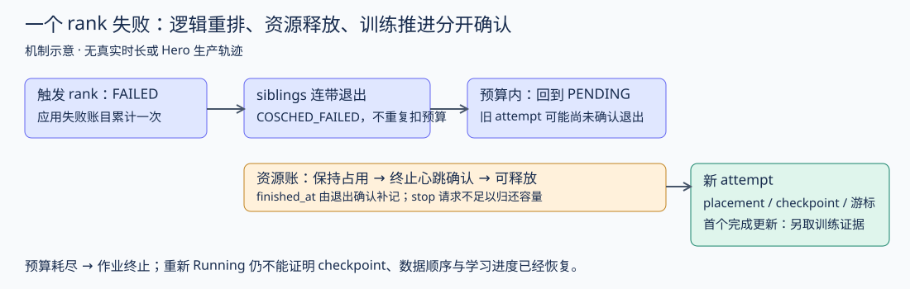

# 一个 rank 失败以后：重试、连带退出与资源归还

本章沿 V101 的退出分类继续向下追：Pod 被归类以后，谁消耗重试预算，其他 rank 怎么退出，调度器何时才能重用资源。对象是固定 main `eee467718515b2383fc3a433014afce4ab075b05` 的 Iris。它能解释该版本的恢复合同；实际 Hero 部署 SHA、真实重试参数与每次恢复记录仍未取得。

## 为什么“重新 Running”不够

分布式训练需要多个 rank 一起完成 collective。一个进程退出后，其他进程可能仍持有 GPU、等待通信或等待退出指令。控制器既要重排整个 gang，又不能让一次根故障被算成四次应用崩溃，更不能仅凭数据库状态已改，就把尚未退出的进程占用资源分给新任务。

这里至少有三种身份：job 是整个作业；task 是一个逻辑副本；attempt 是它的某次执行。重试后 task 可以再次 PENDING/RUNNING，旧 attempt 仍应保留。训练 step、checkpoint 和数据游标则属于另一层：调度器没有据此证明模型恢复到哪里。

## 三本账，不能合并成“失败次数”

|事件与范围|该版本的账目规则|为什么这样区分|
|---|---|---|
|应用 FAILED 的 attempt|消耗该 task 的 failure 预算，并进入 job 累计 FAILED attempt 数|反复应用崩溃即使分散在不同 rank，也需要总止损|
|PREEMPTED/WORKER_FAILED 的执行失败|按 preemption 预算处理；ASSIGNED 阶段交付失败还有单独规则|交付未成与已经执行后被抢占不是同一情形|
|其他 rank 因 coscheduling 被连带停止|旧 attempt 记 COSCHED_FAILED；不计成应用失败或抢占|一次触发故障不应按 gang 大小重复收费|
|控制器要求停止，但 worker 尚未确认|旧 attempt 的 finished_at_ms 可以仍为空，资源占用继续计算|发出 stop 不等于进程已经释放资源|

task 的失败是否超过可重试次数，使用 `failure_count > max_retries_failure`；job 累计止损使用 `total_failures > max_task_failures`。例如 job 上限 2，累计第 1、2 次 FAILED 仍在预算内，第 3 次越界。这个上限不表示“最终允许缺两个 rank”：当所有 task 都终止而非全部成功时，作业也会失败。实际参数必须从真实提交请求取得，不能把测试参数当成 Hero 配置。[task 规则](https://github.com/marin-community/marin/blob/eee467718515b2383fc3a433014afce4ab075b05/lib/iris/src/iris/cluster/controller/task_state.py) · [job 汇总规则](https://github.com/marin-community/marin/blob/eee467718515b2383fc3a433014afce4ab075b05/lib/iris/src/iris/cluster/controller/reconcile/job.py)

## 上游测试具体在保护什么

|上游场景|断言的行为|对应的工程风险|
|---|---|---|
|四 rank，每轮不同 rank 崩溃；每 task 可重试 5 次，job 上限 2|前两轮 job RUNNING，第三轮 FAILED；每 task 失败次数至多 1|只看每 rank 预算会让轮流崩溃永久重启|
|一个可重试 FAILED，其他 rank 连带停止|触发 task 的 failure_count=1；其他 task 的 failure/preemption_count=0，回到 PENDING|把 collective 的受害者也当根故障，导致重试预算提前耗尽|
|一个 rank 终止，引起其他 rank 终止|触发 worker 的资源释放，其他 worker 的占用仍保留|逻辑终止过早归还容量，会让新旧 attempt 竞争同一资源|
|取消 job，随后才收到 worker 的终止心跳|取消先改变 task 状态，心跳再完成 attempt 的终止记录|“取消成功”与“容量已经回收”不是同一个时间点|
|新 attempt 已 RUNNING，旧 attempt 晚报 SUCCEEDED|旧消息不改变新 attempt 的状态|迟到的成功消息可能把正在恢复的任务误判为已完成|
|同批次既有 sibling 更新又有故障级联|级联结果不能被同一批的旧快照更新覆盖|处理顺序会造成幽灵 RUNNING 或错误终止|
|可恢复 gang 被重排|测试检查重新落入同一 coscheduling slice|单个 task 可调度不等于整个 gang 已满足共同调度约束|

这些是原测试定义，不是新增事故清单。[完整上游测试](https://github.com/marin-community/marin/blob/eee467718515b2383fc3a433014afce4ab075b05/lib/iris/tests/cluster/controller/test_transitions.py)。本地执行状态与选中 nodeid 以 [运行记录](analysis/gang_recovery_native_tests.json) 为准；测试内的 worker、故障文本 OOM 和资源值都是构造输入，没有复现真实 GPU OOM、网络通信或 Kubernetes 驱逐。

## 从故障通知到有效训练：两条时间线

task 进入 PENDING，是逻辑上需要重排；旧 attempt 尚未完成，是物理容量尚未确认可用。这两个状态可以同时成立。收到旧 attempt 的退出确认并释放资源，也仍不等于新 attempt 已恢复训练。需要另查新 attempt 选中的 checkpoint、optimizer 状态、数据游标和首个完成更新。

因此采集恢复轨迹时，按 `(job_id, task_id, attempt_id, worker_id)` 关联，保留分类原证据、触发 rank、连带 rank、计数前后值、stop 请求、退出确认与 finished_at、重新 placement。再把新 attempt 绑定到 checkpoint 提交身份和实际完成 step。只记录一个“restart 时间”会混淆等待退出、等待资源、加载 checkpoint 与恢复后首次更新。

## 怎样用于配比研究

配比切换后 loss 跳变，先检查跳变窗口是否跨 attempt 或恢复点。旧曲线末端和新曲线开端可能包含重放数据、停机间隔或不同状态，不能只按墙钟拼起来。当配比修改与基础设施重排同窗发生时，当前观察不足以分别估计两者影响。

建议每个窗口同时给出共同完成 token/update 预算、固定评估、停机时间与 checkpoint 后重放区间。失败后仍可用的数据应保留 attempt 身份；已经完成但未提交 checkpoint 的更新，不应直接假设能在恢复状态中保留。该分析是研究管线建议，尚未取得 Hero 的逐 attempt checkpoint/游标对照。

评审规则可落为三个问题：失败预算是否区分触发者与连带者；容量释放是否有退出确认；恢复推进是否有完成更新和游标证据。缺任何一项，分别留下计数未知、容量待确认、训练恢复未验证。不要用 job 的 RUNNING 状态替代这三个答案。

### 如果最后一次退出回报丢失

容量保留也有另一面：如果只扫描 RUNNING task，已经被取消却没收到最终心跳的 attempt 会永远漏在外面。当前 `load_reconcile_rows` 按 worker 绑定与 `finished_at_ms IS NULL` 取行，刻意不只筛活跃 task；终止 task 的未完成 attempt 也能再次进入 reconcile。原测试用构造的“worker 找不到任务”观察核对补记 finished_at，且不改写 task 已有的终止状态。这解释为什么晚到的消息有两种处理：旧 attempt 的状态不能污染新 attempt；当前仍未确认完成的 attempt，其退出确认却不能随便丢掉。[原查询与说明](https://github.com/marin-community/marin/blob/eee467718515b2383fc3a433014afce4ab075b05/lib/iris/src/iris/cluster/controller/reads.py)

本地 SQLite 场景验证的是这些事务与汇总规则，不包含 RPC 丢包、真实心跳周期或整个 controller 长时间运行。没有 attempt 记录就无法判断一次等待是合理的容量保护，还是迟迟没有补齐确认的残留占用。

### 本地执行怎样复查

本轮原测试 **33 项通过、91 项未选中，pytest 报告用时 1.70 秒**。依赖准备约 14 分钟，不计作测试执行时间。源码及测试来自同一固定提交的完整 checkout；本章使用上游原 `test_transitions.py`，没有提取函数或重写测试。`state` fixture 创建临时目录中的 `ControllerDB` 与 `ControllerTestState`；观察通过原 reconcile/commit 路径写入，再查询 task、attempt、job 和资源使用。不是完整生产 controller 服务循环，也没有真实 worker 进程。[fixture](sources/gang_recovery_2026_10_07/lib/iris/tests/cluster/controller/conftest.py) · [原观察驱动](sources/gang_recovery_2026_10_07/lib/iris/src/iris/testing/transitions.py)。

使用上游冻结 `uv.lock`，保留默认排除 `slow/docker/requires_cluster/manual` 的 marker 表达式，仅选择相关本地测试并把 xdist 改为单进程。初次未冻结依赖同步在解析阶段停止，随后改用已归档的 lock；没有修改上游代码。依赖版本、命令、用例身份和原 pytest 输出均保存。本机环境能否执行、选中用例是否通过与生产恢复可靠性是不同证据层级。

[恢复轨迹空模板](analysis/gang_recovery_trace_template.json)列出事件身份、观察时间、预算前后、终止确认与训练恢复字段。模板没有任何实际事件；观察时间与事件时间分别记录，避免用收集日志的时间替代故障发生时间。

下一步应优先补控制器进程退出后重开 SQLite 的恢复场景，以及真实 attempt 的退出确认和 checkpoint/游标轨迹。本轮局部事务测试没有测试控制器崩溃重启或长时失联，也不给出事故发生概率。

V103 已沿下一步执行原控制器重开与备份恢复测试，并补坏备份/缺失目标/部分发布故障控制。正常 stop 后重开得到证据，强制杀进程与真实训练恢复链仍未覆盖。详见 [控制器恢复](CONTROLLER_RECOVERY_ZH.md)。
