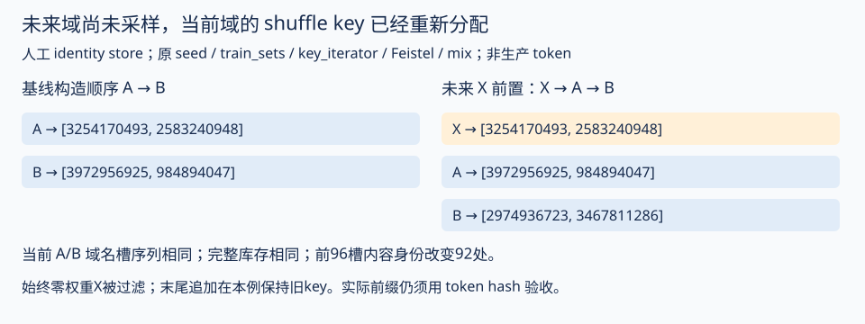

# 混合数据的映射身份：同key、同配比与实际样本

## 1. 同key、同配比为何仍不一定是同一条数据流

前文的逻辑索引合同依赖“共同数据映射”。这轮把这项条件拆开验证：执行归档`MixtureDataset`的原类体，以及原`_compute_block_assignment`，使用真实JAX 0.7.2 CPU的`fold_in`与`permutation`。AsyncDataset基类、StopStrategy容器、local_cpu_mesh和立即完成future替换成最小依赖，子dataset是有限identity store。没有导入完整Levanter模块，也没有执行实际inner shuffle、packing、token store、GPU或checkpoint恢复。[原混合源码](https://github.com/marin-community/marin/blob/84869ae8c91ffe64e9f761c5bd714542eb1876e0/lib/levanter/src/levanter/data/mixture.py)

人工block_size=8，A/B各占一半；每域身份为`域名:库存索引`。首先核对同一窗口拆成不同get_batch请求、非排序请求与重复索引：返回身份都按请求对应。说明下面差异来自映射条件变化，而不是仅改变取数请求分组。

|改变的条件|保持的条件|原类执行结果|可以解释什么|
|---|---|---|---|
|key由7改为8|A/B整数配额、库存、24个混合索引|完整3块的身份多重集相同，顺序不同；前3槽的多重集不同|完整块和边缘窗口需要分别核对|
|dataset插入顺序A/B改为B/A|同key=7、各域每块4条、相同库存与24索引|完整窗口身份多重集相同，排列不同|只有名称权重和key，还不足以重建相同序列|
|等权A/B/C的插入顺序改为C/B/A|同key、block=8、三个浮点权重相同|ABC计数4/2/2，CBA计数4/2/2；余数接收者由A变C|整数余数与并列argmax还依赖有序dataset_index|
|每域库存长度3改为4|同key、配比、24混合索引|取模后的身份不同|库存长度是映射身份的一部分，不能只保存dataset名称|
|同长度库存的内部映射反转|同混合索引、key、配额|所有子索引读取另一组人工身份|相同cursor不能代替内容版本/hash|
|从混合索引16起只读A|前16槽A/B各一半、key与库存|前16槽逐项相同，后8槽读取A:8至A:15的一个排列|阶段变化仍承接已消耗的域内累计offset，不从A:0重新开始|
|有限库存为空|restart策略|原路径抛出空有限dataset的ValueError|空库存应在训练前验收，不用有限loss替代数据条件|

插入顺序进入两处计算。构造器从过滤后的datasets字典建立`dataset_index`，打包ID的高16位是该有序列表的位置；先按此顺序生成未排列数组，再执行真实JAX排列。因此，同一个随机key只是对当前数组排列的控制，不能保持更换数组后的域身份。计数规则则先截断每域的weight×block_size，再把余数加给计数最大项；出现并列时`np.argmax`取最先项，插入顺序会决定余数归属。

不能在恢复时直接“统一排序字典”作为修复：排序本身可能改变既有映射。应保存实际有序dataset_index和打包数组摘要；新规则在新配方中明确版本化，并用同checkpoint输入重放核对。这里的小块等权反例没有外推成生产200桶的偏差幅度，也没有认定Hero字典顺序实际发生过变动。

有限restart子域的逻辑索引经`index % async_len()`落到库存。这次24槽、A/B各12次，库存各3条时只有6个不同身份，每个身份出现4次。总曝光24与独特库存6是两个量；相同总曝光可能包含更多重复，不能仅由loss下降判断增加了多少新知识。人工store的身份不是文档、token或独立语义样本；真实去重、序列切分与inner shuffle还需绑定。[去重与库存](DEDUP_FILTERS_ZH.md)

配比/顺序评审因此新增五项：实际有序域列表；过滤后支持范围与每块整数计数；未排列打包ID和key摘要；子域有限性、库存长度与内容版本；窗口内实际身份/token hash及重复分布。完整块可比较多重集，边缘块还要比较实际读取槽位。报告14项检查只证明人工共同映射下的这些关系；真实Hero映射仍为空。

[14项真实CPU与源码控制](analysis/mixture_identity_cpu.json)保留两组完整排列、部分窗口、并列计数与取模流。[脚本](scripts/probe_mixture_identity_cpu.py)使用已有[CPU依赖](requirements-cpu-numerics.txt)，执行`make mixture-identity CPU_PYTHON=/你的环境/bin/python`。它承接[加载器恢复](BATCH_CLOCK_ZH.md)，把“从哪里恢复”继续追到“同一个位置究竟读到什么”。

## V54：桶内排列和训练/验证切分还依赖什么

上节的identity store固定了子域内部映射；这次继续执行原`PermutationDataset`、`SlicedAsyncDataset`、`BlockShufflingDataset`类体与原`_split_into_trainval_sets`函数，并补取同一固定代码版本的[_prp.py](https://github.com/marin-community/marin/blob/84869ae8c91ffe64e9f761c5bd714542eb1876e0/lib/levanter/src/levanter/data/_prp.py)。PRP函数与类体原样执行，真实JAX CPU负责生成key和种子，原NumPy实现负责Feistel/linear索引映射。替换AsyncDataset基类及slice构造接口、CPU mesh上下文和有限identity store；不是完整模块导入或实际缓存读取。[新增源码来源](analysis/prp_acquisition.json)

|控制|原代码执行结果|对实验的含义|
|---|---|---|
|Feistel与linear，长度1至65|130个小域控制全部是双射|核对这些域内无重复/漏映射；不是对任意库存长度的证明|
|长度22，IO block=4，window_blocks=3|映射完整覆盖0–21；最后2槽只含20、21|尾块保留在最后，只在尾部内部排列；不能把这种层次shuffle当作全库存任意排列|
|同长度、key、窗口设置，独立构造|映射逐项相同；重复/乱序请求按映射返回|在此固定人工快照下可重建，不代替真实缓存身份|
|window_blocks从3改为2|同key和库存下，整体序列改变|窗口配置属于数据流身份，不只是IO性能参数|
|库存长度22变23|尾部映射改变|数据增长会改变排列范围；相同key不能固定所有已有槽位|
|同一22条快照，从训练库存拆4条validation|独立构造得到相同切分；train/val互斥并覆盖0–21|固定key在相同快照上确实支持这条接口合同|
|用23条快照重新切validation|新validation与旧train交集为人工身份1|同seed跨快照不保证留出身份不变；这是可复现控制，不是实际Hero泄漏|
|关闭split前shuffle|最后4条18–21进入validation|顺序结构会决定留出内容；随机与位置切分需要分别记录|
|负索引和长度端点22|原block shuffle分别抛ValueError/IndexError|索引边界有明确拒绝，不能静默当作restart取模|

**最新10月7日归档声明`num_validation_sequences=None`。** 归档LM数据构建代码只有设置该字段，才从train库存拆出validation；这次人工跨快照交集不能用来认定Hero训练污染了验证集。Paloma的外部语料重复与去重问题是另一条证据链，也不能由索引互斥证明不存在。[评估身份](EVAL_IDENTITY_ZH.md) · [去重范围](DEDUP_FILTERS_ZH.md)

切分函数使用固定key=0，先对当前库存长度建立Feistel映射，再按当前length−num_validation_sequences切片。它保证独立构造train和val时采用相同排列，前提是两次看到同一库存长度、顺序和映射实现。数据快照改变后，排列域与切分边界都可能改变；“仍使用seed 0”不足以保持验证身份。人工交集只说明旧train/new-val的身份重叠，不是同一次切分内部重叠。

层次block shuffle先打乱完整IO块，再在若干块组成的窗口内排列样本；最后不完整块保持在末尾。这是IO局部性与排列方式的选择。如果训练预算只覆盖一段前缀，就应检查这个前缀实际覆盖了哪些文档、质量桶与尾部；不能只比较完整库存计数。这次仅验证索引身份，没有测磁盘吞吐、缓存质量分布或模型loss。

配置顺序也需要保留：归档train_sets先拆train/val，再做训练shuffle，然后按experiment_budget/target_budget截断，最后按max_train_batches截断。这些是方法体内的分支顺序，不代表各字段能同时配置：原__post_init__禁止模拟预算与num_validation_sequences/max_train_batches并用。预算截断作用在shuffle后的逻辑前缀；改预算、窗口或缓存长度可能同时改曝光身份。最新声明experiment_budget和target_budget均为None，因此这里只给出配置迁移的核查位置，没有把预算截断归因于Hero曲线。

对自己的实验，可以把“数据身份”记录成一条可重放链：缓存内容与长度 → 切分身份 → 训练shuffle算法/key/窗口 → 截断范围 → 混合域ID/配额 → 恢复next offset → 实际token/hash。验证集固定后，数据增长应明确采用冻结留出清单或重新定义评估版本；重新切分的曲线不能自动与旧曲线作同样本比较。若样本内容可重复，仍需文档/token层去重检查，序列索引不相交只是一层条件。

[14组CPU与源码控制](analysis/inner_shuffle_cpu.json)包含130个PRP小域检查，以及完整人工排列、两份切分身份、交集、配置声明和四份源码SHA。[脚本](scripts/probe_inner_shuffle_cpu.py)使用已有[CPU依赖](requirements-cpu-numerics.txt)；执行`make inner-shuffle CPU_PYTHON=/你的环境/bin/python`。实际Hero inner shuffle、split leakage、token store和GPU/TPU结果仍为空。

## V55：小规模实验的库存缩放，是否真的保持重复曝光率

配比实验常希望用较小训练预算，模拟生产训练的每域曝光轮数。归档`LmDataConfig.train_sets`有对应接口：当experiment_budget和target_budget都非None时，令r为二者比值，在train/val切分和训练shuffle之后，对每域保留`int(length×r)`条逻辑序列，再应用可选max_train_batches截断。[原方法](https://github.com/marin-community/marin/blob/84869ae8c91ffe64e9f761c5bd714542eb1876e0/lib/levanter/src/levanter/data/text/datasets.py)

此次执行原train_sets函数体，复用前两节的原PRP、slice与mixture类体。同时执行原__post_init__约束。缓存构造返回人工identity store，AsyncDataset提供人工同步长度桥；生产key_iterator替换为明确记录的fold_in key序列。没有执行完整LmDataConfig初始化、真实tokenization或模型训练，不能据此确认生产key分配或收益。库存单位均为人工序列，不是loss有效目标或独立文档。

人工参考预算96个混合槽位，A/B各占一半；小实验预算24，r=1/4。原mixture返回两域参考各48次、小实验各12次，名义曝光比例确实缩小了四倍。但库存截断改变了重复率：

|原函数控制|结果|含义|
|---|---|---|
|A库存7，B库存23，r=1/4|保留A:1条、B:5条|逐桶取整，不是整套库存统一抽足25%|
|参考A曝光48/库存7，小实验A曝光12/库存1|6.857轮变12轮，相对高75%|名义预算比正确，A重复率仍不匹配|
|参考B曝光48/库存23，小实验B曝光12/库存5|2.087轮变2.4轮，相对高15%|同一个r对不同域产生不同取整误差|
|A库存3，B库存23，r=1/10，A/B仍正权重|A保留0条，原restart混合拒绝空有限dataset|预算比大于0不保证每个活跃域可训练|
|先shuffle23条，再r=1/4|保留真实原排列的前5条，不是原库存0–4|预算截断选择的是当前shuffle后的逻辑前缀|
|绕过初始化：23条先拆4条validation，再r=1/4|方法体内训练库存19条再截成4条|正常__post_init__拒绝这组字段；只验证函数分支，不是可用配方|
|绕过初始化：23条r=1/2，再max_train_batches=2、initial_batch=4|方法体内先截11条，再截8条|正常__post_init__拒绝此组合；未声称生产可以两种cap并用|
|experiment_budget大于target_budget|原方法ValueError|已有顺序约束|
|experiment_budget=0且target_budget=0|原__post_init__未拒绝；随后方法出现ZeroDivisionError|原初始化与方法边界控制；未核对外层配置解析/launch检查|
|max_train_batches存在，但无initial_batch或要求超过库存|原方法assert拒绝|上限按initial_batch换算序列数；不等于动态batch历史累计|

**先验收完整入口，后解释函数内部。** 原__post_init__明确要求：如果max_train_batches或num_validation_sequences非None，则experiment_budget和target_budget必须都为None。检查器正常调用先执行该原约束；上表两个组合另行显式绕过初始化，用来核对方法分支，并保存初始化拒绝结果。不能把这些分支控制推广成合法配置。

连续理想条件是：曝光E变为rE，库存A变为rA，因此E/A不变。代码库存为n=floor(rA)，当n大于0且名义曝光恰好按r缩放时，重复率的相对倍数成为`rA/n`。差异为`(rA−n)/n`，小库存更敏感；实际混合整数配额和部分边缘块还可能造成曝光端的额外偏差。若n=0，不能再用这条除法估计“轮数”，需要先解决可行性。

不要把所有0库存自动抬到1当作修复：这会另改小实验的库存占比、重复率和内容选择。评审应先拒绝或显式重新设计此条件，保留实际保留数与误差；可选择增加pilot预算、调整缩放方案或单独分析稀有域，但每种方法都改变实验合同。即使取整误差很小，缩小库存也减少内容多样性，配比排名仍可能随模型规模、训练阶段、重复次数和跨域迁移变化，不能把“曝光轮数接近”当作生产收益已证明。

据此做配比研究，至少拆开两类干预：在共同库存上改权重，测新增曝光和供体退步；在共同权重上改库存/去重，测内容多样性与重复曝光。然后固定同一评估身份，在额外预算上确认候选，并用独立随机性观察排序是否稳定。若同时改权重、库存截断、shuffle窗口或恢复状态，loss差异只能归于这个完整组合，不能单独归于新配比。[供体与预算](TRANSFER_GUIDE_ZH.md) · [选择确认](CHANGE_REVIEW_ZH.md)

最新10月7日归档的experiment_budget与target_budget均为None。这节提供小实验设计和配置迁移的检查，**不是Hero实际发生预算截断或重复率事故的记录**。也未测模型loss、真实每桶库存或生产重复率。

[16项原CPU与源码控制](analysis/budget_inventory_cpu.json)保留人工参考/小实验输入身份、两域曝光、截断顺序、错误类型与依赖SHA。[脚本](scripts/probe_budget_inventory_cpu.py)要求已有[CPU依赖](requirements-cpu-numerics.txt)，执行`make budget-inventory CPU_PYTHON=/你的环境/bin/python`。它使用原方法与显式依赖适配；实际pilot模型结果、生产重复率和token store仍为空。

## V90：桶名验收在哪一层，缺失的权重会流向哪里

V53已经验证顺序、库存与key怎样改变身份。这次转向入口边界：声明的权重桶必须实际存在，这项检查究竟由谁负责？执行固定版本 `b65be4c…` 的完整 `MixtureDataset` 原类体、原块排列函数和真实 JAX CPU；依赖仍是本章说明的最小适配，子数据集返回人工身份。另执行 `LmDataConfig.__post_init__` 原函数体。该版本完整 datasets.py 的实时下载与已有归档逐字节相同，保留旧来源记录，新增[版本绑定记录](analysis/mixture_support_source_binding.json)。没有导入完整训练模块、读取真实缓存或恢复训练。

**底层类接受一个缺失桶的正权重，不等于正常训练入口允许桶名拼错。** 原配置初始化已经要求所有权重键属于 components，包括零权重键和每个阶段。Harrier 的原 spec 校验进一步要求每阶段权重键集合与库存集合一致。它们是实际存在的保护，应在工程分析中保留；不能只截取底层函数，宣布生产存在缺失桶事故。

|人工输入与调用路径|原代码执行结果|对应判断|
|---|---|---|
|实际子域A/B；权重A=0.4、B=0.4；block=10|归一化后各5条|已知域之间重新归一化|
|直接构造底层类；增加不存在的TYPO=0.2|A=6、B=4；原get_batch实际返回6个A身份|缺失份额没有被明确报错，也没有按A/B比例分摊|
|同一缺失权重，实际子域顺序换成B/A|B=6、A=4|并列最大配额取首项，缺失份额归属受子域顺序影响|
|直接类；TYPO权重为0|仍A=5、B=5|不影响分母；正常配置入口仍拒绝这个未知键|
|直接类；唯一正权重属于不存在的TYPO|下游空数组argmax抛ValueError|错误发生在计数阶段，缺少明确的缺失桶定位|
|正常配置原初始化；TYPO未列入components|普通字典、阶段字典、零权重三种输入均拒绝|入口已有桶名检查，不能把底层反例当作正常可用配方|
|配置声明A/B/TYPO，但随后人工实际子域只有A/B|配置原初始化接受；直接底层类仍产生6/4|声明集合检查不等于最终子数据集集合检查；这是人工边界控制|
|先20槽只读A，再切到包含缺失权重的6/4配额|A从域内索引20至25继续；单条与批量读取一致|阶段累计索引与异常配额同时作用，并不会因切换自动重置库存|

原因可以沿着原函数调用顺序复核：先对整个权重字典求和并归一化；然后只为实际 datasets 中的名字计算整数配额；最后把总配额与 block_size 的差额补给最大整数项。TYPO虽没有子数据集，仍进入归一化分母。A/B各得到4条，共8条，剩余2条补给首个最大项A。正常入口中的未知键检查发生在此前，因而能挡住桶名拼错。上述6/4是人为小块控制，不是200桶Hero配比偏差的实测值。[混合类源码](https://github.com/marin-community/marin/blob/b65be4c9550c5097f0a3add08933531a1c24d534/lib/levanter/src/levanter/data/mixture.py) · [配置入口源码](https://github.com/marin-community/marin/blob/b65be4c9550c5097f0a3add08933531a1c24d534/lib/levanter/src/levanter/data/text/datasets.py)

对归档数据另做九组集合对照：spec、历史W&B、10月7日W&B各三个阶段，正权重名字全部存在于spec的 available_tokens。**这只能证明这些声明相容，不能证明生产进程实际构造并读取了全部子数据集。** 库存表也不是缓存内容或读取成功的证据。目前未发现Hero发生上述缺失桶问题；实际子数据集清单、token/hash、模型收益仍未知。

工程验收应放在缓存和子数据集构造完成以后。先计算每阶段正权重集合与实际子数据集集合的差集；差集非空时拒绝启动，并打印缺失名和权重。再核对实际有序域列表、有限性、非空库存、整数配额和归一化分母。非活跃域、validation-only零权重域可按既有入口合同保留；不要强求每个阶段使用全部域。新建检查器或调整底层接口属于建议，本轮没有修改上游代码。

直接把缺失桶删掉再归一化，会把原来的实验配方改掉；自动把余数补给其他桶同样改变曝光。应先查明名字迁移、缓存遗漏、split配置、构造过滤或用户输入中的哪一处造成差集，再决定修复配置还是显式定义新配方。只有真实读取身份已经确认，才适合进一步解释loss和调整配比。

把这条规则接入训练管线，可以保留四份清单：①声明components；②每阶段正权重支持；③构造后的实际子数据集及有序ID；④实际读取的身份摘要。前两份一致只是配置验收，第三份核对能发现构造层的差异，第四份才能接近执行证据。配额数和token内容还须分别核对。恢复训练时使用相同清单和映射版本，不能只比较seed与百分比。

[25项原类/入口CPU检查](analysis/mixture_support_cpu.json)保存实际人工读取流、错误类型、九组归档支持对照和依赖SHA。[可复现脚本](scripts/probe_mixture_support_cpu.py)：`CPU_PYTHON scripts/probe_mixture_support_cpu.py`，其中CPU_PYTHON替换为安装了[CPU依赖](requirements-cpu-numerics.txt)的Python路径。完整入口构造、真实缓存可用性、生产执行和loss因果验证仍未完成。

## V91：实际子域构造会报错、跳过，还是改变评估内容

V90要求核对实际子域，但普通缓存缺失是否真的会静默改训练配比？这次继续执行同版本 `LmDataConfig` 的 `_cache_items`、`_has_nonzero_weight`、`build_token_datasets`、`__post_init__` 原方法，以及原组件dataclass字段、原ConcatDataset和MixtureDataset类体。缓存到序列的 `dataset_for_component` 用有限人工identity store替代；格式默认值和组件注册基类用最小占位。没有执行build_caches的网络读取、分词、packing或完整配置解析。[同版本绑定](analysis/mixture_support_source_binding.json) · [数据构造源码](https://github.com/marin-community/marin/blob/b65be4c9550c5097f0a3add08933531a1c24d534/lib/levanter/src/levanter/data/text/datasets.py)

**普通训练缓存缺失已有拒绝路径。** 不能把V90的底层缺桶反例直接描述成“训练缓存少一个就会重配权重”。实际构造方法对活跃普通桶、非空concat的缺失训练子桶、缺train split的direct组件都报错；阶段权重取所有阶段的正支持并集，未来才活跃的桶也在最初构造时检查。永久零权重训练桶则跳过，是预期的过滤条件。

|原方法控制|实际执行结果|需要保存的合同|
|---|---|---|
|A/B正权重，普通B缺训练缓存|ValueError定位B|训练缺失应拒绝，别绕过已有保护|
|B当前零权重、后续阶段正权重，B缺训练缓存|cache items含A/B，构造仍拒绝B|验收全部阶段的正支持并集|
|B所有阶段均零权重，B缺训练缓存|训练构造只保留A|不要把合法非活跃域当成缺失活跃域|
|direct组件没有train split|训练ValueError；缺validation split时warning并省略|训练与验证的容错政策不同|
|concat有x/y两个子桶，只提供x训练缓存|训练ValueError定位A/y|非空concat已有逐子桶检查|
|同一concat只提供x验证缓存|验证长度3；两子桶齐全时长度6|顶层桶名未变，桶内部评估内容已改变|
|普通验证桶B缺缓存|验证返回A，省略B|仅核对总loss字段存在不能确认评估域集合|
|配置B为正权重空concat，A为普通缓存桶|原配置接受；cache items与实际子域均只有A|空children绕过逐子桶检查，仍需构造后支持验收|
|上述A/B权重0.4/0.6，block=10，接原MixtureDataset|整数配额变成A=10，实际10条全读A|声明合法也可能改变实际配比；仅人工空concat反例|

空concat的路径有明确原因：组件只声明 `children: dict`，原dataclass没有非空约束；配置检查只看顶层权重名是否属于components。构造时遍历空children没有机会触发“缺缓存”错误；`if child_datasets`为假，顶层B也不进入返回字典。随后底层采样器仍按A/B的完整权重归一化，A先得4条，再接收剩余6条。本轮接通这几段原方法并读取人工身份，因此比V90的直接底层调用更接近正常构造路径；但仍不是完整入口运行，更不是生产事故记录。

**10月7日元数据声明223个组件，没有children字段或concat类型形状。** 因而目前没有证据把空concat控制用于解释Hero训练曲线。元数据形状检查也不证明生产对象类型、缓存完整性或实际token内容。它只用于限制反例的适用范围，避免以一个可触发的小样本边界概括整个运行。

验证集的省略政策值得单独验收：训练数据可以按阶段有意过滤，评估基准则必须有稳定身份。顶层A仍存在，并不保证concat内部x/y仍齐全。应同时保存顶层评估域清单、每域子桶清单、每子桶序列/有效目标数和内容摘要。这里原concat实际返回了不同长度和人工身份，尚未运行模型；不能称为真实评估分数偏差。

一个解释风险的算术例子：若两个固定评估域的loss为0.5和1.1，等权macro为0.8；后一个域缺失且聚合仅剩第一个域，macro变0.5，模型没有任何更新。这些数字是假设值，只解释为什么“loss有限且更低”不能替代面板身份验收。真实micro还依赖各域有效分母，不能直接沿用这个等权平均。[真实评估聚合口径](EVAL_METRICS_ZH.md)

可操作规则有三条。第一，按全部阶段的正权重并集核对构造后子域，concat还需非空children和每个活跃子缓存的可用性；不要只检查当前阶段。第二，训练和验证分别记录省略/拒绝政策，验证缺失可以在探索模式容忍，但需要显式标记不可与完整面板作同口径比较。第三，顶层名称相同仍需核对concat的子集合与分母。若决定修复空concat，可在配置构造处拒绝并在实际子域构造后再次检查支持差集；这属于建议，本轮没有修改上游。

[15项原方法与真实CPU控制](analysis/component_construction_cpu.json)记录错误、人工concat身份、有效配置的空concat链和归档形状。[脚本](scripts/probe_component_construction_cpu.py)使用已有CPU依赖，执行方式同V90。它没有执行build_caches并发/分布式构建、存储读取、真实模型评估或生产修复。新增检查的意义是分清实际保护与遗漏条件，而不是以检查数声称训练已验证。

## V96：有限停止的“第N次遇到一个域”，不等于有效域内索引

本轮继续执行同固定版本MixtureDataset原类体，核对async_len、耗尽位置计算、真实块排列和两种读取API。子域换成严格有限identity store：任何负索引或超出库存的索引都抛IndexError。依赖仍为本章前述最小适配，真实JAX CPU执行原permutation；没有完整模块导入、实际token cache或loader。[固定源码](https://github.com/marin-community/marin/blob/b65be4c9550c5097f0a3add08933531a1c24d534/lib/levanter/src/levanter/data/mixture.py)

人工block=8，A/B各4条，A库存长度从1至8，B库存100，key7/8，randomize_blocks开/关，共32格。关闭排列的16格，原长度内读取全部成功；开启排列的16格中，8格的原报告长度包含越界子索引。这个有限网格是定向反例，不是实际事故概率或随机seed成功率估计。[完整32格与8项控制](analysis/mixture_exhaustion_cpu.json)

|原策略与人工控制|原报告与实际读取|判断|
|---|---|---|
|first_exhausted，A库存1，key7，随机块|async_len=1；第0槽请求A:1，人工store越界；A:0在第6槽|报告范围内就可失败，不是仅访问范围外才出错|
|first_exhausted，A库存2，key7|async_len=2；第1槽请求A:2，越界|域出现次数与打包域内offset不同|
|first_exhausted，A库存5，先A/B各半、8槽后只A|async_len=9；原范围内读取仍越界|阶段累计正确并不能消除末块排列边界|
|上述first控制关闭randomize_blocks|报告范围内全部成功|未打乱时两种次序一致，普通测试可能漏掉问题|
|all_exhausted，单A库存5，block8、key7|async_len=5；返回A:1、A:2、A:2、A:4、A:1，仅3个独特身份|读取次数达到5，不等于库存五条都覆盖|
|同all控制关闭随机块|返回A:0至A:4，各一次|重复/漏覆盖来自本例排列与取模组合|
|restart，A库存1，混合前16槽|A读取全部为合法A:0|restart避免此有限越界，但当然包含重复|

first策略的长度函数先找出目标域在哪一块达到累计库存次数，再把最后一块中的“第N次出现该域”当作耗尽位置。读取函数却使用打包ID低16位作为域内offset。原排列打乱的是整套“域ID+域内offset”，所以A在某块首次出现不一定携带offset0。key7首块的域内顺序为A1、A2、B3、B0、B2、A3、A0、B1。库存只有A0时，第一次出现A已经要求A1；停止函数给出的范围包含无效读取。

这是原有限长度与读取合同的人工复现，不是严格store自己选择的数据次序。两种原读取API都在报告范围内触发人工IndexError。真实缓存类可能使用不同异常类型，完整loader可能另有处理；本轮没有执行这些路径，不能声称真实作业一定以同样异常退出。

all策略则允许有限库存取模。单域例子按五次出现停止，但打乱后的offset经取模可能重复。它不能被当作“所有独特样本恰好读完一轮”的保证。这里将其作为曝光语义限制记录，没有把策略名称中exhausted解释成源码并未保证的无放回合同。模型loss没有测量，独特人工身份也不等于独特文档或知识。

**10月7日Hero元数据明确声明stop_strategy=restart。** 因而上述first有限范围问题不适用于这份声明，不能用于解释Hero曲线。restart的重复曝光应继续沿库存、映射、真实读取量分析；它避免这个越界条件，但不补齐缓存身份、计数溢出或恢复证据。

若自己的训练需要finite first策略，必须测试每个实际子域的最后部分块，核对0至async_len−1是否都能读取；把各域库存除以每块quota的余数作为重点输入，覆盖随机块和阶段切换。仅测库存恰好整除quota，或关闭随机块，会错过这里的条件。另统计unique身份和重复分布，不以总读数代替一轮覆盖。

修复前应明确想要的合同：在首次无效读取前截断，可以保留可读前缀，但会丢掉排列中位于后面的有效槽；压紧末块或只打乱域ID、按到达次数分配域内offset，又会改变数据映射和恢复身份。不能简单把停止位置改成某个offset的位置，就认为此前所有槽也有效。这些是需要对照的候选设计，本轮没有修改上游或验证训练收益。保留既有映射版本、共同checkpoint和边缘读取账本，再评审迁移。[原类探针](scripts/probe_mixture_exhaustion_cpu.py)

## V98：恢复训练时，已经结束的阶段仍决定当前读什么

恢复时保留当前配比、seed和global sequence index，仍不足以重建原数据流。原类在初始化时按完整阶段表重算每个域的累计offset；当前读取加上此前阶段的累计计数。因而改写过去阶段，也会改变现在的样本身份。这里是数据映射合同，没有测模型checkpoint恢复，也没有发现Hero改写历史阶段的记录。

本轮执行固定版本原MixtureDataset类体及真实JAX CPU排列，采用人工有限identity子域。block=8，seed=7，阶段边界在全局序列16；当前阶段A/B配额均为4/4。只将过去阶段从4/4改成6/2。库存分别为A5、B7，比较全局16–39的24个槽。[原读取与累计源码](https://github.com/marin-community/marin/blob/b65be4c9550c5097f0a3add08933531a1c24d534/lib/levanter/src/levanter/data/mixture.py)

|核对对象|原阶段历史|改写历史后|含义|
|---|---|---|---|
|当前每块配额|A4/B4|A4/B4|当前配比没有变|
|当前槽中的域名次序|原序列|完全相同|只统计域次数会漏掉差异|
|进入当前阶段前累计域内offset|A8/B8|A12/B4|A整体前移4，B整体后移4|
|库存A5/B7下的24个实际身份|原身份流|24个槽均不同|当前域比例相同，读取内容仍不同|
|另一个人工库存A4/B4|原取模流|取模流完全相同|库存周期恰好整除偏移差，样本指纹可能掩盖不同逻辑历史|

`_initialize_stage_counts`计算各阶段的quota×完整块数，再累加到`_counts_after_stage`；`_index_into_dataset_for_id`在当前块local offset上叠加该base。这不是读取对象记住了之前的请求。相同声明重新构造对象、拆分batch、乱序重复请求、挤出32项LRU块缓存后再读，在本轮有界范围中仍重建相同身份流。这些控制说明该映射依赖声明和索引，而非访问顺序；它们不证明loader断点保存或跨版本排列一致。

另一个容易产生误解的控制是把历史阶段删掉，只保留当前配比。原历史本来也一直4/4时，保持同一全局索引的扁平配置恰好复现；过去曾为6/2时，同样操作就无法复现。不能用第一种成功案例概括所有恢复。把混合索引从0重新开始也改变了本轮身份流，因为block key和累计域偏移都回到起点。

### 恢复合同应检查什么

保留完整已执行阶段声明，并记录实际dataset_index顺序、每阶段整数quota、边界和逐域累计未取模offset。结合全局sequence cursor、batch schedule、子域长度、缓存/child mapping身份、随机key与运行时版本，才可以复查恢复前后的数据映射。检查时既比较样本摘要，也比较取模前的整数累计量；小库存下内容相同并不能证明历史相同。

需要改变未来配比时，保持已经执行区间的映射条件，再明确新阶段边界；不要为简化配置把过去阶段一起重写。若确实要迁移历史声明，需要设计显式保存/注入累计offset的合同，或者接受一条新的数据轨迹并记录差异。现有原构造器没有本轮提出的独立历史offset注入接口；本轮没有实现迁移器。

这对比较配比和顺序很关键：共同模型checkpoint之外，还要保持数据起点可解释。历史base改变，会把“比例调整”混入“换一批内容”的效果；即使总体域loss下降，也不能只归因为比例。供应库存、历史重访、供体损失和独立评估仍需一起分析。这里没有训练loss、真实缓存或Hero执行历史，不给出该效应的生产幅度或最佳配比。

[16项原类CPU控制与完整身份流](analysis/mixture_resume_history_cpu.json) · [可复跑脚本](scripts/probe_mixture_resume_history_cpu.py)。依赖适配沿用既有有限identity store，未执行真实token、child shuffle、分布式loader或optimizer恢复。

## V108：同一个 seed 数字，未必是同一条数据流

V107 说明当前权重的 loss 相同不能证明 optimizer 历史相同。这里继续检查下一输入如何重建。GrugTrainState 没有独立 RNG 叶；固定 Hero 入口从配置重建 data/model key，再从完成 step 重建逻辑读取索引。这个设计不等于恢复缺陷，但要求配置派生与映射合同也保持一致。

### None 与显式 0 并不等价

原入口先执行 `data_key, model_key = jax.random.split(jax.random.PRNGKey(trainer.seed), 2)`；只有 data_seed 非 None 才覆盖为 `jax.random.PRNGKey(data_seed)`。随后原 build_train_dataset 再把 data_key 分成 mix_key 与 shuffle_key，分别供混合排列和域内 shuffle 使用。

本次 CPU JAX 0.7.2 / threefry2x32 中，trainer.seed=0、data_seed=None 派生 data_key=[1797259609,2579123966]，显式 data_seed=0 则为 [0,0]。两者的整数标签看似相同，实际 key 和两个后续分支都不同。固定显式 data_seed 时，改变 trainer.seed 会改变 model_key，但本例数据流保持相同；默认 None 时，两者一起改变。

10 月 7 日归档的 hero-fa4sm100-nomask-step146k 声明 trainer.seed=0、data_seed=None、MIXTURE，shuffle 为 io_block_size=256/window_blocks=512/feistel。这是配置声明，未取得生产执行 key 或真实 next token。不能把本次 CPU 派生值直接称为该运行实测 key，也没有发现生产把 None 改成 0 的记录。恢复现有运行时，应保留原派生方式；不要将 None 机械补成同名整数以为配置等价。

### 尚未启用的未来域，也能参与当前 key 分配

原 build_token_datasets 先用 `_has_nonzero_weight` 过滤：阶段表里只要有一个阶段的域权重大于零，就会构造该域。原 train_sets 再按已构造 datasets 的插入顺序，用 key_iterator 逐个分配 shuffle key。key_iterator 每次 split 并产出 subkey，按位置分配，不按域名派生。

因此，把未来才启用的 X 插在 A/B 前面，X 会从当前构造时刻占用第一个 key。A 改用原先给 B 的 key，B 改用下一个 key。X 在当前阶段可以没有任何采样槽，A/B 的域内内容顺序却已经变化。始终零权重的 X 则在分配 key 前被过滤，没有这个影响。

本轮执行原入口的两段 seed 语句、原 build_train_dataset、原 train_sets/build_token_datasets/支持过滤、原 key_iterator、原 BatchSchedule/阶段换算、原 MixtureDataset 与原 Feistel/block shuffle。底层用命名 identity store 代替真实 token。每域 48 条，混合 block=8，域内 IO block=4/window=3，batch=4；未来阶段从 step24 即全局序列96开始。以下只比较此前的 0–95，当前仍是 A/B 各半。

|相对基线的修改|前96槽内容变化数|完整A/B库存是否相同|完成step6后的逻辑batch（索引24–27）|
|---|---:|---|---|
|完全相同配置重建|0|是|B:22, B:21, B:18, A:30|
|data_seed: None → 0|96|是|B:17, A:28, A:32, A:35|
|始终零权重X置于前面|0|是|B:22, B:21, B:18, A:30|
|未来正权重X置于前面|92|是|B:37, B:15, B:18, A:2|
|未来正权重X追加末尾|0|是|B:22, B:21, B:18, A:30|

始终零与未来正权重前置两个控制的声明组件顺序同为 X→A→B、阶段边界同为 [0,96]，只改变第二阶段权重。未来前置例的 mix_key 和当前逐槽 A/B 域名序列都与基线一致，当前 X 的采样数为零；变化来自现有域 shuffle key 的重新分配。完整库存相同也不保证有限窗口看到的内容相同。92/96 是这个确定 fixture 的计数，不是生产发生率、坏样本比例或 loss 变化幅度。

末尾追加在本例保持前缀，只能说明这个条件下存在保持旧 key 分配的方式；不能推广成所有配方都可安全追加。已有阶段整数 quota、域顺序、库存、shuffle 参数、runtime 或数据映射有任何变化，仍需重放验证。固定按名字排序也会改掉旧运行的历史映射，不能把排序本身当成兼容修复。

### 对配比与顺序实验的实际约束

原来的“冻结已执行历史阶段”仍有必要，但还不够：完整阶段表的支持并集与有序构造列表，也参与当前 child key 分配。做未来阶段设计、删域或补域时，需核对这些构造信息；如果要求共享当前数据前缀，应对固定全局索引比较实际 token/hash，而不是只核对当前百分比和 seed。

可以提出一种后续设计：显式记录旧域的 key 绑定，新域只领取新的绑定，并给映射格式加版本。它尚未实现或接入；直接修改当前派生策略会改变旧顺序，必须设计兼容路径与迁移验收。眼下可执行的规则是保留旧声明、导出完整派生链与 child key 表，并在候选构造后做前缀重放。下一批一致之后，再核对原 loader、state 和 optimizer 更新。

12 项 CPU 控制通过，7 份核心源码与冻结 eee467… 完整 git blob 字节一致。Axis/DirectDatasetComponent 为最小类型适配，build_caches 返回空，原 direct 分支供给有限 identity store；未执行真实缓存、tokenizer、完整 LmDataConfig 实例化、DataLoader 或 checkpoint 恢复。logical batch 由原 BatchSchedule 取得，不能叫生产下一批实测。原 PRP/BlockShufflingDataset 使用真实 JAX CPU，local mesh 为 null 适配。

[逐槽、child key 与全部控制](analysis/seed_pipeline_cpu.json) · [源码绑定](analysis/seed_pipeline_source_binding.json) · [脚本](scripts/probe_seed_pipeline_cpu.py) · [待执行的真实交接模板](templates/data_seed_resume_review.json)。复现：`make seed-pipeline-cpu CPU_PYTHON=/tmp/marin-jax-cpu-072/bin/python`。真实 Hero 数据断流、next token 与配比因果效应仍为空。

## V120：删域响应依赖参照，过期历史也参与key分配

重算80次删域的54字段4320行响应；两套参照下Paloma/GSM8K/HumanEval方向反转分别6/9/31个域，均非显著性结论。真实配置保留过去的正权重阶段，原函数条件复算仍给200桶相同命名child key；剪历史反事实才过滤额外桶并改变key。11项分析控制、16000条key记录和新响应图；不归因为历史事故或535B配比最优解。[原值、源码与可执行规则](PRACTICAL_ZH.md)。

## V121：配比边界早于共同恢复点

新取得生产run声明0/3120阶段，与80份续训的0/384/3120不同；日志前沿对应393次更新。原49,152槽混合块条件复算显示部分块前缀计数和逻辑身份不同，不能扩大为真实重复token事故。直接改393违反原整块assert；step432桥接合法但改变39次续训更新和预算，仍未执行。12项控制、逐桶原值与时间线；实际checkpoint、历史key及训练收益未知。[恢复边界与部分块](BATCH_CLOCK_ZH.md)。

## V125：前缀抽样支持与IO布局

对此前完整库存双射控制的补充：双射不保证特定前缀是等概率子集。V125沿历史block shuffle计算窗口支持上限，明确最后tiny tail留在末端；小比例slice可能排除尾部。四种window改变入选集合，不仅改变IO局部性，且未测性能或训练收益。
