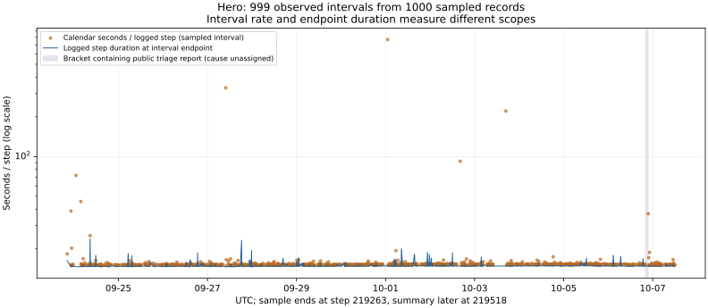

# 训练步很快，为什么跨天的进度仍会慢下来？

V110重新取得三个工程issue和Hero的公开W&B响应。#8435、#8506、#8870的评论仍为27、59、30条，与V77归档相比，没有新增、删除或正文修改，issue正文和开闭状态也未变。因此，这轮没有“新修复”的证据。新增的是1000条带时间戳的吞吐采样，以及它们与原计时源码的对应。

公开摘要在2026-10-07 13:03:06 UTC记录step 219518，名义累计输入10.128T；前一归档摘要为step 214913。这里的时间是日志时间，并非读者打开报告时的实时状态。完整响应保存在[sources/operational_2026_10_07](sources/operational_2026_10_07/wandb_meta.json)，计算保存在[operational_progress.json](analysis/operational_progress.json)。

## 先区分四种时钟

|测量|具体范围|能回答什么|不能直接回答什么|
|---|---|---|---|
|GPU kernel trace|本轮没有取得设备trace|取得后可检查kernel和通信耗时|不能由Python duration反推出纯kernel时间|
|`throughput/duration`|归档训练循环从step_start到训练完成、等待loss就绪及有限值检查等操作|记录这一训练步边界的耗时|不含此前取下一批数据、此前启动恢复；也不是纯GPU计算|
|`throughput/iteration_time`|从本轮迭代开始，覆盖取批、训练、hooks及checkpoint on_step调用等|观察单次迭代的宿主侧范围|异步checkpoint提交可在调用返回后继续；不能代替完整提交时间|
|日历进度率|两个记录时间戳之差除以日志步数增量|这段日历时间内，已记录训练前沿推进多快|不能独立拆出重启、评估、编译、存储、日志延迟各自耗时|

源码入口是冻结revision `eee467718515b2383fc3a433014afce4ab075b05`的[训练循环](https://github.com/marin-community/marin/blob/eee467718515b2383fc3a433014afce4ab075b05/experiments/grug/moe_hero_ep/train.py)与[吞吐回调](https://github.com/marin-community/marin/blob/eee467718515b2383fc3a433014afce4ab075b05/lib/levanter/src/levanter/callbacks/_metrics.py)。冻结代码说明接口机制；本轮仍未确认线上部署的精确revision。

1000条返回记录全部具有请求的五个字段，步数与时间严格递增。固定batch 11264、长度4096给出每步46,137,344个名义位置；全部采样计数都满足`total_tokens = (logged_step + 1) × 46,137,344`。这个等式核实了日志计数规则，未测得去重后的token量、实际计分目标量或各域目标权重。后几者仍要按[V109四本曝光账](DATA_GUIDE_ZH.md)另外记录。

## 真实采样说明了什么

图中橙点是相邻两个采样记录之间的平均秒/日志步，蓝线是区间终点记录的单步duration。纵轴取对数，防止少数大值掩盖常态。橙点覆盖区间，蓝点描述终点一轮，两者不能逐点相减当成停机时长。原值与图的摘要绑定见[图绑定](analysis/operational_plot_binding.json)。

|范围|步数变化|时间跨度|名义输入前沿速度|
|---|---|---|---|
|本次采样端点|146089 → 219263，共73174步|2026-09-23 20:24:12 → 10-07 11:58:13 UTC；1,179,241.52秒|2.862903M位置/秒；平均16.115581秒/日志步|
|两次摘要之间|214913 → 219518，共4605步|2026-10-06 16:33:52 → 10-07 13:03:06 UTC；73,753.87秒|2.880696M位置/秒；平均16.016042秒/日志步|
|采样中单步duration|1000个记录|中位数14.806245秒|这是采样中位数，不是全步加权平均|
|采样中iteration_time|1000个记录|中位数15.051948秒|不是跨重启的日历时间平均|
|最新摘要中的单步吞吐|step 219518|duration 14.895603秒|3.097380M位置/秒，仅对应这次记录边界|

采样最后一步219263早于摘要219518，不能把两个数据集当作同一终点。完整采样端点的速度由总增量除以总时间计算，不能取999个区间速度的简单平均；后者会让仅跨几步的短区间和跨几百步的长区间得到同样权重。

以下列出按“秒/日志步”排序的五个最慢采样区间。单看一个区间持续了几千秒容易误判，因为正常推进数百步也需要这么久。必须同时看步数增量。

|UTC区间|日志步范围|增量|区间秒/日志步|终点duration（秒）|
|---|---|---:|---:|---:|
|09-30 22:34:13 → 10-01 01:08:16|184963 → 184975|12|770.264|14.812|
|09-27 08:20:05 → 09:48:31|164933 → 164949|16|331.660|14.635|
|10-03 09:50:54 → 16:51:22|197941 → 198055|114|221.296|14.823|
|10-02 14:22:42 → 16:11:46|193731 → 193802|71|92.162|14.820|
|09-23 23:32:10 → 09-24 01:12:59|146538 → 146622|84|72.008|14.683|

这五个区间共同说明：终点单步恢复到约15秒，并不代表此前日历进度一直正常。现有数据可以定位需要查日志的时间范围，不能给这些区间分别贴上“存储故障”“重启”“GPU损坏”标签。采样边界也不是故障精确起止时刻。

## 与NoExecute事故记录怎样对应

[10月6日带🤖标记的公开排查评论](https://github.com/marin-community/marin/issues/8506#issuecomment-6025364160)报告：Kubernetes因NoExecute taint删除task 16所在节点`s14fys64`的任务，触发gang重试；Iris重新排队，随后176个task运行，21:00 UTC附近训练到step 215756。作者没有确认taint最初由什么条件触发。此处是公开排查条目的中文转述，不视为独立节点日志；内部事故链接未读取。

本次W&B采样中，step 215744（20:05:11 UTC）到215886（21:32:40 UTC）的区间同时包含评论时间21:00:53和作者报告的215756步。它们在时间和进度上相容；这支持把两条公开记录放在一起继续查证。该区间共142步、5248.43秒，平均36.96秒/日志步。**不能把整个87.47分钟都计入NoExecute停机**：其中包含实际训练推进，且缺少节点事件、attempt边界、恢复、编译及日志缓冲的完整记录。

对应关系应写成：作者报告的触发事件 → gang重试与重新排队 → 作者报告恢复运行；发起taint的根因未知，恢复所耗时间未知。不能把恢复运行写成根因已经修复，也不能把这条旧评论包装为本轮新增修复。

## MFU数字应该怎样读

本轮从完整回调源码提取原函数与原BatchSchedule执行，使用公开摘要里的batch、长度、duration、声明FLOPs和理论峰值等输入，复算六个最新字段：累计tokens、duration、tokens/s、examples/s、GFLOPs/s与MFU，均与日志匹配。它核实的是**计算公式及输入的一致性**，不是一次设备性能实验。

设备数量适配值704、总理论峰值1.76e18来自公开字段及其算术关系；没有独立核验硬件峰值、真实指令工作量或线上设备状态。最新MFU约26.3517%，`mean_mfu`约26.3259%。源码中的窗口是最多500次回调观察；本次配置`log_every=1`，其他配置不能一律称为500训练步，重启还会重新建立窗口。

不要用14.806秒的采样中位数除以16.116秒的端点平均来公布“利用率”或“停机比例”。它混合了不同聚合口径，也缺少重放、回退、重复计算和设备占用记录。设备MFU、日历前沿速度、持久化checkpoint进度、唯一计分目标进度应分别呈现。

## 对配比和顺序实验的实际影响

配比决策首先要明确预算。固定名义输入量适合检查相同输入前沿下的能力差；固定日历时间适合回答有限资源期限内能得到什么；固定有效目标质量或权重份额又是另一种问题。这些比较不能共享一个没有单位的“tokens预算”。

若某数据源引入较慢的解码、远端读取或批准备，一次配比更改可能同时改变训练内容与日历进度。此时先保留共同checkpoint、优化器状态、序列身份规则和评估输入，分别比较域级能力、目标份额、单步duration、取批等待与日历进度。只有后两者变差并不能推出内容价值低；只有单步速度不变也不能排除数据管线瓶颈。本文未测得哪个Hero数据域导致慢区间，不据此改动数学或代码配比。

建议新增一份训练生命周期事件账：attempt ID、UTC与单调时钟、step/输入游标、取批开始结束、训练开始结束、评估、保存请求、提交完成、失败、恢复以及设备占用范围。它能把“这段时间推进慢”变成可检查的分解，随后才讨论应该改加载器、保存频率、重试策略还是配比。[事件账模板](templates/operational_timeline_review.json)只是未执行的记录合同。

本轮8项分析检查与静态验收覆盖采样完整性、计数公式、端点求和、原函数复算及评论对齐；未运行GPU训练、未验证故障停机分解、未估计配比因果收益。
