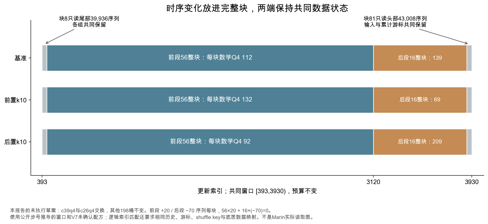

# 顺序实验：相同累计量，要匹配到哪一层

“早一点学数学”与“晚一点学数学”是一个值得检验的问题。困难在于两组可能同时改变了数学总量、供体总量、恢复位置和样本重复。顺序结论之前，先证明它们确实只差安排。

本轮继续检查八组公开顺序对照，并给出一份保持原窗口预算的整数草案。新发现是：连续补偿近乎相同，不代表混合块累计计数相同；完整块计数相同，也不自动保证两端不完整块读取相同。解决办法是把时序变化放在完整块内，并让边缘块与相应游标成为共同对照。

网页“顺序账本”可以切换八组历史对照、0—19档整数步幅，以及保留/改变边缘块。新草案和诊断均由本报告编制，没有执行GPU训练，也没有重放Marin实际token store。

## 1. 先把四种“相同”分开

| 所谓相同 | 需要核对什么 | 可以得到什么结论 |
|---|---|---|
| 连续计划相同 | 阶段长度×浮点权重，逐桶求和 | 设计目标中的预算相同 |
| 完整块计数相同 | 整数配额×各阶段完整块数 | 完整块部分的每桶样本数相同 |
| 累计逻辑索引相同 | 共同前缀游标、完整块索引范围、边缘块排列 | 在固定数据映射下，两组看到相同逻辑样本多重集，顺序可不同 |
| 实际内容相同 | 真实恢复、token store、内部shuffle、packing、有限库存取模 | 模型收到的内容、重复次数和实际预算可以对应 |

这四层不能互相代填。权重文件齐全，只证明第一层输入可回查；没有数据store的本地计数探针，不能声称第四层已经完成。相同多重集也不意味着更新效果相同，梯度、优化器状态和中间表示仍随先后改变。

## 2. 公开窗口其实从块中间开始，也在块中间结束

原顺序配置记录batch1024、4K序列、混合块49152序列，因此每块相当于48次更新。阶段边界为0/384/3120，权重阶段要先经batch schedule换成序列索引；这里固定batch时就是步号乘1024。[归档加载器与转换函数](sources/deepening_2026_10_04/mixture_production.py)

公开历史从`_step=393`出现恢复后的新更新，终点为3929。本报告按这一记录推导序列窗口`[393×1024, 3930×1024)`，即`[402432, 4024320)`，共3537次更新、14,835,253,248 tokens。这是记录支持的条件窗口，实际恢复后的next index仍未从checkpoint读取。

| 区域 | 更新索引区间 | 块与读取位置 | 序列数 |
|---|---|---|---:|
| 起点所在块尾部 | [393,432) | 块8，跳过前9216个槽位 | 39,936 |
| 前段完整块 | [432,3120) | 块9—64，共56块 | 2,752,512 |
| 后段完整块 | [3120,3888) | 块65—80，共16块 | 786,432 |
| 终点所在块头部 | [3888,3930) | 块81，只读前43008槽位 | 43,008 |

前段2727次更新并不是整数个块，后段810次也不是。两个完整部分的长度比56/16=7/2；整个窗口的更新比2727/810=101/30；原浮点补偿比2726/810=1363/405。三者各自回答不同的问题，不能因数值相近而混用。

## 3. 八组历史对照，完整块计数已经不同

对16份原始运行配置的三个阶段，执行归档MixtureDataset的归一与取整方法，共48次计数核对。保留23个零权重验证来源的原配置，分析只取200个训练桶。以56/16个完整块为范围，再逐桶累计：

| 历史对照 | 完整块差涉及桶数 | 完整块累计差L1 / tokens |
|---|---:|---:|
| r-stem high，早加 vs 晚加，seed0 | 8 | 2,293,760 |
| r-stem low，早减 vs 晚减，seed0 | 8 | 2,293,760 |
| r-stem高/低前置交换，seed0 | 6 | 4,456,448 |
| r-stem高/低前置交换，seed1 | 6 | 4,456,448 |
| u-math high，早加 vs 晚加，seed0 | 10 | 2,293,760 |
| u-math low，早减 vs 晚减，seed0 | 11 | 2,424,832 |
| u-math高/低前置交换，seed0 | 11 | 4,718,592 |
| u-math高/低前置交换，seed1 | 11 | 4,718,592 |

L1把同量的多读与少读同时计算，不是额外训练量。这里1序列按4K折算4096 tokens。它不是模型质量差，也不是完整历史窗口差；启动代码版本、恢复内容和实际shuffle没有逐一确认。

此前用2726/810次更新乘连续权重，差值接近零；用公开2727/810次更新，部分对照的L1约20,971.52 tokens。现在完整块计数的差为数百万，原因不是新的训练现象，而是又推进了一层执行核对：权重会先取成整数，预算窗口也不全是整块。原连续表保留，整数表另存，不把新口径覆盖旧口径。[原三口径表](analysis/order_budget_audit.csv) · [八组200桶整数表](analysis/order_integer_cell_audit.csv)

还不能断言整个窗口一定不匹配。边缘块的差可能部分补回完整块差，也可能继续扩大它。真实块内排列缺失时，最终累计差仍未知。因此这轮不会用2.29M或4.72M去解释GSM8K BPB，更不会把原顺序实验的方向改写成已识别的纯时序效果。

## 4. 边缘块为什么不能简单按比例折算

一个块给某桶n个槽位，但只读r个槽位时，该桶的读取数量不是必然等于`r×n/K`。其范围是：

```text
最少 = max(0, n − (K−r))
最多 = min(n, r)
```

例如一个块有100条数学序列，最后只读部分槽位，数学可能集中在已读区，也可能落在未读区。随机排列下可以谈期望，但一次实际训练的结果是一个确定排列；相同seed标签也不能证明两个配方的块内排列或数据索引相同。

逐桶表保存了两端读取差的松界，加上完整块已知差得到整个窗口的逐桶可能区间。这些界没有利用各桶配额的共同约束，**不是可同时取得的最坏情形，也不是实际差值或置信区间**。它们用于判断现有信息是否足够，不能替代真实key和token ID。

## 5. 先在整数计数上写出补偿方程

若前后分别有m0/m1个完整块，每桶配额变化为整数Δn0/Δn1，累计量不变要求：

```text
m0 × Δn0 + m1 × Δn1 = 0
g = gcd(m0,m1)
Δn0 = (m1/g) × k
Δn1 = −(m0/g) × k
```

56/16的最小整数补偿是前段+2k、后段−7k。不能先随便选一个小数，再假定取整也保持关系。供体做相反变化；其余桶保持原计数，每块总和仍为49152。

如果直接按整个更新比101/30计算完整块配额，要求的是前段+30k、后段−101k。它对应“按整个时长外推完整块比例”的方程，却不能解决实际部分块读取。较细的连续补偿与较粗的整数补偿各有可行范围；阶段越不对称，小桶后段配额越容易被扣成负数。

## 6. 保留总预算，用共同边缘块包住时序变化

不必把原窗口裁成72个整块，那会减少339,738,624 tokens并改变实验预算。新的草案保留全部3537次更新：块8和块81在各组中使用共同配额，只把变化放进块9—80。这样完整块用56/16关系补偿，而两端读取同一个块输入。



计算锚点取V7 c26供体M1Q1的整数配方。它是未确认的数学修复候选，不意味着已经决定在生产中采用。这里研究c39q4数学Q4与c26q4议会/董事会Q4的先后交换，累计两桶预算均保持不变；其他198桶不变。原共同初始阶段计数来自已归档顺序配置，只用于构造共同前缀，不能证明真实checkpoint的历史曝光。

默认k=10，前段每块数学Q4增加20条、后段减少70条。供体反向补偿。三份配方是：

| 条件 | 前段完整块的数学Q4/块 | 后段完整块的数学Q4/块 | 两端块配额 |
|---|---:|---:|---|
| 基准 | 112 | 139 | 共用112 / 139 |
| 前置 | 132 | 69 | 共用112 / 139 |
| 后置 | 92 | 209 | 共用112 / 139 |

前置组比基准在前段多见`56×20×4096=4,587,520`名义数学Q4 tokens，后段恰好扣回。前置与后置两组相差两倍这个移动幅度。这里没有增加数学总量，供体也没有累计减量；研究的是两桶在不同阶段的相对安排，不是数学单方面的“最佳顺序”。

对这套配额，前置方向k最多19，反向k最多56；要同时保留对称前置/后置两组，范围取0—19。k=20不能运行三臂对称设计，工具会拒绝，不裁剪为19。k=0时三份配方相同，只是一份无扰动配方，不是三个独立顺序实验。

新增权重边界放在全局序列索引0、393216、442368、3194880、3981312，对应更新0、384、432、3120、3888。所有边界都是块大小的整数倍，整个窗口的LR、更新数和序列长度应保持共同配置。多了数据阶段边界，不应顺手重置优化器或改其他设置。

## 7. 为什么这里能给出条件匹配证明

共同边缘块不仅要同配额，还要同累计游标。前段变化从块9开始，因而块8之前的配额前缀在各组相同；两个完整部分逐桶总差为零，因而进入块81时的累计索引也相同。

归档实现把桶ID与桶内索引编码进块，然后按block index和mix key排列。两端的未排列数组相同、相应累计索引相同；若key相同，两端排列也相同。中间完整块把各桶的连续逻辑索引范围完整读过，累计起点和终点一致。因此在共同映射下，整个窗口的逻辑样本多重集一致，先后安排不同。

本轮AST提取并执行六段原方法：归一、每块计数、未排列ID、阶段累计计数、查阶段和桶内索引。Python3.12.13/numpy2.0.2实际核对48组历史阶段计数；0—19档、两种边缘设计、三臂的480组阶段计数；共同边缘设计的20份数组/游标检查。JavaScript的40个模式/步幅组合另逐项匹配480个原方法计数摘要。[原方法探针](analysis/order_loader_probe_python312.json)

这不是完整加载器实例或实际数据流复现。没有执行JAX随机排列、读取token store或恢复checkpoint；共同key、底层顺序、真实next index和历史仍是实验必须满足的条件。已验证的范围是计数编译与条件逻辑索引关系。将它写成“已经验证Marin看到了完全相同的token”会超出证据。

## 8. 一个必须保留的错误设计反例

关闭“共同边缘块”，把前段+2k、后段−7k连同块8和81一起改变。中间56/16整块的累计差仍为零。若只验这个方程，设计会被误放行。

使用原方法生成的未排列ID作为关闭shuffle的诊断，默认k10前置和后置相对基准的整个窗口L1均为140序列，4K折算573,440 tokens。它说明存在一种合法块内排列，使整块补偿通过但实际窗口累计不同。**这个数是诊断反例，不是历史运行读取差。** 它也不需要解释某项BPB收益，作用是推翻“整数整块匹配足够”的评审规则。

正确草案的同一诊断差为零，同时两端数组和游标共同保留。诊断通过只是检查之一；如果实际shuffle key、数据映射或恢复内容不同，条件仍不成立。反例草案也保留供下载，状态未执行，不能作为训练推荐。[错误设计计数合同](templates/order_edges_changed_counterexample.json)

## 9. 怎样把它接进训练决策管线

首先在P1/P2确认候选累计配方与供体成本，再在P3做未参与选择的能力确认。若候选本身没有通过，P4时序讨论保持条件设计，不提前用新顺序掩盖配方缺口。

P4应留下四份东西：整数目标账本；每个阶段的绝对边界与共同边缘块；恢复内容、key和数据映射清单；实际中期/末期评估计划。先验证每桶累计量、支持范围、可行配额和索引范围，再运行相同checkpoint、优化设置与评估下的前置/后置比较。

| 规则 | 本轮发现 | 现在应该检查 |
|---|---|---|
| R05 预算从实际区间计算 | 2726/810、2727/810与56/16不是同一长度比 | 从真实next index和batch schedule算边界，逐段列完整块与部分块 |
| R10 顺序匹配累计量和游标 | 整块匹配仍可留下两端差 | 相同总预算；逐桶整块补偿；边缘数组、游标与真实映射 |
| R14 执行状态不只看路径 | 同seed标签不能代替共同key和恢复内容 | 代码/环境摘要、checkpoint内容、真实cursor、mix/inner shuffle和store版本 |
| R16 图能被正确复述 | “整数差”容易被读成实际重复token | 标明范围、序列/token单位、条件证明和诊断来源 |

原18条规则和锚点仍为1.0。本轮改变的是应用检查的具体程度：R10不能在仅有一个零残差数字时通过，必须看它覆盖了哪些块、哪些索引和哪些真实状态。[规则](RUBRICS_ZH.md) · [管线](PIPELINE_ZH.md)

## 10. 下载、复算与尚缺的证据

[默认k10完整权重草案](templates/order_edge_locked.json)保存三臂、五个阶段的计数及权重编码；网页导出的是计数评审JSON，明确不含可直接传给加载器的权重。不同k先由`compile_order`生成，再执行原方法探针。小幅编码适配继承V7的固定49152块/运行时范围，换环境必须重查。

离线`make report`重算账本、图、JS/Python检查、HTML并核对已经保存的原方法输出。重新执行原方法需要本地Python3.12/numpy2.0.2，例如`uv run --offline --no-project --python 3.12 --with numpy==2.0.2 scripts/probe_order_loader.py`；无缓存时离线命令不能安装依赖。全部计划的真实checkpoint、cursor、key、store与评估仍为空，`launchable=false`。

下一步最有价值的验证是实际数据状态与读者理解。真实token流需要相应资源；本地仍可用这些反例做理解检查：读者能否解释“完整块残差为零而整个窗口仍未知”，能否指出哪项共同状态一变就会破坏证明。理解检查要记录实际误读，不把页面能打开或自评勾选通过当作理解证据。
