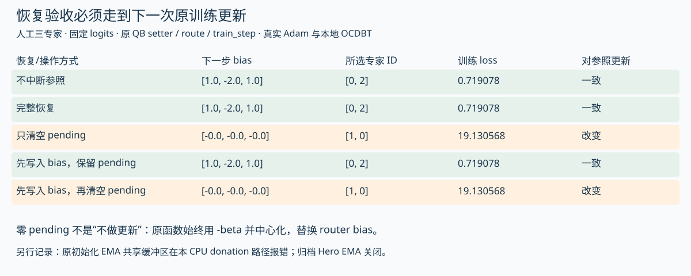

# 恢复了参数，还没有证明恢复了训练

V111把此前分开的两条检查接起来：V63验证了QB状态视图可能改变专家选择；V107验证了小型Adam状态的保存恢复与下一次更新，但明确没有让pending参与目标函数。这次执行归档的原`_make_train_step`，让原pending setter、原路由代码、真实Adam和真实本地checkpoint恢复共同决定下一次更新。

得到的结论是：**参数相同、优化器计数相同、loss有限，仍不足以证明恢复等价。必须连同pending，检查下一次实际前向、路由与参数更新。** 数值来自人工三专家控制，不是Hero效果估计。[19项控制与全部值](analysis/pending_resume_step_cpu.json) · [执行输出](analysis/pending_resume_step_cpu_output.txt) · [复现脚本](scripts/probe_pending_resume_step.py)。

## 原代码怎样传递这份状态

归档[训练入口](https://github.com/marin-community/marin/blob/eee467718515b2383fc3a433014afce4ab075b05/experiments/grug/moe_hero_ep/train.py)在一次训练步中先执行：

```python
qb_params = apply_qb_betas(state.params, state.pending_qb_betas)
(loss, summarized_metrics), grads = _loss_and_grads(qb_params, batch, mp, z_loss)
```

接着优化器以`qb_params`为参数视图更新；如果开启EMA，也先把同一pending应用到EMA，再计算新EMA。结束时，返回状态里的params已包含这次实际使用的bias；当前批估出的`qb_beta_per_layer`保存为新的pending，留给下一次训练步。

因此，刚完成一步后的state同时含两种时间语义：stored bias是这一步使用的阈值；pending是下一步准备使用的阈值。它们不同并不意味着保存内部不一致。恢复时不能为了“整理状态”把其中一份删除。

原[apply_qb_betas](https://github.com/marin-community/marin/blob/eee467718515b2383fc3a433014afce4ab075b05/experiments/grug/moe_hero_ep/model.py)的关键操作是：

```python
new_bias = -qb_betas
new_bias = new_bias - jnp.mean(new_bias, axis=-1, keepdims=True)
return eqx.tree_at(lambda t: t.stacked_blocks.stacked.mlp.router_bias, model, new_bias)
```

它是替换，不是增量累加。同一beta重复应用，在本控制中幂等；传零beta会把bias设置成零。**“已经写进参数，所以清空pending”在这条训练路径里不是安全的消费协议。** 如果真的要改变状态表示，必须同步改变下一步消费者的语义，并验证恢复、评估、导出等入口；本轮没有修改上游生产代码。

## 接到真实恢复之后，再走一步

本控制模型只有一层、三个可训练标量专家输出，固定logits为`[0.1, 0.2, 0]`，K=2；使用归档路由块，包括top-k、权重归一化与stop-gradient。完整Transformer、真实QB阈值估计、容量丢弃、专家通信都被明确排除：目标是平方误差，beta由人工batch提供。

先用原训练闭包走三步，建立Adam count=3、非空EMA和pending。然后用原host serializer写入本地TensorStore/OCDBT，等待真实commit，手工写入metadata；再执行原Grug恢复策略和原tree/leaf reader。11个数组叶覆盖step、参数、Adam count/mu/nu、EMA和pending，恢复全部相同。metadata发布和barrier是显式适配，没有验证生产发布器或多rank协调。



所有对照使用同一下一批输入与同一优化器状态。完整恢复与不中断参照的下一次输出状态逐叶相同，不只是loss相近。

|方式|下一次训练使用bias|所选专家|这一步loss|下一次完整状态与参照|
|---|---|---|---:|---|
|不中断参照|[1,-2,1]|[0,2]|0.719078|相同|
|完整恢复|[1,-2,1]|[0,2]|0.719078|相同|
|只清空pending|[0,0,0]|[1,0]|19.130568|不同|
|先将pending写入params，保留pending|[1,-2,1]|[0,2]|0.719078|相同|
|先将pending写入params，再清空pending|[0,0,0]|[1,0]|19.130568|不同|

第三行在恢复时保留了参数和Adam计数，只改变pending。第五行虽然已经把bias改成了正确值，下一步setter仍会按零pending将它覆盖为零，所以与第三行完全一致。第四行应用两次同一setter没有累积偏移。这里的loss差异仅用于揭示机制，不能当作真实Hero遗漏pending的误差大小。

这一步返回的新pending统一为人工输入`[3,0,0]`。完整恢复分支的stored bias仍为`[1,-2,1]`，下一次前向则会用`[-2,1,1]`。这把“当前stored状态”与“下一次训练视图”的差别再推进了一步，不能用相同step标签自动消除。

## 普通评估到底读哪个模型

本轮执行了训练入口中原callback的两个model getter，以及归档原`cb_tagged_evaluate`。普通current评估取`state.params`；EMA评估取`state.ema_params`。这些访问器没有接收pending，也没有自动把下一步阈值写进模型。录制评估器只观察接收到的模型，不模拟真实Paloma评估。

在step=3的人工恢复状态中，普通current/EMA评估都选择专家[1,0]，下一次训练视图选择[0,2]。这不是新的Hero生产事故证据，而是对源码消费者差异的可执行确认。原tagged回调还会抑制同一步的强制重复评分；本轮确认了这条去重路径，但未执行真实评估模块。

判断哪个视图适合比较，要先说明问题：评价stored checkpoint、评价下一步训练将使用的路由，或者评价明确导出的推理模型。当前/EMA、权威master、pending、dtype、backend和容量策略都要对齐。不能让候选A用stored、候选B用pending-applied，然后把差别归给配比或kernel。

此前[工程地图](ENGINEERING_MAP_ZH.md)的下一项检查写作“pending应用恰好一次”，容易让读者以为setter是需要清空的增量。这轮将其更正为“绑定消费者语义、重复应用是否幂等、清空是否重设bias”，保留历史实验结论。真正要避免的是不一致的状态解释。

## 实际运行中暴露的EMA与donation边界

第一次把原训练步接上时，JAX报错：`Attempt to donate the same buffer twice`。没有直接绕过去：继续执行原`initial_state`，仅把`Transformer.init`替换为同结构的小模型，确认源码在开启EMA时返回`ema_params=params`，对应叶是同一对象。原训练闭包的`donate_argnums=(0,)`把整个state交给donation，本轮CPU运行拒绝同一缓冲区的重复输入。

|控制|实际观察|可以推出什么|
|---|---|---|
|原initializer，EMA=0.9，共享参数叶|JAX CPU报重复donation错误|这个runtime与人工模型下的真实兼容性边界|
|相同原initializer状态，为各叶分配独立缓冲区|原EMA训练闭包成功推进一步|本控制中独立缓冲区避免该错误；不是生产修复验收|
|原initializer，EMA关闭|原非EMA训练闭包成功推进一步|错误不是所有初始化路径都会触发|
|归档Hero W&B配置|`ema_beta=null`|不能把EMA开启路径的错误归为本次Hero事故|

运行版本是JAX/jaxlib 0.7.2、Optax 0.2.5、Equinox 0.13.2、TensorStore 0.1.69、NumPy 2.5.3。原源码完整Transformer、实际GPU/XLA版本、恢复后的其他共享叶、pinned-host master和分布式执行都还要单独验证。本轮的主恢复对照使用独立EMA缓冲区的人工fixture，并明确记录该选择；未合入“初始化复制”修复，也未估算535B规模的内存与时间代价。

这个发现还说明，checkpoint验收不应只看值、shape、dtype。开启donation时，输入叶之间的共享关系也会影响可执行性。值相同不意味着缓冲区独立；缓冲区独立也不意味着状态语义相同。两层检查都需要。

## 怎样放进自己的训练管线

1. 保存状态前明确params、master、EMA和pending分别代表哪一时刻；恢复时保留这份合同。
2. 独立检查pending与应用后bias的shape/dtype/finite状态，记录应用逻辑是替换还是累加；零值不能默认解释成“没有待办”。
3. 从共同checkpoint与共同下一批数据分别运行不中断/完整恢复，比较路由ID与按ID配对的权重、loss、参数、优化器、EMA和新pending。
4. 开启EMA、master或offload时另外检查共享缓冲区与donation兼容性；不要只复用关闭这些开关时的验收。
5. 配比切换首步保留原pending作为生产式对照；若清空pending做机制实验，将其列为第二个干预，不能当作单纯换配比。

[状态视图验收模板](templates/pending_consumer_review.json)仍为未执行草案。下一步有价值的外部证据是实际checkpoint与完整模型的固定输入对照，以及真实部署版本下的donation矩阵；本轮不能提供Hero效果、故障发生率或配比收益。
