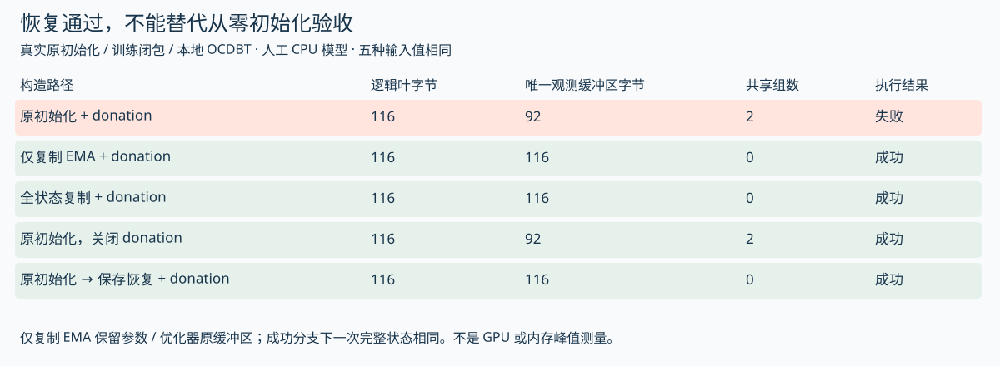

# 恢复了参数，还没有证明恢复了训练

V111把此前分开的两条检查接起来：V63验证了QB状态视图可能改变专家选择；V107验证了小型Adam状态的保存恢复与下一次更新，但明确没有让pending参与目标函数。这次执行归档的原`_make_train_step`，让原pending setter、原路由代码、真实Adam和真实本地checkpoint恢复共同决定下一次更新。

得到的结论是：**参数相同、优化器计数相同、loss有限，仍不足以证明恢复等价。必须连同pending，检查下一次实际前向、路由与参数更新。** 数值来自人工三专家控制，不是Hero效果估计。[19项控制与全部值](analysis/pending_resume_step_cpu.json) · [执行输出](analysis/pending_resume_step_cpu_output.txt) · [复现脚本](scripts/probe_pending_resume_step.py)。

## 原代码怎样传递这份状态

归档[训练入口](https://github.com/marin-community/marin/blob/eee467718515b2383fc3a433014afce4ab075b05/experiments/grug/moe_hero_ep/train.py)在一次训练步中先执行：

```python
qb_params = apply_qb_betas(state.params, state.pending_qb_betas)
(loss, summarized_metrics), grads = _loss_and_grads(qb_params, batch, mp, z_loss)
```

接着优化器以`qb_params`为参数视图更新；如果开启EMA，也先把同一pending应用到EMA，再计算新EMA。结束时，返回状态里的params已包含这次实际使用的bias；当前批估出的`qb_beta_per_layer`保存为新的pending，留给下一次训练步。

因此，刚完成一步后的state同时含两种时间语义：stored bias是这一步使用的阈值；pending是下一步准备使用的阈值。它们不同并不意味着保存内部不一致。恢复时不能为了“整理状态”把其中一份删除。

原[apply_qb_betas](https://github.com/marin-community/marin/blob/eee467718515b2383fc3a433014afce4ab075b05/experiments/grug/moe_hero_ep/model.py)的关键操作是：

```python
new_bias = -qb_betas
new_bias = new_bias - jnp.mean(new_bias, axis=-1, keepdims=True)
return eqx.tree_at(lambda t: t.stacked_blocks.stacked.mlp.router_bias, model, new_bias)
```

它是替换，不是增量累加。同一beta重复应用，在本控制中幂等；传零beta会把bias设置成零。**“已经写进参数，所以清空pending”在这条训练路径里不是安全的消费协议。** 如果真的要改变状态表示，必须同步改变下一步消费者的语义，并验证恢复、评估、导出等入口；本轮没有修改上游生产代码。

## 接到真实恢复之后，再走一步

本控制模型只有一层、三个可训练标量专家输出，固定logits为`[0.1, 0.2, 0]`，K=2；使用归档路由块，包括top-k、权重归一化与stop-gradient。完整Transformer、真实QB阈值估计、容量丢弃、专家通信都被明确排除：目标是平方误差，beta由人工batch提供。

先用原训练闭包走三步，建立Adam count=3、非空EMA和pending。然后用原host serializer写入本地TensorStore/OCDBT，等待真实commit，手工写入metadata；再执行原Grug恢复策略和原tree/leaf reader。11个数组叶覆盖step、参数、Adam count/mu/nu、EMA和pending，恢复全部相同。metadata发布和barrier是显式适配，没有验证生产发布器或多rank协调。


所有对照使用同一下一批输入与同一优化器状态。完整恢复与不中断参照的下一次输出状态逐叶相同，不只是loss相近。

|方式|下一次训练使用bias|所选专家|这一步loss|下一次完整状态与参照|
|---|---|---|---:|---|
|不中断参照|[1,-2,1]|[0,2]|0.719078|相同|
|完整恢复|[1,-2,1]|[0,2]|0.719078|相同|
|只清空pending|[0,0,0]|[1,0]|19.130568|不同|
|先将pending写入params，保留pending|[1,-2,1]|[0,2]|0.719078|相同|
|先将pending写入params，再清空pending|[0,0,0]|[1,0]|19.130568|不同|

第三行在恢复时保留了参数和Adam计数，只改变pending。第五行虽然已经把bias改成了正确值，下一步setter仍会按零pending将它覆盖为零，所以与第三行完全一致。第四行应用两次同一setter没有累积偏移。这里的loss差异仅用于揭示机制，不能当作真实Hero遗漏pending的误差大小。

这一步返回的新pending统一为人工输入`[3,0,0]`。完整恢复分支的stored bias仍为`[1,-2,1]`，下一次前向则会用`[-2,1,1]`。这把“当前stored状态”与“下一次训练视图”的差别再推进了一步，不能用相同step标签自动消除。

## 普通评估到底读哪个模型

本轮执行了训练入口中原callback的两个model getter，以及归档原`cb_tagged_evaluate`。普通current评估取`state.params`；EMA评估取`state.ema_params`。这些访问器没有接收pending，也没有自动把下一步阈值写进模型。录制评估器只观察接收到的模型，不模拟真实Paloma评估。

在step=3的人工恢复状态中，普通current/EMA评估都选择专家[1,0]，下一次训练视图选择[0,2]。这不是新的Hero生产事故证据，而是对源码消费者差异的可执行确认。原tagged回调还会抑制同一步的强制重复评分；本轮确认了这条去重路径，但未执行真实评估模块。

判断哪个视图适合比较，要先说明问题：评价stored checkpoint、评价下一步训练将使用的路由，或者评价明确导出的推理模型。当前/EMA、权威master、pending、dtype、backend和容量策略都要对齐。不能让候选A用stored、候选B用pending-applied，然后把差别归给配比或kernel。

此前[工程地图](ENGINEERING_MAP_ZH.md)的下一项检查写作“pending应用恰好一次”，容易让读者以为setter是需要清空的增量。这轮将其更正为“绑定消费者语义、重复应用是否幂等、清空是否重设bias”，保留历史实验结论。真正要避免的是不一致的状态解释。

## 实际运行中暴露的EMA与donation边界

第一次把原训练步接上时，JAX报错：`Attempt to donate the same buffer twice`。没有直接绕过去：继续执行原`initial_state`，仅把`Transformer.init`替换为同结构的小模型，确认源码在开启EMA时返回`ema_params=params`，对应叶是同一对象。原训练闭包的`donate_argnums=(0,)`把整个state交给donation，本轮CPU运行拒绝同一缓冲区的重复输入。

|控制|实际观察|可以推出什么|
|---|---|---|
|原initializer，EMA=0.9，共享参数叶|JAX CPU报重复donation错误|这个runtime与人工模型下的真实兼容性边界|
|相同原initializer状态，为各叶分配独立缓冲区|原EMA训练闭包成功推进一步|本控制中独立缓冲区避免该错误；不是生产修复验收|
|原initializer，EMA关闭|原非EMA训练闭包成功推进一步|错误不是所有初始化路径都会触发|
|归档Hero W&B配置|`ema_beta=null`|不能把EMA开启路径的错误归为本次Hero事故|

运行版本是JAX/jaxlib 0.7.2、Optax 0.2.5、Equinox 0.13.2、TensorStore 0.1.69、NumPy 2.5.3。原源码完整Transformer、实际GPU/XLA版本、恢复后的其他共享叶、pinned-host master和分布式执行都还要单独验证。本轮的主恢复对照使用独立EMA缓冲区的人工fixture，并明确记录该选择；未合入“初始化复制”修复，也未估算535B规模的内存与时间代价。

这个发现还说明，checkpoint验收不应只看值、shape、dtype。开启donation时，输入叶之间的共享关系也会影响可执行性。值相同不意味着缓冲区独立；缓冲区独立也不意味着状态语义相同。两层检查都需要。

## 怎样放进自己的训练管线

1. 保存状态前明确params、master、EMA和pending分别代表哪一时刻；恢复时保留这份合同。
2. 独立检查pending与应用后bias的shape/dtype/finite状态，记录应用逻辑是替换还是累加；零值不能默认解释成“没有待办”。
3. 从共同checkpoint与共同下一批数据分别运行不中断/完整恢复，比较路由ID与按ID配对的权重、loss、参数、优化器、EMA和新pending。
4. 开启EMA、master或offload时另外检查共享缓冲区与donation兼容性；不要只复用关闭这些开关时的验收。
5. 配比切换首步保留原pending作为生产式对照；若清空pending做机制实验，将其列为第二个干预，不能当作单纯换配比。

[状态视图验收模板](templates/pending_consumer_review.json)仍为未执行草案。下一步有价值的外部证据是实际checkpoint与完整模型的固定输入对照，以及真实部署版本下的donation矩阵；本轮不能提供Hero效果、故障发生率或配比收益。


## V112：为什么恢复成功，仍会漏掉初始化失败

上一轮的成功控制复制了所有状态叶，因此尚未把“只复制EMA是否足够”单独隔离。这轮使用同一原初始化和原训练闭包，增加五条构造路径。每条路径在训练前的11叶数值完全相同，目标、输入pending、优化器和EMA系数也相同；只改变缓冲区关系、donation开关或是否经过真实保存恢复。[15项控制](analysis/ema_alias_matrix_cpu.json) · [完整执行输出](analysis/ema_alias_matrix_cpu_output.txt) · [复现脚本](scripts/probe_ema_alias_matrix.py)。V111归档和来源文件保持原字节。



|构造路径|EMA与params共享缓冲区组数|原训练闭包是否成功|与成功参照的下一次完整状态|
|---|---:|---|---|
|原初始化，开启donation|2|失败：重复donation|无有效输出，不比较|
|仅复制EMA，保留params与optimizer原缓冲区|0|成功|逐叶相同|
|复制全部状态叶|0|成功|逐叶相同|
|原初始化，仅关闭donation|2|成功|逐叶相同|
|原初始化，经原本地IO保存恢复，开启donation|0|成功|逐叶相同|

这里只复制EMA的控制，实际核对了参数与优化器指针在调用前没有改变，状态值全部保留。观察到的两组共享分别是`params.w ↔ ema_params.w`与两份router bias。独立复制这两个EMA叶后，原donation闭包成功执行。关闭donation的诊断只改原JIT装饰器的`donate_argnums`，没有修改训练函数体；它也保留原共享输入并得到相同完整输出。

更值得留意的是第五条：原host serializer按逻辑路径分别保存数组，原reader逐叶恢复。本次真实OCDBT往返保留全部数值，但恢复出了独立缓冲区。于是，同一个初始化状态直接训练失败，先保存、恢复再训练却成功。这个反例说明：只从checkpoint开始跑回归，可能绕过从零初始化才出现的共享关系问题。它不是恢复器必须保留共享关系的要求；是启动验收必须覆盖不同构造路径的理由。

### 数组相等、对象相同、缓冲区共享是三种检查

这轮不仅比较Python对象身份，还在调用前读取JAX CPU数组的缓冲区指针，按逻辑叶路径归组；记录中不保存原始地址。该方法在本单设备控制中确认了共享关系，不作为多设备、切片重叠或pinned-host内存的通用检测器。

五条路径的逻辑叶字节均为116。共享EMA的路径中，按观测指针去重后是92字节；复制EMA或真实恢复后是116字节，差24字节，正好对应本人工模型的两个EMA叶。这是输入数组的记账，**不是allocator、RSS、HBM峰值或训练临时内存测量**。不能按这个小模型比例预测535B峰值，也不能由“关闭donation能跑”推出它在生产中没有内存或性能代价。

[JAX的donation说明](https://docs.jax.dev/en/latest/buffer_donation.html)和[jit接口](https://docs.jax.dev/en/latest/_autosummary/jax.jit.html)把donation定义为允许复用不再需要的输入缓冲区。对整个state声明donation，会涉及其pytree叶，但不保证每个叶都实际被复用。本轮三个成功donation分支中，11个输入叶有9个被标记deleted；关闭donation分支没有输入叶被标记deleted。不要在成功donation后继续拿旧state做值比较；先保存独立参照，或者比较返回的新state。

### 一个可审查的初始化候选

本轮提供[局部候选函数](scripts/candidate_ema_buffer_copy.py)，状态是`candidate_not_integrated`。它只为EMA建立独立数组；EMA关闭时原样返回state：

```python
if state.ema_params is None:
    return state
ema = jax.tree.map(lambda leaf: jnp.array(leaf, copy=True), state.ema_params)
return dataclasses.replace(state, ema_params=ema)
```

候选用于原初始化完成后、第一次donated训练前。本轮直接执行该函数验证了EMA-only分支，未把它合入Marin；它不是每一步都需要调用的拷贝操作。跨设备sharding、master/EMA权威来源、offload和内存峰值仍须验证，不能把单CPU候选称为生产修复。

仍然保留原边界：归档Hero配置`ema_beta=null`，没有证据证明Hero遇到这条EMA开启路径的错误。当前实验的Transformer.init、小模型目标和beta估计是替代；实际原QB setter、route块、初始化控制流、训练闭包、Adam和本地IO参与执行。

### 应怎样改验收管线

把“从零初始化”和“从checkpoint恢复”设为两个独立入口，各自至少走到第一次真实更新，再对比下一次更新。EMA/master/offload/donation开关应记录具体组合，不能只填“恢复成功”。在值、shape、dtype、状态计数之外，补充输入叶共享与实际deleted状态观察。对于可以跑通的替代路径，同时保留数值等价证据和资源开销的未知项；不要把绕过错误与生产修复合并成同一结论。

[初始化构造路径验收模板](templates/initial_state_alias_review.json)保留实际设备、模型、内存和线上部署结果为空。当前只有这个人工CPU矩阵的结论，未执行GPU、分布式或完整Transformer验收。


## V119：执行作者的最终评估补丁，而不只解释缺陷

这一轮固定到作者fork的[`a00cb77a491f4777a2c66edce54f47ff7b255c40`](https://github.com/yonromai/marin/commit/a00cb77a491f4777a2c66edce54f47ff7b255c40)，归档train、原回归测试、callback core、state adapter、tagged evaluator、commit差异及#9352最新正文，共7份新来源。API正文与旧归档一致，状态Open、评论数0；正文仍注明未合并。该状态不能单独证明所有生产分支的采用情况，本轮没有验证生产部署。

### 为什么最终补丁要收窄到eval hook

commit差异显示前一版把应用pending的逻辑放进runner的通用model getter。getter构造每次回调共用的`CallbackStateView`；即使这次只做日志，也会先取模型。最终补丁恢复getter读取stored params，EMA关闭时回退current params；只在评估hook的外层构造两份带pending的视图。这解决了“为了修评估，却改变所有回调读到的模型并增加工作”的范围问题。[原差异](sources/eval_fix_2026_10_08/commit.json)、[runner](sources/eval_fix_2026_10_08/state_adapter.py)。

实际次序为：runner按原getter创建StepInfo → 判断hook是否到期或force → 评估包装器替换current/EMA模型视图 → 原评估hook判断重复step → 评分。包装器用`dataclasses.replace`创建新的callback state和StepInfo，保持事件处理器、step、loss、duration及optimizer引用；没有向训练state写回bias，也没有清空pending。setter仍是替换，而不是累加。

train源码在初始化runner时绑定pending，在正常步`state_callbacks.run`前刷新，并在强制结束回调前再刷新。嵌套包装器读取的是同一个外层变量，不能提前捕获一次固定数组。局部探针把原嵌套函数放入人工闭包，刷新pending后看到了新的bias；生产循环这些赋值位置是源码检查，未执行完整循环。[固定train](sources/eval_fix_2026_10_08/train.py)、[对应线上位置](https://github.com/yonromai/marin/blob/a00cb77a491f4777a2c66edce54f47ff7b255c40/experiments/grug/moe_hero_ep/train.py#L1118)。

### 15项CPU控制实际覆盖什么

执行原setter、原StepInfo/Callback/LambdaCallback、原StateCallbackRunner、原包装器和原tagged callback；模型替换成有相同router_bias层级的微型Equinox对象，评估器和日志替换成记录器。作者的原字符串回归测试也执行了，但使用最小monkeypatch接口适配，不是跑过整份pytest文件。[探针](scripts/probe_eval_pending_fix_cpu.py)、[原值与边界](analysis/eval_pending_fix_cpu.json)。

|局部路径|观测|支持的结论|
|---|---|---|
|只有普通hook，评估未到期|setter调用0次，普通hook读stored bias|此次调用不承担QB应用工作|
|checkpoint-only强制回调|current与EMA均由beta `[1,3,2]`得到bias `[1,−1,0]`|两种评估视图覆盖pending，raw state未改|
|刷新闭包pending为 `[3,0,0]`|两份bias变为 `[−2,1,1]`|没有固定读取首次pending|
|EMA关闭|原getter回退current，真实setter成功|不用向setter传None|
|同次runner调用两个eval hook|setter调用4次，视图值相同|包装器按hook执行，不能描述成每step仅应用一次|
|同step强制回调两次|setter调用4次，仅有2次模型评分，即current与EMA各一次|评分去重位于QB应用之后|
|state.step=0时force|setter调用2次，评分0次|completed-step为−1的guard也在包装之后|
|只启用current评分|setter调用2次，评分1次|包装器仍构造EMA视图|
|评估函数抛错|错误传播，同一runner调用的后续hook未执行|新视图未污染输入state，但不保证后续回调执行|
|包装只接受step的普通函数|普通run也收到force参数并TypeError|扩展hook必须满足包装后的调用合同|

这里的setter调用计数不是kernel次数或内存测量。JAX可能异步执行，重复计算对真实训练时长、显存或通信的影响均未测量。`eval_current=True, eval_ema=False`也构造两份视图，说明可讨论进一步收窄工作，但不能据此认定值得修改；共享计算、对象生命期与真实成本需要另测。

### 一个容易被装饰器掩盖的接口变化

原`LambdaCallback`先检查函数签名：只接受step的函数不会收到force。最终包装器签名为`wrapped(step, *args, **kwargs)`，因此runner认为它能接受force；包装器再把force转发给内层hook。于是一个原本可以直接注册的`lambda step: ...`，包装后即使force=False也失败。这不是当前生产hook已失败的证据：固定版本的`cb_tagged_evaluate`显式接受force，dropless hook接受kwargs，二者兼容。

这个反例给出的工程规则更具体：**为回调加装饰器时，既检查模型视图，也检查签名、force传播、异常传播和去重位置。** 原作者测试只把helper结果append到列表，能检查current/EMA转发，却没有执行`with_pending_qb`包装链，因而不能覆盖这些接口条件。

### 对训练与配比研究的实际影响

对照run应记录使用raw还是pending-corrected的评估视图。校正评估不能靠在训练state中先应用pending再清零实现；先前原setter控制已证明，零beta会替换bias为零。评估补丁只应改变评分视图，继续训练的state需单独验收。

同step强制重评的评分去重也要考虑：同一个callback实例记住last_eval_step，包装器即便传入了新pending，内部仍可能跳过评分。要比较同checkpoint不同评估策略，应建立独立、明确标识的评估调用，不能仅凭runner被再次调用就认为已经重评。本轮只验证原callback按step去重的局部行为，没有执行真实Paloma重评。

15项控制支持作者最终补丁的局部视图行为，未运行完整Transformer、训练循环、真实checkpoint发布器、dropless mesh迁移或GPU；真实Paloma loss、额外成本和生产采用均未知。也没有得到任何数据桶最优比例或能力因果结论。
