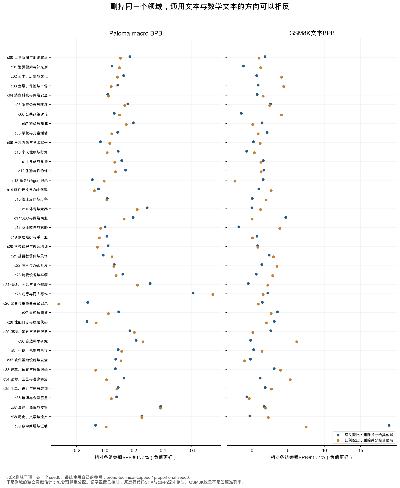
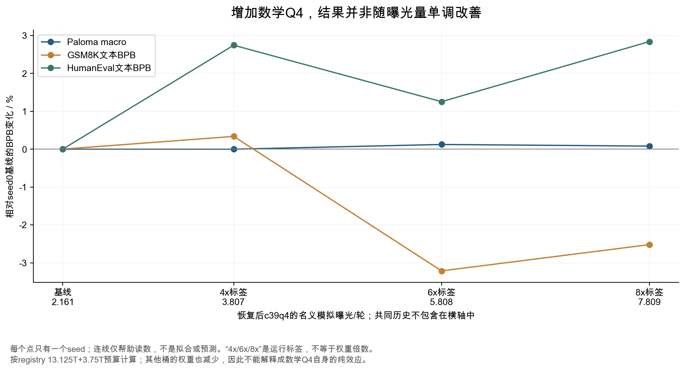
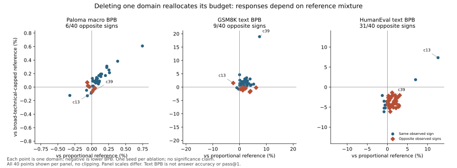

# 第三轮：从删域实验，走到自己的配比与顺序方案

这一轮不再只读被选中的最佳配比。我重新核对了80个删域实验、10个质量档实验和数学Q4增量实验，并取到了125个对应的原始W&B配置。目的很具体：弄清楚“加哪类数据”“加多少”“什么时候加”分别有多强的证据，以及怎样把这些问题拆成自己能做的实验。

最值得记住的三个结果是：删掉数学域后，Paloma与GSM8K的方向可以相反；只保留最高质量档Q4没有取得最好的代理结果；顺序实验的权重藏着曝光补偿，但补偿使用的步数与公开历史相差一次更新。后者很小，却说明只看“前70%、后20%”这样的标签不够。

所有新增实验仍属于d512代理，约2084万激活参数、5.976亿总参数。下面的任务指标是文本BPB，越低越好，不是GSM8K答题准确率或HumanEval pass@1。535B模型是否出现同样变化，需要另做固定评测。

## 一、先找正确参照，再解释删域结果

### 1.1 80个实验实际上有两套参照

公开registry分别有40个`semantic-zero-cXX`与40个`proportional-zero-cXX`。每个实验把一个cluster的五个质量桶全部置零，再把预算给其余桶。这不等于只拿掉数据而保持其他训练量不变。

我用200桶的实际权重寻找参照，而不是根据运行名称猜测。40个语义组删域配比，全部等于`broad-technical-capped`删掉相应域后重新归一化；剩余桶的最大误差仅6.94e−18。这套参照不是Hero最初的Harrier配比，也不是最终被选中的`996f4891`。比例组对应`proportional seed0`，但并非严格逐桶重新归一：最大权重误差1.65e−6，即0.000165个百分点。小桶保底等因素会影响这种比较，不能宣称它们完全相同。[固定版本的原始registry](https://huggingface.co/datasets/marin-community/grug-moe-mix-swarm/tree/75c25718e2a7cf7a3b1b498b00479351f80345e0/registry/v1/swarms/h100-d512-from10pct-store-4d2e363d) · [逐桶构造误差与参照CSV](analysis/domain_ablation_audit.csv)

语义参照的后缀是`20260827-ceguard-use02a`，删域运行是`20260826-rno2a`。仅凭后缀，我一开始不能确认是否有运行环境差异，因此又查了原始配置。80个删域实验与各自参照，在移除配比及运行专属路径后，记录配置全部一致：模型、优化器、种子、硬件资源、数据组件、模拟曝光设置、评估设置，以及共同的step-393恢复路径均相同。80个Paloma终点也与registry一致。

这消除了“已记录配置不同”这一疑点。但配置里有先恢复自己运行的checkpoint、再回退共同checkpoint的路径；我没有逐个读取checkpoint内容，也没有核对每个启动时的代码SHA、环境变量及实际token ID。因此可以说“记录配置可比”，不能说所有执行条件都已经逐一复现。[125个配置的紧凑审计表](analysis/experiment_config_audit.csv) · [保留了原始GraphQL请求的来源清单](sources/source_manifest.json)

### 1.2 删数学：通用文本与数学文本可以方向相反

| 删除的领域 | 语义组Paloma变化 | 语义组GSM8K文本变化 | 比例组Paloma变化 | 比例组GSM8K文本变化 |
|---|---:|---:|---:|---:|
| c39 数学问题与证明 | −0.068% | +18.915% | +0.006% | +7.460% |
| c13 命令行Agent记录 | −0.089% | +1.536% | −0.008% | −2.348% |
| c28 性能日志与底层代码 | −0.128% | +3.077% | −0.064% | +1.965% |
| c30 自然科学研究 | +0.213% | −0.185% | +0.262% | +6.170% |
| c37 法律、法院与监管 | +0.383% | +1.681% | +0.382% | +1.853% |

Δ相对各组自己的seed0参照，负值更好。这些数字不是跨组直接比较两套基线的优劣。

在语义配比里，删除数学后，Paloma略好，GSM8K文本建模明显变差。一个合理解释是：有限预算被转给了对Paloma更合适的内容，同时数学覆盖减少了。但“合理解释”还不是机制证据：c39包含什么、被补给哪些桶、数学题是否重复、文本BPB是否主要由答案或提示部分主导，都还需要进一步检查。

对自己的模型，实际含义是：如果需求里有数学能力，不能只让一个通用文本macro决定是否减少数学。至少应同时约束数学固定文本BPB与真实解题准确率；前者便于诊断语言建模，后者检验使用效果。把c39减少到零的干预，也不能替代在当前配比附近减少1个百分点的局部试验。

同样，删除Agent记录在两种参照下对GSM8K的方向不同。这不支持“Agent数据促进数学”或“Agent数据伤害数学”的普遍判断；它说明结果依赖其余配比与预算替代方式。[完整80项及54个任务终点](analysis/ablation_task_endpoints.csv)



### 1.3 删域后的改善，不等于这个域毫无价值

假设配比为w，删除领域i后，其余领域变为`w_j / (1−w_i)`。测量到的变化同时包含：失去i，增加所有其他j，改变重复曝光，以及可能的优化器路径变化。删除大域与删除小域的干预幅度也不同。

例如，c25幻想与同人写作在两套参照里被删除后，Paloma分别变差0.609%和0.746%；c26议会与董事会记录被删除后，分别改善0.123%和0.323%。可以把前者列为保留覆盖、后者列为局部减量的候选，但不能直接把整个cluster当成干净的“幻想文学”或“会议记录”。第一版已经展示过cluster标签与样本不完全一致。

这里每个删域实验只有seed0，还从80次干预中挑出了极值。比例基线的10个seed给出的Paloma标准差为0.000668，GSM8K文本BPB标准差为0.062685；这是同一配比下跨种子的波动，不是每个删域对照的置信区间。不要给单个删域结果贴“统计显著”标签，也不要把这组标准差直接套到另一个语义基线。[10个比例基线及其他实验索引](analysis/swarm_inventory.csv)

较可靠的下一步是：冻结当前共同checkpoint，围绕当前配比做局部扰动，明确把增加的预算从哪里扣回；对可能部署的候选另跑未参与筛选的种子与固定评估。前80个实验用于缩小搜索范围，后一个确认实验决定是否上线。

## 二、Q4与多轮曝光：为什么不能只按质量标签排序

### 2.1 只保留Q4，代理结果反而更差

比例配比组的质量隔离实验，不是“给Q4稍微加一点”，而是只用一个质量档，把其他档的预算全部转过来。

| 保留内容 | Paloma BPB | 相对比例seed0 | GSM8K文本BPB | 相对比例seed0 |
|---|---:|---:|---:|---:|
| 比例基线，混合质量档 | 1.186472 | — | 0.783100 | — |
| 仅Q1 | 1.224815 | +3.232% | 0.899053 | +14.807% |
| 仅Q2 | 1.210277 | +2.006% | 0.798326 | +1.944% |
| 仅Q3 | 1.225250 | +3.268% | 0.897764 | +14.642% |
| 仅Q4 | 1.296149 | +9.244% | 0.866761 | +10.683% |

在这四个隔离实验中，Q4的Paloma最差。这足以否定“这个数据池只用Q4必然最好”。但它不能证明Q4普遍不好：隔离同时改变领域分布、唯一数据覆盖、每桶重复轮数，以及分类器偏好。Q4不是人类对所有任务的统一质量判定。

语义组还有一个相反的提醒：删Q4后Paloma只改善0.055%，GSM8K文本反而变差1.842%；删Q0后Paloma变差1.078%。不能因为Q0名字里有“低质量”，就把它视为没有任何可学习信息。六个语义删档实验的权重构造也已复核为删档后归一化，但上述执行来源限制仍适用。[10个质量实验完整CSV](analysis/quality_ablation_audit.csv)

要区分“质量更好”与“重复更少”，可以从每个质量档抽相同唯一token量，尽量匹配领域分布，再固定抽样预算、重复轮数和去重策略。若仍有差异，才更接近内容质量效应。另设一个保持内容集合、只改变重复轮数的实验，检查是否已经进入边际收益下降区域。这两个实验不应混在一个“只留Q4”的运行里。

### 2.2 加数学Q4，收益没有单调增长

| 运行标签 | 前段c39q4权重 | 后段c39q4权重 | 恢复后的名义模拟曝光 | Paloma BPB | GSM8K文本BPB | HumanEval文本BPB |
|---|---:|---:|---:|---:|---:|---:|
| 基线seed0 | 0.926% | 2.472% | 2.161轮 | 1.193234 | 0.741226 | 0.513522 |
| math-q4-4x | 1.894% | 3.439% | 3.807轮 | 1.193223 | 0.743721 | 0.527605 |
| math-q4-6x | 3.070% | 4.615% | 5.808轮 | 1.194708 | 0.717419 | 0.519957 |
| math-q4-8x | 4.245% | 5.791% | 7.809轮 | 1.194195 | 0.722550 | 0.528095 |

“4x/6x/8x”是运行标签，不是实际权重相对基线的倍数。横轴使用registry的13.125T与3.75T预算，并除以c39q4库存；它表示恢复后的名义模拟曝光，不包含共同前10%的历史。有限代理数据的模拟轮数也不是535B已实际看过的轮数。

在seed0里，6x的GSM8K文本BPB比8x低；8x比4x低，却没有改善Paloma或HumanEval文本。可确认的是这些终点并非单调。不能确认的是6x“最优”、8x“过拟合”，或数学Q4天然排挤代码能力：每个点只一个seed，而且其余桶权重也被扣回。要判断过拟合，至少还需要独立数学验证、训练与验证差距、重复文档检测及更多种子。[实际权重与曝光计算CSV](analysis/math_q4_response.csv)



重复数据本身不等于浪费。一项数据受限预训练研究在其固定算力设置下发现，少量多轮重复可以接近用更多唯一数据训练的效果；继续增加重复后，收益会减弱。这支持估计自己的重复收益曲线，不支持把“最多4轮”或“最多8轮”当作所有领域、模型和训练阶段的规则。[Scaling Data-Constrained Language Models](https://arxiv.org/abs/2305.16264)

## 三、顺序实验：先把阶段曝光账算清楚

### 3.1 权重里能读出怎样的补偿

`r-stem-pre-high`在前段把数学域加0.25个百分点、从自然科学域扣回；`r-stem-cool-high`在后段完成同方向干预。后段数学增幅是0.841358024691个百分点。两者比值恰好为：

```text
0.841358024691 / 0.25 = 2726 / 810
```

如果前段有2726次更新、后段810次更新，每次全局token量相同，这两种计划的数学新增量就相等。其余五档也逐桶补偿；用这组步数计算，全部200桶的曝光差L1低于1e−6 token，仅剩浮点误差。`u-math`家族也满足同一比例，只是预算从其余桶扣回的方式不同。因此不能把`pre-swap`简单理解为把两套原始权重直接互换。

原始配置确认两次运行都是：4K上下文、batch1024、总3930次更新，混合权重边界0/384/3120，共同回退恢复路径step-393，seed0；其他记录设置一致。W&B历史从零编号`_step=393`开始，终点为3929；开头两次运行的CE不同，且累计token量为`(393+1)×4194304`，支持这是恢复后的新更新，而非复制的旧点。[早期干预W&B](https://wandb.ai/marin-community/marin_moe/runs/h100-d512-mix-r-stem-pre-high-seed0-from10pct-20260826-rno2a) · [后期干预W&B](https://wandb.ai/marin-community/marin_moe/runs/h100-d512-mix-r-stem-cool-high-seed0-from10pct-20260826-rno2a)

据此按配置区间计数，恢复后前段是2727次、后段810次，合计3537次，恰好等于registry的14,835,253,248 physical tokens。权重补偿使用的是2726次：相差一次更新。

| 计算口径 | 两段预算 | 前段加数学与后段加数学的曝光差L1 |
|---|---|---:|
| registry名义模拟预算 | 13.125T / 3.75T | 2.523148B |
| 权重实际补偿的步数 | 2726 / 810次 | 浮点误差，低于1e−6 token |
| 公开历史与配置区间 | 2727 / 810次 | 20,971.52 tokens |

最后一行只有数学净差10,485.76 tokens，以及供给领域相反方向的同量差；它非常小，不足以单独解释BPB变化。第一行则说明registry的名义模拟分段与已经取整的物理训练日程不能直接混用。[8组比较、3种口径CSV](analysis/order_budget_audit.csv) · [200桶曝光差CSV](analysis/order_cell_exposures.csv)

这些仍是连续权重的曝光计算。加载器会以49152条序列为混合块取整，恢复位置还可能落在半块中；实际已读token集合是否相同，必须再核对整数计数、块内顺序和有限库存取模。第二轮已经展示过同样的游标风险。本轮未进行这8组运行的token ID重放。

### 3.2 终点没有给出一个普遍最好的顺序

以下是同一seed下，后期数学增量与前期数学增量的对照。`r-stem`主要从自然科学域转预算；`u-math`分摊给其余内容，二者的替代方式不同。

| 比较 | 前期增量Paloma | 后期增量Paloma | 前期增量GSM8K文本 | 后期增量GSM8K文本 |
|---|---:|---:|---:|---:|
| r-stem high，seed0 | 1.194312 | 1.194267 | 0.743442 | 0.712546 |
| u-math high，seed0 | 1.193637 | 1.193895 | 0.749093 | 0.729499 |

这两个点对比中，后期增量的GSM8K文本更好；Paloma的方向却不同。互换前期增减方向的实验有seed0和seed1，GSM8K差值在不同seed下也明显不同，例如r-stem的差值分别为−0.022107与−0.001820。其余四组减量与交换实验全部保留在CSV，没有只留下支持“数学最后学”的点。

这些结果可以支持一个小范围候选：在自己的模型上，试验相同累计数学曝光下的前期/后期偏重。不能支持“通用预训练应该先通用、再代码、最后数学”的固定顺序。它们共用的初始阶段也已经有数学数据，并不是从完全没有数学的模型开始。

### 3.3 怎样构造真正匹配预算的顺序对照

设后续总预算为B，前段占f，基准每桶比例为w。选择前段扰动δ，且全部桶的δ合计为零。前段用`w+δ`，后段用：

```text
w − f/(1−f) × δ
```

于是每桶总曝光都满足：

```text
fB×(w+δ) + (1−f)B×(w−f/(1−f)δ) = B×w
```

如果前段70B、后段30B，数学基准15%，前段增加5个百分点，后段就必须减少11.667个百分点。两段分别为20%和3.333%，仍合计15B数学。若把这两个权重直接交换，却仍保持70B/30B日程，数学只剩8.333B；比较结果同时包含顺序变化与少看6.667B数学。

给通用网页做相反补偿，全部桶的曝光差L1为13.333B。L1把数学少看的量与网页多看的量都算入，不能再把它解释成额外训练了13.333B。随后的整数取整又可能破坏精确匹配，所以顺序实验最好在整数块计数上构造方案，再反推配置权重。[交互预算工具](#planner)会同时展示连续补偿、直接交换、整数取整三者的区别。

阶段相同曝光仍可能有不同效果。最简单的SGD解释是：先学A会改变模型位置，后学B时的梯度也会改变；两次更新通常不能交换。若二阶近似有效，A后B与B后A的参数差包含`ηAηB(HB·gA − HA·gB)`。这是顺序效应的直觉，不是Marin的实测参数差；真实MuonH/AdamH还带着动量、预条件与路由状态。切阶段时重置优化器，也会引入另一项干预。

更细的分段未必更好。DoGE附录E在一个小模型设置中比较了总领域曝光相同的全程平均权重与分阶段权重：2或3段接近基线，有些域好、有些域差；10段在该实验里普遍退步。它提供的是受限设置下的反例，不能推成“10段一定差”，但足以说明频繁调配需要自己的对照验证。[DoGE附录E](https://arxiv.org/html/2310.15393v2#A5)

## 四、拿到每域Loss后，到底怎样决定下一次增减

### 4.1 先定义目标，避免训练Loss自己当裁判

加某个域后，训练CE可能升高，只因为模型看到了更难预测的文本；它也可能降低，只因为更多预算转到了已经很熟的数据。都不能单独决定配比好坏。

在简单SGD的一阶近似下，训练域i是否有助于目标域j，与两者梯度的内积有关，而不是只取决于i本身的Loss。梯度同向，i的更新有助于降低j；方向冲突，则可能损害j。这只是解释为何“难”和“有用”不同；真实训练的预条件更新、长程效应和梯度噪声不在这个简单近似里。

| 方法 | 它依据什么改变配比 | 对自己项目的用途 |
|---|---|---|
| DoReMi | 代理模型与参考模型的正超额Loss，经过域级鲁棒优化 | 有参考模型时估计还可学习的部分；参考模型本身会影响结论 |
| DoGE | 训练域梯度与目标梯度的对齐 | 目标域明确时诊断跨域帮助或冲突；先在小代理上验证 |
| RegMix | 多个小规模配比运行的终点评估，拟合配比响应 | 有并行代理预算时搜索候选；部署前另做确认 |
| Data Mixing Laws | 拟合领域比例与领域Loss的关系 | 预测候选前先用未参与拟合的配比检查误差，不能只看拟合曲线 |
| Online Data Mixing | 把训练反馈作为非平稳bandit奖励，并保留探索 | 需要在线适配时的候选；奖励设计决定它在优化什么 |

这些是论文的方法摘要，不是声称Marin使用了它们的完整算法。本研究没有拿到Marin完整选择器、代理训练目标和全部筛选过程。DoReMi依赖参考差距，DoGE关注目标梯度，ODM可以使用训练Loss反馈；不能把它们合并成一个“Loss高就多采样”的通用规则。[DoReMi](https://arxiv.org/html/2305.10429v4) · [DoGE](https://arxiv.org/html/2310.15393v2) · [RegMix](https://arxiv.org/html/2407.01492v2) · [Data Mixing Laws](https://arxiv.org/html/2403.16952v2) · [Online Data Mixing](https://arxiv.org/html/2312.02406v2)

一个可操作的起点是：固定一份通用验证集合，另固定代码、数学、科学、多语等项目实际需要的集合。保留桶级Loss便于诊断，但部署目标用不会随配比变化而改变的评估。数学最终还要测真实解题，代码还要测执行通过率；不要把BPB变好直接写成下游能力提升。

### 4.2 用局部替代试验回答“再给1B是否值得”

在当前checkpoint附近，把数学预算增加1B，从通用网页扣1B，其他保持一致。再做相反方向的−1B试验。若预算足够，还换一个供给方，例如科学论文。这能区分“数学本身有增量价值”与“刚好从一个更差的供给域扣回”。

固定总预算后，可以估计一个局部替代效应：`目标Loss差 / 转移token量`。它只对当前模型、配比、供给方和训练区间有意义，不是这个数据域永远的单价。更大的调整应另测，因为重复曝光、梯度竞争和领域覆盖都可能产生非线性。

先用代理筛选数个候选，再用同一共同checkpoint与未用于筛选的种子确认候选。对确认结果同时报告通用改善、重点能力损失、波动和实际tokens/s。若候选让通用macro小幅改善，却突破数学或多语的允许退步线，应调整约束或保留原方案，而不是事后换一个更好看的macro。

## 五、库存、保底与曝光上限怎样一起约束配比

设一个桶的可用库存为N，已经抽样的历史tokens为H，后续预算为B，希望全程曝光不超过E轮。则后续平均比例必须满足：

```text
w ≤ (E×N − H) / B
```

N应是能实际使用、完成过滤与去重、按同一tokenizer计算的库存；H是历史消费量，可以包含重复抽样，不能用“存储里有多少token”代替。若过去token历史不完整，就应保留不确定区间：用历史上界核对容量，用历史下界核对最乐观情况。没有测到历史不等于历史为零。

保底ℓ约束覆盖，上限u约束容量。静态比例方案存在的必要且充分条件是：每桶`ℓ≤u`，且`Σℓ≤1≤Σu`。这是预算可行性，不是质量最优性；满足这些不代表训练一定有效。

在工具的自拟100B示例中，数学库存12B，历史4B，最多2轮。未来最多还能抽20B，所以平均权重上限20%。基准15%意味着累计19B、1.583轮。如果把数学提高到25%，累计29B、2.417轮，已经超过用户自定上限。把上限设为2轮只是演示；它不是来自Marin或论文的普遍推荐。

实际设置保底时，可以从目标覆盖要求、历史配比和确认试验出发：例如多语不能在整个阶段完全消失，但具体最低比例仍需验证。不要把每个桶都设相同保底，再忽略它们的库存相差几个数量级。若小桶太多，考虑按语义域先约束覆盖，再在域内分质量档；是否合并要看目标与样本，不应只为了让数学可行。

若全体容量放不下预算，应明确选择：补充唯一数据，缩减总训练量，接受并验证更高曝光，或改变哪些域承担重复。工具不会替你自动放宽上限，也不会为了凑到100%把已经超额的历史曝光清零。

## 六、建议怎样安排自己的下一批实验

以下是一套可执行的顺序，具体运行数量应按自己的算力缩减。示例转移量是设计示范，不能直接照搬535B的比例。

1. **建立消费与评估账。** 给每桶记录去重库存、历史抽样、阶段token量、有效整数计数、固定验证Loss、下游能力与tokens/s。先把配置比例和实际消费分开。
2. **在当前日程上测局部配比。** 冻结同一checkpoint与优化器状态，恒定数据顺序，分别转移±1B或相同的小比例。预先写清供给域、目标指标和允许退步线。
3. **给可能部署的候选做独立确认。** 搜索阶段的seed0结果只用于选候选，增加未参与筛选的种子或数据切片；保持模型、总tokens、长度、批量和评估一致。
4. **固定累计曝光，再测顺序。** 先算每桶累计量，按实际完整混合块构造前期偏重、后期偏重和恒定方案。阶段边界使用真实token计数，并保留中间checkpoint，观察是否只是暂时遗忘。
5. **再单独测长度。** 若下一步需要4K→16K，用相同数据语义、总tokens和基准配比做长度对照；同步核对QK、全局batch、LR、IO窗口与游标。不要把长上下文、配比、优化器改动放进同一个对照。
6. **在较大模型上确认转移。** 小代理选出的候选能降低搜索成本，但不能证明535B收益。至少复测关键能力的方向、预算和吞吐，再决定是否扩大。

对“数学被降低但总Loss变好”这样的现象，这套实验的回答顺序是：先确认总Loss的评估分布有没有改变；再看固定数学和通用集合；再查数学覆盖与重复；最后通过局部替代与预算匹配的顺序对照定位原因。每一步都有下一项能推翻当前解释的检查，不需要先编一套听起来合理的训练故事。

## 本轮来源与计算边界

新增材料保存在`sources/practical_2026_10_04/`：125个原始W&B配置与终点、两个顺序运行的早期和边界窗口、相关一手论文、训练器源码及完整请求清单。训练曲线仍沿用报告此前冻结的2026-10-04快照，没有把本轮查到的代理配置当成Hero最新部署进展。

本轮重新计算了80个删域干预、10个质量干预、数学Q4四个曝光终点，以及8组顺序比较的3种预算口径。代码是[analyze_practical.py](scripts/analyze_practical.py)，完整摘要是[practical_audit.json](analysis/practical_audit.json)。交互工具是确定的预算算术，不预测Loss，不执行训练；其数值检查包含曝光守恒、历史容量、无解情况和取整误差。[工具数值验证](analysis/planner_validation.json)

没有在本机重现GPU训练，没有测535B任务准确率，没有确认逐文档质量效应，也没有对这8组顺序运行重放实际token集合。明确这些边界，是为了让下一次实验能补上缺口。

<!-- GENERATED_PRACTICAL_TABLES -->
## 附录：80个删域实验的对照与终点评估

每行是一个seed0实验。语义配比组的参照是broad-technical-capped；比例配比组的参照是proportional seed0。Δ以各自参照为分母，负值表示BPB降低。80项与对应参照的记录配置在去掉配比和运行路径后相同；代码SHA、实际加载的checkpoint及token ID未逐一验证。这是删掉领域并把预算分给其余领域的联合干预。

| 配比组 | 删除领域 | 前段删掉的比例 | 后段删掉的比例 | Paloma Δ | GSM8K Δ | HumanEval Δ |
|---|---|---:|---:|---:|---:|---:|
| 比例 | c00 世界新闻与地缘政治 | 2.898% | 2.898% | +0.105% | +0.967% | +1.224% |
| 比例 | c01 消费健康与补充剂 | 4.076% | 4.076% | +0.098% | +1.209% | +0.809% |
| 比例 | c02 艺术、历史与文化 | 0.847% | 0.847% | +0.084% | +4.088% | +0.165% |
| 比例 | c03 金融、保险与市场 | 4.349% | 4.349% | +0.041% | +4.360% | +0.240% |
| 比例 | c04 消费科技与网络安全 | 0.753% | 0.753% | +0.022% | +1.533% | +2.189% |
| 比例 | c05 政府公告与环境 | 2.996% | 2.996% | +0.134% | +2.431% | +1.380% |
| 比例 | c06 公共政策讨论 | 0.878% | 0.878% | +0.098% | +4.062% | +0.094% |
| 比例 | c07 游戏与赌博 | 1.272% | 1.272% | +0.146% | +0.099% | -0.810% |
| 比例 | c08 学校与儿童活动 | 0.557% | 0.557% | +0.044% | +0.841% | +2.689% |
| 比例 | c09 学习方法与学术写作 | 0.706% | 0.706% | +0.031% | +1.124% | +0.482% |
| 比例 | c10 个人健康与行为 | 1.084% | 1.084% | +0.012% | +0.317% | +2.148% |
| 比例 | c11 食品与食谱 | 1.096% | 1.096% | +0.066% | +1.222% | +0.449% |
| 比例 | c12 旅游与目的地 | 1.673% | 1.673% | +0.071% | +1.261% | +0.419% |
| 比例 | c13 命令行Agent记录 | 2.552% | 2.552% | -0.008% | -2.348% | +12.604% |
| 比例 | c14 软件开发与Web代码 | 6.733% | 6.733% | -0.076% | +2.637% | -0.167% |
| 比例 | c15 临床治疗与牙科 | 1.246% | 1.246% | +0.010% | +1.919% | -0.823% |
| 比例 | c16 体育与竞赛 | 1.310% | 1.310% | +0.221% | +1.167% | -0.502% |
| 比例 | c17 SEO与网络商业 | 3.095% | 3.095% | +0.130% | +0.007% | +1.182% |
| 比例 | c18 商业软件与策略 | 1.132% | 1.132% | -0.033% | +3.827% | +0.927% |
| 比例 | c19 家居维护与手工业 | 1.082% | 1.082% | -0.043% | +0.059% | +0.068% |
| 比例 | c20 学校课程与教师培训 | 1.584% | 1.584% | -0.055% | +0.804% | +2.790% |
| 比例 | c21 基督教信仰与灵修 | 2.228% | 2.228% | +0.046% | +2.951% | +1.596% |
| 比例 | c22 应用与Web开发 | 0.379% | 0.379% | +0.059% | +3.453% | -0.835% |
| 比例 | c23 消费设备与车辆 | 2.645% | 2.645% | +0.075% | +2.853% | +2.100% |
| 比例 | c24 情绪、关系与身心健康 | 2.468% | 2.468% | +0.222% | +2.170% | +3.064% |
| 比例 | c25 幻想与同人写作 | 4.021% | 4.021% | +0.746% | +1.538% | +2.157% |
| 比例 | c26 议会与董事会会议记录 | 7.522% | 7.522% | -0.323% | +0.851% | +2.105% |
| 比例 | c27 常识与问答 | 0.242% | 0.242% | +0.022% | +2.638% | +1.481% |
| 比例 | c28 性能日志与底层代码 | 6.774% | 6.774% | -0.064% | +1.965% | +7.013% |
| 比例 | c29 课程、辅导与学校服务 | 3.157% | 3.157% | +0.202% | +0.112% | -0.588% |
| 比例 | c30 自然科学研究 | 5.393% | 5.393% | +0.262% | +6.170% | +2.865% |
| 比例 | c31 小说、电影与电视 | 0.542% | 0.542% | +0.113% | +1.390% | +0.280% |
| 比例 | c32 软件基础设施与安全 | 7.035% | 7.035% | +0.108% | -1.009% | +1.100% |
| 比例 | c33 赛车、体育与娱乐记录 | 2.406% | 2.406% | -0.066% | +3.936% | -1.268% |
| 比例 | c34 宠物、园艺与害虫防治 | 0.540% | 0.540% | +0.009% | +5.265% | +1.668% |
| 比例 | c35 手工、设计与家居装饰 | 1.889% | 1.889% | +0.080% | +2.691% | +0.543% |
| 比例 | c36 赌博与金融服务 | 0.743% | 0.743% | +0.042% | -0.380% | +0.723% |
| 比例 | c37 法律、法院与监管 | 2.689% | 2.689% | +0.382% | +1.853% | +0.195% |
| 比例 | c38 历史、文学与遗产 | 5.322% | 5.322% | +0.254% | +2.244% | +1.681% |
| 比例 | c39 数学问题与证明 | 2.082% | 2.082% | +0.006% | +7.460% | +1.903% |
| 语义 | c00 世界新闻与地缘政治 | 3.047% | 2.680% | +0.170% | +1.802% | -4.324% |
| 语义 | c01 消费健康与补充剂 | 3.938% | 3.081% | +0.046% | -1.192% | -2.759% |
| 语义 | c02 艺术、历史与文化 | 1.045% | 1.352% | +0.127% | +0.624% | -4.561% |
| 语义 | c03 金融、保险与市场 | 3.246% | 4.172% | +0.086% | +0.844% | -2.657% |
| 语义 | c04 消费科技与网络安全 | 0.230% | 0.128% | +0.017% | +0.710% | -3.499% |
| 语义 | c05 政府公告与环境 | 2.736% | 2.687% | +0.156% | +2.555% | -2.035% |
| 语义 | c06 公共政策讨论 | 0.277% | 0.159% | +0.062% | -1.488% | -4.120% |
| 语义 | c07 游戏与赌博 | 1.359% | 0.953% | +0.194% | +1.388% | -5.232% |
| 语义 | c08 学校与儿童活动 | 0.608% | 1.467% | +0.085% | +2.081% | -2.445% |
| 语义 | c09 学习方法与学术写作 | 0.554% | 2.050% | -0.034% | +0.196% | -4.344% |
| 语义 | c10 个人健康与行为 | 0.526% | 0.869% | +0.089% | -0.738% | -5.223% |
| 语义 | c11 食品与食谱 | 0.785% | 0.600% | +0.113% | +1.551% | -4.682% |
| 语义 | c12 旅游与目的地 | 1.581% | 1.400% | +0.141% | +1.645% | -3.349% |
| 语义 | c13 命令行Agent记录 | 3.275% | 2.615% | -0.089% | +1.536% | +7.356% |
| 语义 | c14 软件开发与Web代码 | 9.109% | 6.859% | -0.047% | +0.942% | -3.579% |
| 语义 | c15 临床治疗与牙科 | 0.354% | 0.136% | +0.014% | +0.025% | -3.524% |
| 语义 | c16 体育与竞赛 | 1.197% | 1.131% | +0.290% | -0.006% | -5.191% |
| 语义 | c17 SEO与网络商业 | 2.656% | 2.457% | +0.192% | +4.642% | -1.392% |
| 语义 | c18 商业软件与策略 | 1.328% | 1.776% | -0.002% | -1.814% | -4.791% |
| 语义 | c19 家居维护与手工业 | 0.853% | 0.626% | +0.011% | +0.685% | -3.503% |
| 语义 | c20 学校课程与教师培训 | 1.321% | 1.825% | +0.018% | +0.773% | -4.893% |
| 语义 | c21 基督教信仰与灵修 | 1.593% | 2.601% | -0.015% | +2.352% | -4.168% |
| 语义 | c22 应用与Web开发 | 0.387% | 0.627% | +0.061% | +1.343% | -6.148% |
| 语义 | c23 消费设备与车辆 | 2.213% | 2.631% | +0.122% | +0.579% | -3.040% |
| 语义 | c24 情绪、关系与身心健康 | 1.631% | 3.941% | +0.310% | -0.499% | -2.036% |
| 语义 | c25 幻想与同人写作 | 3.801% | 3.257% | +0.609% | +2.181% | -4.084% |
| 语义 | c26 议会与董事会会议记录 | 4.597% | 3.856% | -0.123% | +1.442% | -2.681% |
| 语义 | c27 常识与问答 | 0.267% | 0.558% | +0.092% | +3.487% | -5.062% |
| 语义 | c28 性能日志与底层代码 | 9.553% | 8.381% | -0.128% | +3.077% | +1.859% |
| 语义 | c29 课程、辅导与学校服务 | 2.815% | 2.523% | +0.171% | +2.584% | -4.483% |
| 语义 | c30 自然科学研究 | 7.668% | 7.260% | +0.213% | -0.185% | -4.550% |
| 语义 | c31 小说、电影与电视 | 0.354% | 0.325% | +0.089% | +0.209% | -2.179% |
| 语义 | c32 软件基础设施与安全 | 10.295% | 9.509% | +0.072% | -0.221% | -2.224% |
| 语义 | c33 赛车、体育与娱乐记录 | 1.422% | 0.936% | +0.069% | +3.054% | -2.094% |
| 语义 | c34 宠物、园艺与害虫防治 | 0.391% | 0.340% | +0.128% | +1.116% | -3.748% |
| 语义 | c35 手工、设计与家居装饰 | 1.519% | 1.361% | +0.089% | +1.828% | -5.261% |
| 语义 | c36 赌博与金融服务 | 0.792% | 1.161% | +0.078% | -0.720% | -6.119% |
| 语义 | c37 法律、法院与监管 | 2.420% | 2.517% | +0.383% | +1.681% | -3.505% |
| 语义 | c38 历史、文学与遗产 | 4.555% | 3.988% | +0.253% | -0.306% | -3.508% |
| 语义 | c39 数学问题与证明 | 3.701% | 5.207% | -0.068% | +18.915% | -2.054% |

[80行权重与参照审计CSV](analysis/domain_ablation_audit.csv) · [全部54项任务终点CSV](analysis/ablation_task_endpoints.csv) · [逐桶顺序曝光差CSV](analysis/order_cell_exposures.csv)


## V120：同一个删域实验，为什么不能变成通用数据排行榜

这轮把80个删域实验按两套真实参照重新配对，导出54个文本BPB字段的4320条差值，再把配置送进归档的原数据支持过滤与key分配函数。没有新训练；目标是区分真实观察、源码机制与不成立的推测。[计算脚本](scripts/analyze_ablation_context.py)、[完整结果](analysis/ablation_context.json)、[4320条响应](analysis/ablation_context_responses.csv)。

### 1. 先看两套参照下的方向，而不是给训练域贴好坏标签

每个domain都有两次删域记录，分别相对proportional seed0和broad-technical-capped seed0。以下统计的是相对各自参照的BPB变化符号，不是两种基线直接竞争，也不是显著性检验。

|指标|40个域中，两套参照下方向相反|再要求两边变化绝对值均至少0.5%|
|---|---:|---:|
|Paloma macro BPB|6|0|
|GSM8K文本BPB|9|4|
|HumanEval文本BPB|31|22|

0.5%是事后读图筛选条件，不是训练前声明的保底，也不是置信区间。Paloma的6个反向例子，两边较小变化的最大值仅约0.0660%，用严格符号计数容易夸大微小差异。HumanEval的反向例子更多且部分幅度较大，但仍只有每配方一个seed，不能据此证明稳定的因果交互。



读图：横轴是相对比例参照的变化，纵轴是相对语义参照的变化；负数表示更低BPB。左上、右下象限说明方向相反。三个面板尺度不同，不能凭点到原点的视觉距离跨指标比较。每个面板保留40个点，没有裁去大幅退步点。HumanEval这里是代码目标文本的BPB，不是执行测试的pass@1。

例如删除c30自然科学研究，HumanEval文本BPB相对比例参照变差约2.865%，相对语义参照改善约4.550%。这不能推出自然科学对代码“既好又坏”的矛盾规律；两个干预失去的预算和补给其他桶的量不同，其余配比也不同。删除c39数学域在两组中均损伤GSM8K文本BPB，却在HumanEval上出现方向分歧。数据价值应写成“在什么当前配比、什么供体安排和什么评估目标下的响应”。

完整54字段里包含`belebele_mean`和`include_mean`等汇总字段，不能把它们与子任务当成独立样本，再汇成一个整体胜率。4320行是保留原值的配对记录，不是4320次独立实验。

### 2. 一个被真实配置否定的源码推测

原`build_token_datasets`先按`_has_nonzero_weight`筛训练组件，随后`train_sets`按剩余组件顺序依次取child shuffle key。由此很容易推测：删掉一个域的五个桶，会让后面桶的key前移。但必须看`_has_nonzero_weight`究竟检查哪段历史：它对阶段列表使用`any(...)`，扫描所有阶段，没有按恢复步截断。[原函数](sources/deepening_2026_10_04/datasets.py)、[原key iterator](sources/tree_restore_2026_10_07/jax_utils.py)。

80份真实配置均保留0/384/3120三个阶段。删域只在后两段置零；第一段历史里，被删的五个桶仍有正权重。因此把完整配置送入这份归档源码，仍构造200个训练子数据集，所有命名child key与各自完整基线相同。**这组配置不支持“删域必然让剩余child key改变”的推测。** 这是固定源码下的条件复算；历史启动代码SHA、实际根key与token流仍未恢复。

探针给两边提供相同`PRNGKey(0)`，原函数真实生成JAX key；`block_shuffle`用记录器代替，仅保存收到的key，不执行shuffle或读取token。后续模拟曝光切片关闭，因为本轮只检查发生在切片之前的支持过滤和key分配。不能把“命名child key相同”扩大成“其余样本顺序或整个token流相同”；混合权重、整数quota和消费cursor仍会改变。

### 3. “清理过期配比历史”可能不是等价重构

再做一个明确的反事实：从同一配置删除第一段历史，只保留384和3120阶段。两套基线都会失去后两阶段始终为零的c22q0。删域配置除目标域外，也可能同时失去这个桶。下表是在相同给定根key下，相对各自**完整历史基线**的原函数复算；不是线上修改记录。

|传给原函数的配置|支持的训练桶数|其中相对完整历史基线改变child key的桶数|
|---|---:|---:|
|完整基线|200|0|
|剪去首段历史的基线|199|89|
|完整删c00配置|200|0|
|剪历史后的删c00配置|194|194|
|剪历史后的删c22配置|195|85|
|剪历史后的删c39配置|194|84|

两套参照在本轮得到同样的这些支持/key计数。删c39是末尾域，也不能据位置断言所有剩余key不变，因为剪历史同时过滤了前面的c22q0。这个细节说明，不能只检查目标域是否仍在，也要检查整个阶段支持集合。[16000条逐桶key对照](analysis/ablation_child_key_replay.csv)。

这不证明有人实际做过这种清理，更不证明历史训练因此退步。它给代码评审的规则是：**删除已过去的权重阶段之前，要同时验收子数据集支持、命名key与累计消费映射，不能只比较恢复步之后的权重数值。** 保留旧阶段可能带来缓存元数据工作；本轮没有测量它的成本，不能据此建议无条件删除或永远保留所有历史。

### 4. 训练桶和评估域也不是同一张表

记录配置有200个`cXXqY`训练桶和23个验证组件；训练桶各自带cell tag，验证组件的声明tags为空。原`tagged_eval_sets`会在组件tags后追加组件name，因此这些验证域仍有自己的评估标签。它没有在这个入口把c39映射为某个数学验证域，也没有把c13映射为Agent能力分数。原支持过滤排除了零训练权重的验证组件，不能把它们计入200桶预算。

所以“PTB涨了就加cXX”“HumanEval变好就是c28有效”都需要额外实验，不能由名称补全映射。40个聚类是训练内容分组，Paloma子集是固定文本分布，54字段又含目标文本评估和汇总；三者回答不同问题。源码中没有这项映射的入口，不等于全项目不存在任何语义关系；本轮未恢复可验证的训练桶→评估收益因果对应表。

### 5. 怎样用这些结果调整自己的配比

先选择自己的当前配方和不得退步的真实能力，别把80次删域结果按一个指标排成通用榜单。用它们提出少数局部供体交换：每次明确增哪几个质量桶、从哪里扣预算、保持什么累计量。把数学文本BPB、代码文本BPB与实际解题/代码执行结果分别保留，候选冻结后再独立确认。

对源码改动，分别比较完整历史、剪历史与显式保留命名key的路径；先验收整数计数、key、cursor和恢复边界，再讨论loss。若要测key分配本身的训练影响，需要同配方下改变这一因素的真实续训，当前条件复算没有完成这一步。也不能把本轮符号反转归因给key变化——完整历史配置的局部key复算恰好没有出现那种变化。

本轮11项分析/原函数控制支持上述归档数据与局部接口结论。未新增独立种子、完整token重放、535B跨规模确认或最优比例；已有573份来源保持。


## V121：配比边界早于共同恢复点

新取得生产run声明0/3120阶段，与80份续训的0/384/3120不同；日志前沿对应393次更新。原49,152槽混合块条件复算显示部分块前缀计数和逻辑身份不同，不能扩大为真实重复token事故。直接改393违反原整块assert；step432桥接合法但改变39次续训更新和预算，仍未执行。12项控制、逐桶原值与时间线；实际checkpoint、历史key及训练收益未知。[恢复边界与部分块](BATCH_CLOCK_ZH.md)。


## V122：历史源码与恢复证据

V122核对两份上传源码快照，四个所审计的数据支持、key分配与评估命名方法AST与V120所用版本一致；这提高局部版本证据，没有恢复历史key或真实输入，也没有新增删域训练结果。[证据与限制](RUN_CODE_PROVENANCE_ZH.md)。
