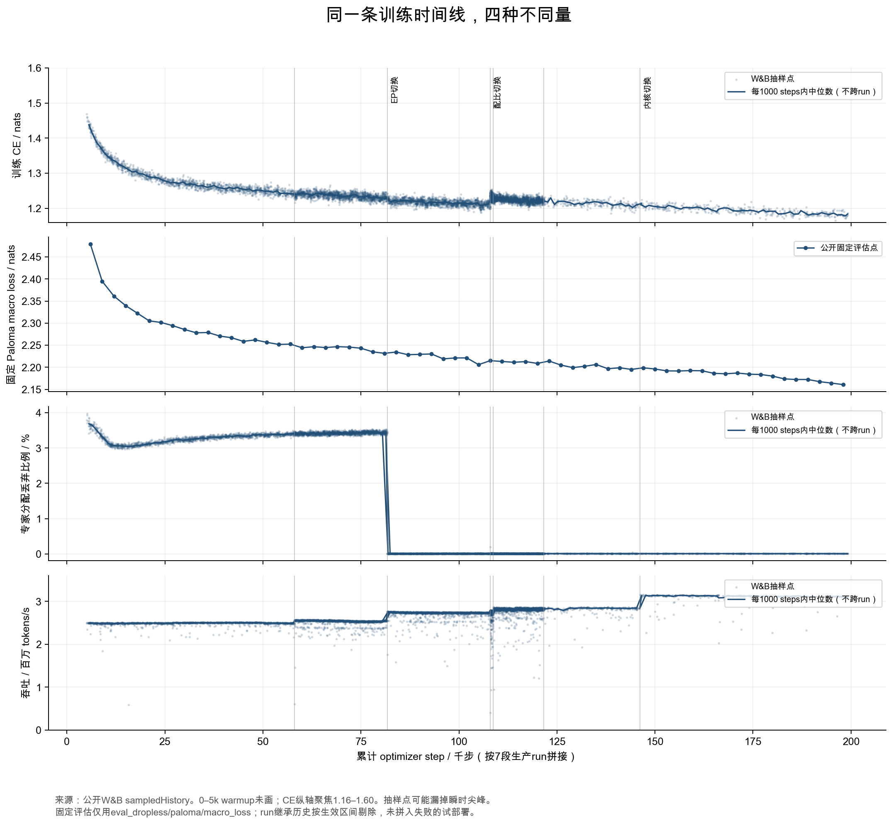
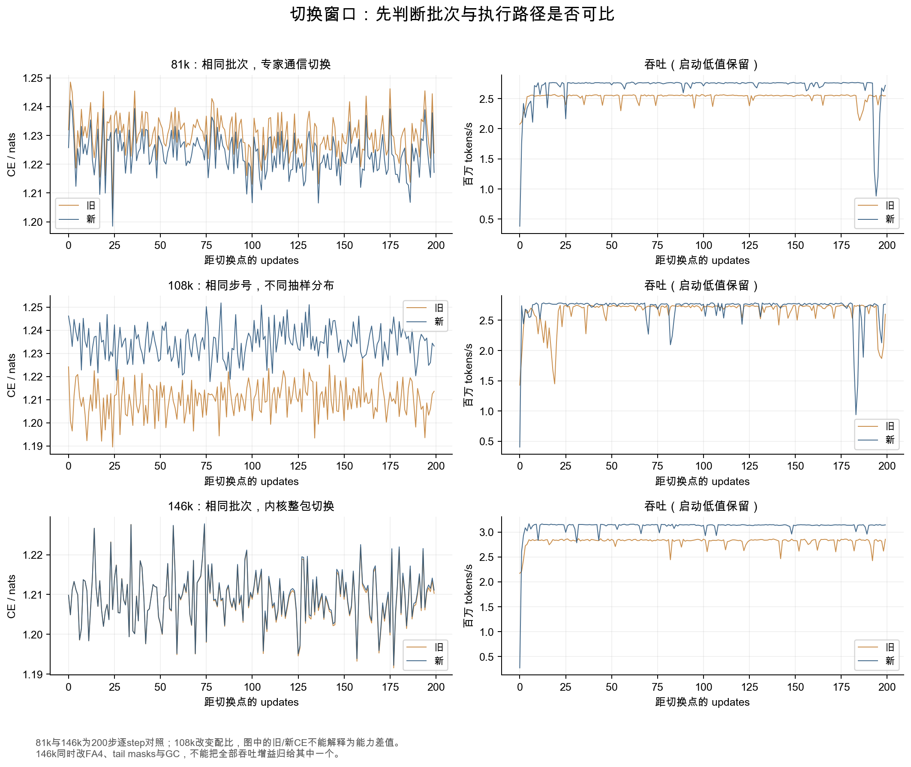

# Marin 535B 预训练：读懂故障、Loss 与数据配比

这份报告研究的是 Marin 的 **535.3B 总参数、22.76B 激活参数（通常写作 A23B）** Hero Run。18T 是训练目标，不是已经完成的训练量。资料截止北京时间 **2026 年 10 月 4 日约 05:38**：最新公开 W&B 快照在 step 199174、约 51% 进度，配置仍是 4K 上下文。后面的 cooldown 与 16K/65K/262K 扩展不能写成已完成结果。

阅读顺序建议：先读本篇的三个具体案例，再查工程问题表；需要逐条对照原文时读《#8435 中文逐条解读》；真正准备调整自己的数据时读《数据配比与顺序实操》。HTML 把这些内容合在同一页，保留搜索、目录、200 桶数据查询和本地笔记。

## 1. 先把最容易误读的三个地方说清楚

### 1.1 通信实现改变，也会让 Loss 下降

在 step 81716，更换专家通信实现后，训练 CE 平均下降约 **0.006498 nats**。本报告从两条公开 W&B run 取得完全相同的 step 区间 `[81716, 81916)`，逐 step 对齐 200 个样本，重新算出了这个差值。旧实现平均丢弃约 3.43% 的专家分配，新实现约 0.0076%。相同 checkpoint、相同批次下，少丢弃专家计算，本身就会改变前向结果。

因此，这里不能解释成“数据质量提高让 Loss 降低”。它首先是执行路径改变后的直接效果。整个部署还同时更新了通信 wheel、GEMM 和状态布局，单凭这次整包切换，不能把所有吞吐收益分摊到某个内核。[部署及官方同批次对照](https://github.com/marin-community/marin/issues/8506#issuecomment-5610467489)

### 1.2 配比改变以后，训练 Loss 上升，也可能是合理的

在 step 108000，数据配比切换。新分布的训练 CE 比旧分布高：本报告保留的窗口里，旧配比在 `[107800,108200)` 的均值约 1.2097，新配比在 `[108000,108200)` 的均值约 1.2346。两个均值的区间、批次和分布不同，**这里只是现象记录，不能做能力优劣判断**。官方 W&B 阶段说明也把上升解释为新数据更难预测。

支持新配比的证据来自固定验证集：在 d1536 的配比实验里，Paloma macro BPB 从 **0.925068 降到 0.918442，降低约 0.716%**，16 个子集里 15 个改善。但旧、新 ladder 的硬件、EP、batch 和部分优化器设置不同，而且 d768 在切换前已经存在差异；这不是毫无混杂的单因素实验。更严格的辅助证据是 d512 同 checkpoint、三 seeds 的旧/新配比比较，但那批实验参与了配比选择，也有选择偏差。[完整实验、配置差异与最终 CSV](https://github.com/marin-community/marin/issues/9126)

### 1.3 某层输出很小，不能据此说它没用

早期 attention gate 的参数范数不断长大，把多数词的门压到接近零。研究者一度担心早期层已经不工作。随后真的把前十层删除：dropless global macro loss 从 **2.093 变成 6.584**；只去掉前十层的 attention，也升到 **2.798**。早期层虽然只做小幅修改，后续层依然依赖这些修改。

这组实验纠正了“输出幅度小就是没贡献”的解释。最后对 gate/router 加了缓慢衰减的 0.02 weight decay，而没有直接把 gate 缩小一半，因为 gate logit 缩放实验表明强行改掉学到的尺度会显著破坏模型。[范数调查与敲除实验](https://github.com/marin-community/marin/issues/8818)

## 2. 模型与训练的实际结构

### 2.1 为什么是 535B，但每个 token 只激活约 23B

模型共 48 层，hidden dimension 6144。每层都有 MoE FFN，384 个路由专家，每个 token 选 8 个，另有 2 个始终执行的共享专家。路由专家和共享专家 FFN 宽度均为 3072。大量参数存放在每步只用一部分的专家中；注意力、共享专家、embedding/readout 等还会消耗计算，因此不能简单用 `535B × 8/384` 算全部激活参数。[初始模型说明](https://github.com/marin-community/marin/issues/8435#issuecomment-5335872267)

LatentMoE 先把 6144 维 token 压成 3072 维，在这个空间发送给专家，合并后再升回 6144 维。router 自己仍读全宽 token。通信 payload 因而减半。作者报告，latent projection 后加可学习 RMSNorm 还改善了质量；不加时出现 activation scaling 问题。原评论的“质量差 30%”“提高 15%”没有在这条评论里给出完整指标定义和误差，应该保留为作者的实验总结，不能写成任务准确率提高 15 个百分点。[作者答复](https://github.com/marin-community/marin/issues/8435#issuecomment-5406648997)

### 2.2 专家并行与数据并行分别跨哪里

初始配置是 11 个 GB200 NVL72 rack，但参与训练的是每 rack 64 张 GPU，共 **704 张**；不能把 11×72=792 都当成训练卡。EP64 把同一 rack 内 64 张 GPU 用于专家并行；11 个 rack 之间是数据并行复制，通过 DCN 做跨 rack 梯度归约。

这一区别解释了许多故障：一个 rack 内的 grouped GEMM 卡住，整个 rack 就进不了后续归约，其他十个 rack 会在 AllReduce 等它。日志最后停在 AllReduce，不代表 AllReduce 一定是最初出错的位置。要往前追“第一个没能进入归约的 rank”。[挂起调查的证据链](https://github.com/marin-community/marin/issues/8870#issuecomment-5531534090)

初始每步 11264 条、每条 4096 tokens，即 **46,137,344 tokens/update**。当前 schedule 是 390251 steps；按配置相乘约 **18.0051T tokens**。主帖早期给的是 390139 steps、约 18T，两者属于不同记录时点。本文用抓取到的运行配置计算当前阶段预算。[当前配置快照](sources/wandb/hero-fa4sm100-nomask-step146k_meta.json)

### 2.3 注意力的局部层与全局层

大约四分之三的层使用 2048 滑动窗口，局部层 12 个 KV heads；每第四层以及最后一层使用 full causal attention，全局层 6 个 KV heads。Q heads 是 48，所以 local/global GQA 分别是 4:1 与 8:1。局部层使用 half-RoPE，全局层 NoPE。48 层放在一个 `lax.scan` 编译体里，层类型通过 traced scalar 选择，不用 Python 为每层展开不同程序。

XSA 从 attention 输出里减掉与本 token value 平行的分量，head gate 再用 `2·sigmoid(...)` 调整每个 head 的输出。ShortConv 放在 K、attention 输出和 MLP 输出，kernel size=4，而且带 packed-document segment mask。这些都是初始配方的构件；本文没有复做足够的消融，不能把它们各自写成确定的质量贡献。[固定版本 model.py](https://github.com/marin-community/marin/blob/12d8b6f09f96ad4f0277445765c1a00dbc81d5be/experiments/grug/moe_hero_ep/model.py)

### 2.4 为什么训练中参数范数不动，并不奇怪

MuonH 用于 attention、专家、latent 和 GatedNorm 的矩阵，AdamH 用于 lm_head，两者把更新投影回参数的 Frobenius 范数球面。它们的范数基本不变，是算法本来就要求的行为，不是梯度消失的证据。embedding、router、attention gate、norm gains、短卷积等用普通 Adam，范数可以改变。

初始峰值 MuonH LR≈0.003291，Adam LR≈0.000759；warmup 占 1%，随后线性衰减至峰值的 5%，没有全局 grad clipping。最终 logits 的 z-loss 权重 1e-4 加进训练目标。router z-loss、load-balance loss、entropy 主要是监控项，不能看到名字带 loss 就认为它参与了反向传播。[优化器与实际分组](https://github.com/marin-community/marin/blob/12d8b6f09f96ad4f0277445765c1a00dbc81d5be/experiments/grug/moe_hero_ep/optimizer.py)

后续 ordinary Adam 的 attention gate/router 增加了单独的 WD=0.02，并随训练衰减。不要把它理解成 MuonH/AdamH 全部开始使用普通 AdamW weight decay；也不要把配置里顶层的 `weight_decay` 数字直接等同于所有参数的最终处理。[WD 作用对象与消融](https://github.com/marin-community/marin/issues/8818#issuecomment-5498576154)

## 3. 工程问题逐项对应：做了什么、解决了什么、为什么

下面的“原因”分成确证、强证据支持的机制，以及仍未确定的原因。相关 issue 里的 agent 自动摘要会被后续评论纠正；报告保留这些纠正，不只读 issue 的首段。

### 3.1 Checkpoint 写得出来，却读不回来

**症状。** 把 fp32 master weights 和 optimizer state offload 到 pinned-host RAM 后，checkpoint 保存成功，恢复却报 memory kind 不匹配。

**原因。** TensorStore deserialize 先生成 device buffer，但恢复模板要求 `pinned_host`；组装 sharded array 时，两边的内存类型不一致。abstract-mesh sharding 具体化时若丢掉 memory_kind，还会悄悄把本来该在 host 的状态恢复进 HBM。

**改动。** 每个 leaf 先按 device materialize，再移动到其目标 memory kind；保留 sharding 的 memory_kind。逐 leaf 处理，避免整个恢复状态同时挤进 GPU。**解决的是读回语义和内存放置，不是文件格式本身。**[PR #8443](https://github.com/marin-community/marin/pull/8443)

### 3.2 一味加 host RAM，仍然在恢复后被杀

**症状。** container RAM 申请从 850 GiB 增到 909、940 GiB，恢复依旧被 OOM kill。日志已经显示 Loaded checkpoint。

**原因。** 单 rank 恢复前约 148 GiB，恢复后稳定在 230 GiB；4 ranks/node 便逼近 940 GiB。冷启动只约 175 GiB/rank，说明额外约 55 GiB/rank 在恢复路径长期驻留，不是短暂读峰值。

**改动。** pinned-host shard 分成 1 GiB chunks；把读缓冲 donate 给 `device_put`；完整 restore 前释放初始状态；把 restore 放到 data-cache 构造之前；同一容器内 ranks 轮流恢复。fleet 峰值从 882 降到 735 GiB，step 164 成功续训。retry budget 也从不合理的 1000 次降至每 task 3 次、累计 5 次，避免确定性 OOM 每 25 分钟把 704 GPUs 拉起来再失败。[PR #8480](https://github.com/marin-community/marin/pull/8480)

**你可以复用的判断。** 先区分 init state、restored state、deserialize staging 和 allocator pool，画出它们何时共存；只有知道谁占着内存，才知道加 RAM 是否有效。

### 3.3 每隔几次保存，host RSS 的地板抬高

**症状。** 训练开始后约每三小时 OOM；writer tasks 保存后 RSS 的最低值升高，非 writer tasks 没有同样变化。

**诊断被改写过。** 最初怀疑 persistent CUDA pinned-host BFC pool，后来发现 `GlobalAsyncCheckpointManager._commit_futures` 等待结束后没有清空，已完成 futures 仍可能引用源缓冲。allocator 的 pool floor 是另一个因素，清 futures 不等于 pool 一定全部退还 OS。

**处理。** restore concurrency 限额、checkpoint staged host cache 限额、`malloc_trim()`、jemalloc 等先后尝试；`malloc_trim` 仍不稳定。这是一串收窄问题的尝试，不能把其中第一项写成“从此根治”。writer/non-writer 对照比总 RSS 曲线更能定位保存路径。[早期处理](https://github.com/marin-community/marin/issues/8506#issuecomment-5373722833) · [后续纠正](https://github.com/marin-community/marin/issues/8506#issuecomment-5389725084)

### 3.4 Loader 缓存不是越大越好

两 trays、batch 1024 的 Harrier loader 对照中，1 GiB/process cap 的吞吐约 0.937 batches/s，125 GiB 约 0.956；训练只需要约 0.050 batches/s，低 cap 仍有约 18.6× headroom。缓存占更多内存，未必增加端到端训练吞吐。这里测的是小规模 loader，不是11 racks 的所有存储尾延迟。[loader 消融](https://github.com/marin-community/marin/issues/8506#issuecomment-5401613236)

### 3.5 NVLink、IB 与节点掉线，不能混为训练数值不稳定

`CUDA_ERROR_NVLINK_UNCORRECTABLE` 是明确的设备互连故障证据；IB port error/IBFlapping 是另一条网络证据；节点 `NotReady`、heartbeat 消失又是另外一类。重启或 whole-gang retry 从完整 checkpoint 继续，可恢复进度，但不自动说明硬件根因已被修好。[NVLink 事件](https://github.com/marin-community/marin/issues/8506#issuecomment-5365222655) · [节点掉线及恢复](https://github.com/marin-community/marin/issues/8506#issuecomment-5442658185)

相反，watchdog 结束时出现的 CUDA peer-memory error 可能是 teardown 的后果，不该倒推成最初原因。9 月 27 日事件明确把这点写了出来。[因果顺序纠正](https://github.com/marin-community/marin/issues/8506#issuecomment-5856665151)

### 3.6 Ragged EP 第一次切换：质量和速度通过，稳定性没通过

9 月 2 日从 pooled-wave 改为 ragged。约 70 个更新内：drop 从约 3.4% 降到 <0.01%，MFU 从约 20.5% 到 23.4%，同批次 Loss 降约 0.006。但是两次启动都发生 silent hang，于是回退到旧代码和旧 checkpoint。新 run 使用独立 W&B ID、checkpoint tree，没有污染旧树；回退后同批次 Loss 重放也被核验。[回退决定](https://github.com/marin-community/marin/issues/8506#issuecomment-5518830230)

**为什么这种改动要有 rollback。** 内核数学正确、单 rack smoke 正常，都无法覆盖11 racks 下的同步行为。部署最先验证的应该是“发生异常能否回到完整旧状态”，不能只有一个越来越快的候选分支。

### 3.7 “两个 executable 交替”是曾经的解释，后来被排除

#8870 首帖把 hang 与 watch/plain executable 交替、symmetric memory window 重叠联系起来。但后续代码审计发现生产配置是 `WatchMode.INLINE`：每步是同一编译路径，`step%10` 只是是否写日志。capacity-limited eval 也早已禁用。因此“刚过 watch step 就挂了”是时间上相邻，不是机制证据。

另一个 symmetric window 问题确实存在，但不能因为相似就移植其根因。报告在这里保留排除过程，因为只读首帖会学到一条已经失效的诊断。[首帖解释的纠正](https://github.com/marin-community/marin/issues/8870#issuecomment-5531534090)

### 3.8 NCCL 编译 headers 与 runtime 不一致：实在的缺陷，但不是全部解释

运行期 NCCL 是 2.30.7，PJRT 的 device kernels 却按 2.29.7 headers 编译。旧 compat shim 的行为与新 device API 有差异，缺少一些新的 barrier timeout 能力。换成一致 headers 后，四次立即挂起的模式变成通过约 200 步试验；但后来又在约 1590 clean steps 后出现 hang。

所以 #9062 修的是版本偏差，有真实短期收益；不能写成“silent hang 根因已经完全解决”。[header 修复](https://github.com/marin-community/marin/pull/9062) · [后来复发](https://github.com/marin-community/marin/issues/8506#issuecomment-5614639876)

### 3.9 真正把 GPU 内部卡在哪里抓出来：PDL 与 warp 读取不一致

后续 GPU dump 定位到 QuACK 0.6.4 的 SM100 grouped backward GEMM。MMA/epilogue warps 已退出，TMA-load warp 还在等待一个不会被释放的 pipeline barrier，scheduler warp 则以为仍有工作。不同 warp 对同一组 `cu_seqlens` 边界解码不同。

PDL（programmatic dependent launch）允许后续 kernel 提前启动，再由 kernel 内部等待前驱完成。这里只有 load/scheduler warps 在首次读取前执行 `griddepcontrol.wait`，MMA/epilogue 没有等。因此它们可能提前读到尚未写完的专家分组边界，错误地判定没有工作并退出。第二次 dump 中有一个 cluster 在第一个 tile 就出现分歧，加强了这个机制解释。[dump 分析](https://github.com/marin-community/marin/issues/8870#issuecomment-5688372126)

**改动。** 三处 grouped-GEMM launcher 设置 `use_pdl=False`，先让前驱完整结束；另一条 upstream 方向是在相关 warps 加 wait。microbenchmark 成本在约 0.3% 以内。微基准没复现稀有 hang，不能宣布定论；生产 recurrence interval 才是后续判断依据。部署同时升级了 PJRT wheel，因此 2.6% 吞吐收益也不能算成“关闭 PDL 自己提速”。[PR #9183](https://github.com/marin-community/marin/pull/9183) · [200 步接受记录](https://github.com/marin-community/marin/issues/8506#issuecomment-5690222518)

### 3.10 存储策略不让删 checkpoint，却误伤了原子提交

永久 checkpoint metadata 改成 `atomic_rename` 后，典型对象存储实现是：写临时对象 → copy 成正式对象 → delete 临时对象。bucket 的 `DenyHeroCheckpointDeletion` 保护规则把临时 sibling 也覆盖了，copy 成功、source delete 被拒绝，checkpoint 提交流程报 AccessDenied。

规则从8月就存在，为什么9月才出错？因为 #8974 在9月15日才把 metadata 从 direct write 改成 atomic rename，代码第一次触碰了旧策略不允许的动作。temporary root 未受同样保护，所以 hourly temporary saves 能成功；第一次 permanent milestone 才暴露冲突。[策略与代码时间线](https://github.com/marin-community/marin/issues/8506#issuecomment-5708008076)

工程上该修 staging 路径或把 policy 范围收窄，同时保留对永久 payload 的保护。本报告读到的调查明确没有修改 policy；随后 step121638 的新部署通过了200步及保存测试，但不能从这个日志反推出每一个存储权限问题都已永久消失。[后续切换验收](https://github.com/marin-community/marin/issues/8506#issuecomment-5734989379)

### 3.11 Checkpoint 留得多，反而把训练拖停

9月23/24日，区域存储达到约 104.56 TiB，超过100 TiB quota，服务端暂停写入并返回405。约11.7 TiB 的增量主要来自强制 checkpoint 和 durable handoff copies。一次 manifest upload 没 timeout，rank0 卡在 S3 上传；另一次背景提交没有完成，下一次保存又会等它。

清理旧临时 checkpoint 和重复件后恢复写入；生产记录说明保留了若干 handoff，删掉的旧 handoff 也被明确列出。诊断不能把“写入被 quota 暂停”写成 GPU hang。[存储事故、恢复与遗失的锚点](https://github.com/marin-community/marin/issues/8506#issuecomment-5817400840)

### 3.12 正确的提速改动也需要数值对照

step146139 部署 native SM100 FA4 和 ragged MLP tail-mask removal，官方200步报告：MFU 24.10%→26.75%，tokens/s 2.83M→3.14M。本文独立抓取同批次 `[146139,146339)`，200 个 CE 差值平均 **+0.0003601**，max abs **0.0008768**，复现官方约 +3.6e-4 的结果。

tail masks 为什么能删？grouped GEMM 只读真实 segment 范围，return transport 只送 active rows；无效 tail 不会进入最终 combine。测试用 NaN 填满 unused capacity，专门检查它是否泄露进输出。local/FSDP 路径仍读取完整缓冲，所以保留 masks。[FA4 原生内核](https://github.com/marin-community/marin/pull/9332) · [tail masks 与 NaN 测试](https://github.com/marin-community/marin/pull/9333)

这里有实测的质量近似对齐与吞吐改善。但窗口只有200步，eval/save/resume 需要继续测；官方接受记录没有把未测项写成已经通过。[正式验收](https://github.com/marin-community/marin/issues/8506#issuecomment-5804146010)

### 3.13 Router “提高精度”改变的是路由策略

BF16 dot 输出再 cast 到 FP32，并不等于 FP32 accumulation/output。保存的输入上，后者把 score RMS error 从0.0074565降到0.00002808，324条有效记录全部匹配 FP64 top-8 顺序；旧算术80条不匹配。但是在实际恢复 batch 上，约8.99%的 token top-8 顺序、2.65%的 token 专家集合发生变化。

top-k 是离散边界，微小 score 变化会切换专家，继而改梯度、QB pending state 与下一批路由。20-step 单 rack 对照里 train loss 几乎相同，sender drops 反而增加约5.55%，修正后的 preferred checkpoint Paloma loss 高0.00072265。没有证据支持生产中途换，作者建议保持原算术。单 rack、20步、固定旧算术评估 preferred-trained checkpoint，均限制其外推。[完整数字、复现代码与未部署状态](https://github.com/marin-community/marin/issues/8435#issuecomment-5785310423)

### 3.14 参数存了，不代表评估用了完整状态

QB 阈值本步计算、下一步应用。checkpoint 把 `pending_qb_betas` 存在参数之外；普通下一步 train forward 会应用它，某些 checkpoint-only evaluation 却直接读取 raw params，漏掉这次更新。

实验评估被重做，a1 结果废弃，a2 应用 pending state。两个 checkpoint 的 macro loss 修正约 −3.53e-5 和 −2.41e-5。影响小仍然需要改，因为所评估的状态与模型下一次真正使用的状态不同。#9352 说明实验 fork 有 fix 和 regression，但未合入主线；**已纠正实验结果，不等于生产评估路径已修好**。[#9352 的完整状态说明](https://github.com/marin-community/marin/issues/9352)

### 3.15 拉长上下文：drop 变多，先看分母与数据相关性

同一180k checkpoint、固定4.19M tokens/rack/update、三个seeds×100步：4K→8K tokens/s −1.6%，assignment drop fraction约1.86e-4→8.29e-4；16K约2.94e-3，速度−3.1%。绝对值仍小，不能只说“暴增16倍”。

更长 sequence、相同 token budget 意味着每批独立文档更少，相邻 tokens 主题更相似，专家负载可能更集中。这是合理机制解释；此实验还同时改 qk_mult、只用一个 rack，诊断LR约生产0.69倍且WD=0，不能凭它证明生产Loss如何变化。

ragged 路径把 receiving shard 的 per-chunk capacity clipping 计入 `sender_dropped`，并把 receiver_drop_fraction 写零。**字段名是记账位置，不是根因位置。**[实验设置与后续纠正](https://github.com/marin-community/marin/issues/9615)

## 4. 怎样使用 Scaling Ladder，而不把它当承诺

初始 ladder 维持近似同样的 tokens/active-param（约791），在 d768、d1024、d1536、d2048 等小模型上检查动态与拟合。d2048 在约81%失败、未补跑；终点是外推。不同训练百分位分别拟合 `L=1.5+A·C^-α`，按 Hero compute 预测约2.039 的 dropless Paloma macro loss。固定1.5是建模假设，不是已经测出的不可约损失。[官方脚本](https://github.com/marin-community/marin/blob/d23e6e9c3673435fb82d83aa6c51a607d0da6009/experiments/grug/moe_hero_ep/plot_scaling_ladder.py)

它最有用的部分是提供参照：grad norm 什么时候应该到峰值；drop 是否按类似轨迹发展；固定评测是否突然偏离。它不能同时替你预测未来新配比、新 context 和新 kernel 的效果。作者很早就说明原预测假设全程4K、固定data mix和token horizon，而8月19日已调整过配比。[适用条件说明](https://github.com/marin-community/marin/issues/8435#issuecomment-5358054499)

本文核对到，当前 W&B initial phase 的200桶权重与固定12d8b6f版本JSON的最大差约3.47e-18，基本相同。但未抓取所有原 ladder 配置来定位8月19日那次变化究竟改变哪些权重，因此不能以这次比较“否认”原评论。已核实的是**当前生产配比**，不是所有历史recipe差异。

新mix的1.20דcompute-equivalent speedup”使用 **BPB 的零floor拟合**，macro α≈0.040007，与旧Hero预测的 `L−1.5` 拟合不是同一个公式。由 `(0.925068/0.918442)^(1/α)` 得约1.1968：意思是旧配方需要约19.7%更多compute才能按该拟合达到相同BPB；在其假设下，新配方比这个旧预算少约16.4%。这不是训练吞吐提升20%，也不是模型能力提升20%。

## 5. 一张曲线至少对应四种不同量

| 量 | 回答的问题 | 常见误读 |
|---|---|---|
| train/cross_entropy_loss | 当前被抽到的训练分布有多难预测 | 把配比变化后的数值当同一把尺 |
| train/loss | 实际优化目标，可能包括最终logit z-loss | 与纯CE混用，误判正则的效果 |
| eval_dropless/paloma/macro_loss | 固定Paloma子集的无容量丢弃平均loss | 与eval_dropless/macro_loss混用 |
| macro BPB | 每byte的平均预测代价，减少tokenizer计量差异 | 把小百分比下降直接叫同百分比算力收益 |
| moe/drop_fraction | 专家分配丢弃率 | 说成同样比例训练tokens整个被删除 |
| throughput/mfu | 按解析FLOPs估计的硬件利用 | 跨context比较时忽略分子FLOPs变了 |

Paloma macro 是子集平均，领域权重与训练池占比不是一回事。固定评测的多领域macro提高，不意味着每个下游任务都提高：新mix在d1536的Wikipedia BPB仍回退约0.50%；d768/d1024的code BPB略退，d1536才转为改善。[各子集最终结果](sources/mix_study_final-2026.09.15.1_final_results.csv)

W&B 图表在本报告中按七条实际 lineage 的有效区间拼接，避免把回退 trial 或父run的重复历史加进训练主轨迹。原始 GraphQL response 保留；长时间序列每个metric请求至多1500采样点，图中1000-step中位数只用于读趋势，不能检出所有单步尖峰。专项200步窗口单独抓取，逐点范围和数量核验。重复eval同step、同值已去重，未发现数值冲突。

## 6. 旧 pretrain 仓库究竟缺了什么

我检查了旧仓库固定tree snapshot中的README、信号阅读章、step32999算例、9月3日生成报告、10月2日日志和数据拉取实现。它的来源区分、matched-progress方法、可重算输入是有用的，不能为了重写而丢掉。

但README自己也承认，v2第一阶段主要覆盖Scaling Ladder，router/datamix是后续内容。日报列出“19个updated issues、158条comments”，只证明收集到资料，没有回答这些问题：起初怀疑什么、哪个实验排除了它、后来原因怎样改变、生产到底接受还是回退。old repo对单条hero run的追踪也不能直接覆盖后续七段 lineage。[旧仓库README](https://github.com/fudan-chen/pretrain)

这份新报告的增量是：把28个#8435条目（主帖+27comments）逐条中文解释；读#8506、#8818、#8870、#9126、#9615及修复PR；重算200桶三阶段权重和暴露次数；用公开W&B重做同批次对照；给出可以实际执行、能被推翻的数据配比实验方案。它不把每天的抓取条数当成研究结论。

## 7. 资料可信到哪一步

- **我做了的工作：**公开资料保存、全文阅读#8435、关联日志与重点实验阅读、匿名W&B数值取得、配比和窗口重算、报告及图表构建。没有登录私有集群，没有运行535B模型，也没有独立复做作者的GPU消融。
- **训练语料可见性：**GCS报告和样本可读，CoreWeave原始token store不向匿名用户提供直接数据访问；作者明确说明可分享metadata但不能开放完整数据。公开classifier/cluster weights不等于完整数据已可下载。
- **不能完成的因果归因：**200个桶同时变更，无法从一次整体切换估计每桶的独立边际贡献；实测训练CE不能消除分布改变；小规模收益也不能保证535B长期收益。
- **目前仍未知：**18T最终质量；未来context阶段的最佳qk_mult与capacity；若干storage、node和checkpoint-barrier事故的最初原因；高精度router新训练从零开始是否有益。
- **来源相冲突时：**优先用运行配置和原始metric，保留历史说法及后续纠正。当前state=running是抓取时点，旧run的state=crashed不等于模型数值发散；多次是主动切换、协调器退出或基础设施中断。

继续阅读《数据实操》和《逐条中文解读》，可以分别查实验方案和每条原评论。所有计算输入和生成脚本都保存在独立仓库中。
