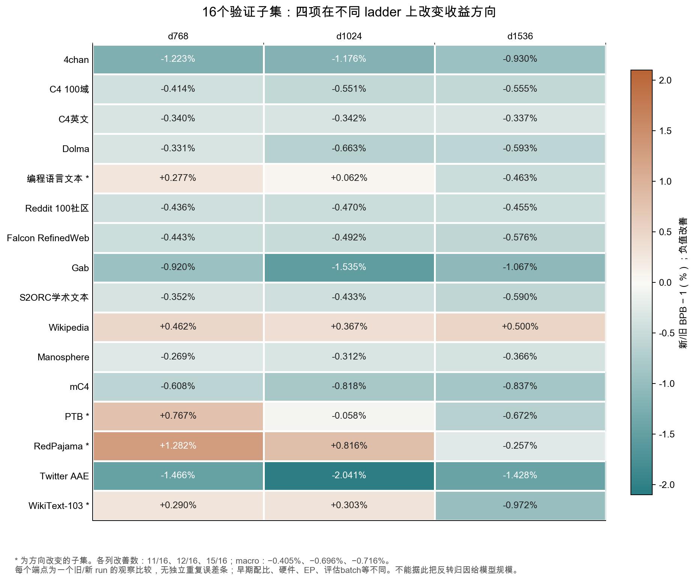
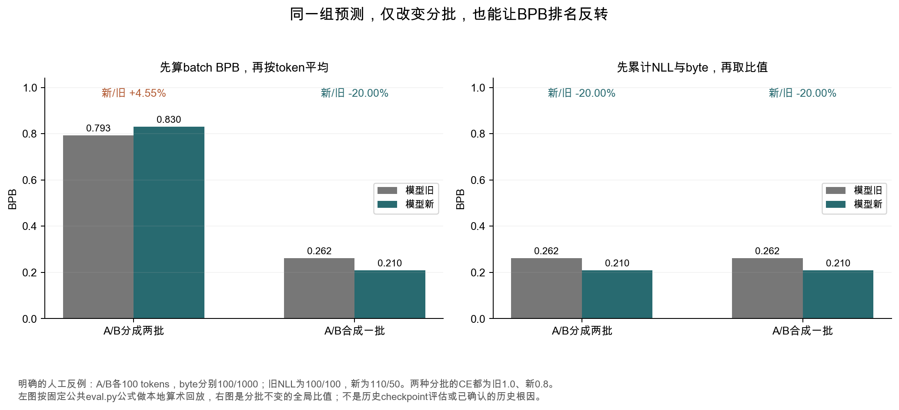
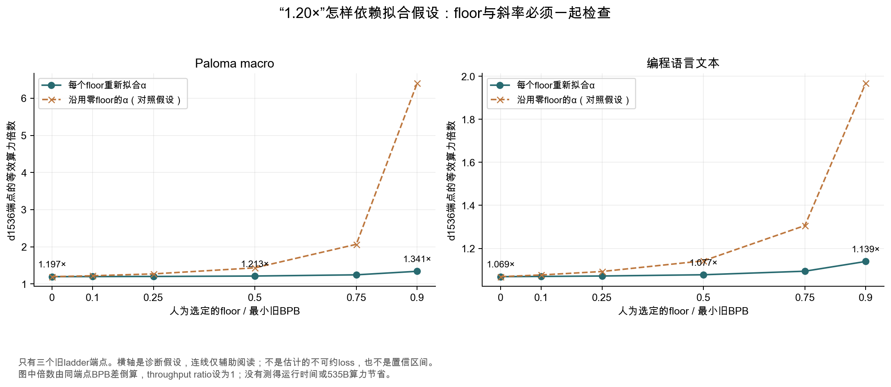

# 配比怎样跨规模迁移：先确认比较的是同一件事

V15补充：[缓存身份核查](CACHE_PROVENANCE_ZH.md)发现旧组200桶与mix25组200桶指向两个不同store根。V16进一步追到[16来源fuzzy豁免政策](DEDUP_FILTERS_ZH.md)。实际缓存差异尚未独立验证，因此下文跨组端点只能支持完整配方的观测比较，不能单独归因于配比或切换时刻。

这一轮让我改变判断的，不是多找到一篇支持代理搜索的论文，而是公开配置中的一个具体差异：三个旧、新 ladder 在所谓“25%切换”之前，初始训练配比已经不同。随后又发现，代码子集的 CE 和 BPB 在两个较小 ladder 上给出相反方向，而固定公共评估代码里确实存在一种随 batch 分组变化的 BPB 聚合方式。

因此，当前最值得补的实验是统一评估和训练历史后的候选确认。继续扩大代理搜索，不能消除这些比较口径的问题。下面把实际复算、机制反例、论文方法和未来实验分开写清。

本章是 V11，来源核对日期为2026年10月5日。生产训练曲线仍使用10月4日固定快照；本章没有重新抓取535B完整历史，也没有执行GPU训练。新增原文件见[sources/scale_2026_10_05](sources/scale_2026_10_05/issue_9126.json)，数值入口为[scale_audit.json](analysis/scale_audit.json)，离线重建命令为`make report`。

## 1. 先把跨规模“方向不稳”说准确

### 1.1 不止代码，有四个子集改变了方向

原始[point_speedups.csv](sources/mix_study_final-2026.09.15.1_point_speedups.csv)有96行：三个 ladder、16个子集、CE/BPB两种指标。其中48行是BPB，**没有macro行**。本章按各列16项等权重建macro，没有把总体汇总当成第17个子集。

| 固定验证子集，BPB新/旧变化 | d768 | d1024 | d1536 |
|---|---:|---:|---:|
| 编程语言文本 | +0.277496% | +0.062118% | −0.462972% |
| PTB | +0.767396% | −0.057760% | −0.671786% |
| RedPajama | +1.281948% | +0.816203% | −0.256744% |
| WikiText-103 | +0.289719% | +0.302872% | −0.971503% |
| Macro，16项等权 | −0.405107% | −0.695737% | −0.716282% |
| 改善子集数 | 11/16 | 12/16 | 15/16 |



另外11个子集在三列都改善，Wikipedia在三列都退步。这个观察比只看最终“15/16改善”更有用：某些风险在早期代理出现，到更大实验消失；另一些风险贯穿三个实验。它提示需要保留逐任务确认，而不是让macro替所有任务作答。

这些列并非“只改变模型规模”的控制实验，也不是多配方的跨规模排名实验。只有旧、新两套run的端点，不能计算完整候选排序的Spearman相关；更不能从四个正负变化断言“规模导致反转”。`d`表示hidden width，不能读成参数量。上表的微小正负值没有独立重复误差条，方向变化尚未被证明超出训练或测量波动。

[48行端点与CE对应值](analysis/scale_endpoints.csv) · [官方实验记录](https://github.com/marin-community/marin/issues/9126)

### 1.2 新核对到的混杂：切换前的权重并不相同

这一轮通过匿名公共W&B GraphQL读取六个run的config和summary，并将响应冻结。三组初始权重的半L1差都为：

```
0.5 × Σ桶 |w新初始 − w旧初始| = 0.20391888499269878
```

这表示两套名义权重之间约有20.39%的概率质量需要重新分配。它不是20.39%的文档发生变化，也不是实际token重复比例。两边初始权重均有200个正权重训练桶，总和为1；用于验证的零权重组件不混入这个差值。

举一个能直接回查的桶：d768的`c13q4`，旧初始权重为0.010884626898116395，新初始权重为0.003001305223936239。这个差异出现在新run的step 0权重表中，早于记录的step 2880新阶段边界。d1024/d1536的对应初始权重相同，因此不是只出现于某一个ladder的孤立字段。

| 记录配置，旧 → 新 | d768 | d1024 | d1536 |
|---|---|---|---|
| GPU型号 | GB200 → H100 | GB200 → H100 | GB200 → H100 |
| Expert axis | 64 → 8 | 64 → 8 | 64 → 8 |
| Global train batch | 1024 → 1024 | 2048 → 1024 | 6144 → 1024 |
| Eval batch | 64 → 16 | 128 → 32 | 384 → 64 |
| Muon learning rate | 相同 | 0.0144112 → 0.0101903 | 0.0148894 → 0.00607859 |
| Optimizer beta2 | 相同 | 0.95 → 0.968491 | 0.95 → 0.968491 |
| 初始配比半L1差 | 20.3919% | 20.3919% | 20.3919% |
| 16项验证组件配置 | 相同 | 相同 | 相同 |

对应的训练token数也应说清。d768两run均记录47,898,951,680 tokens，d1024均为128,144,375,808。d1536旧run为380,708,585,472，新run为380,704,391,168，差4,194,304，约占旧量0.001102%。这个舍入差很小，但“严格相同token预算”不是原值支持的表述。官方倍数CSV将两边compute设为相同，本章复算其公式时仍沿用这个约定，并单列实际配置差。

[#9126](https://github.com/marin-community/marin/issues/9126)还报告，d768在20%训练、切换之前，新run的macro已低0.61%。结合初始配比差、硬件和EP差，这个现象不能全归给后来发生的切换。它也不能用“最终差减去切换前差”自动得到配比因果效应：两套配方后续的学习轨迹可能不同，尚未确认平行趋势。

**修正后的结论是：终点支持两套完整训练方案的观察差，尚未隔离25%切换的纯效应。** 配置核对也不能证明启动时实际加载的代码、checkpoint和逐token流完全对应。若要进一步追溯配方名称，应核对版本和启动产物，不能把文件名相似当成权重相同。

[600行初始桶权重对照](analysis/scale_initial_weights.csv) · [字段差异CSV](analysis/scale_config_contrasts.csv) · [token、阶段边界与配置摘要](analysis/scale_run_metadata.json)

## 2. CE改善、BPB略差：先检查评估聚合

### 2.1 这里确实有指标方向冲突

代码文本在d768上的CE由1.329096317降到1.317257047，BPB却由0.576616049升到0.578216136。d1024也有同类冲突。其他46个“规模×子集”组合没有CE/BPB方向冲突。

如果两次评估使用完全相同的有效token、byte、mask，并将全部负对数概率统一累计后取比值，那么CE与BPB共享同一个NLL分子；分母只是固定常数，两者的改善方向应一致。**这两行提示，我们不能默认公开的BPB就是CE乘以一个跨run不变的常数。** 它没有单独证明模型有问题，也没有证明评估有bug。

### 2.2 固定公共代码提供了一个具体的可能机制

在固定公开代码SHA `84869ae8c91ffe64e9f761c5bd714542eb1876e0`的`TaggedEvaluator`中，[eval.py第583—590行](https://github.com/marin-community/marin/blob/84869ae8c91ffe64e9f761c5bd714542eb1876e0/lib/levanter/src/levanter/eval.py#L583)先按batch求BPB，再用该batch的有效token数更新running mean。符号写出来更容易检查：

```
每批NLL = N_j；每批有效token数 = T_j；每批byte数 = B_j

公共代码中的聚合：BPB_batch = Σ_j T_j × (N_j / B_j) / Σ_j T_j × log2(e)
统一累计后取比值：BPB_global = Σ_j N_j / Σ_j B_j × log2(e)
```

两式一般不相等。只有在额外条件成立时，比如所有batch的`B_j/T_j`相同，分组变化才不会引入这个差异。按byte数加权各批BPB，则会回到统一累计后的比值。这个问题出在平均顺序和权重，不能只靠把变量名叫作“bits per byte”解决。

注意代码证据的范围：这是10月固定公开版本。尚未核对它就是9月三个ladder实际执行的版本；本章因此把它称为**可验证的实现机制**，不把它写成历史指标冲突的已确认根因。

进一步追查执行来源：六个run的公共`commit`字段均为null；按精确文件名查`wandb-metadata.json`没有返回记录。文件连接显示`hasNextPage=false`，列举65/26/10/10/12/10项，但对应`fileCount`均多1。这个不一致保留在审计里，本报告不推断缺的是什么，也不宣称搜完了所有job artifacts。

两份已保存的`code/_callable_runner.py`入口确实可读，但只是通过`cloudpickle.loads`从`_callable.pkl`取得函数再调用。本轮只解析入口文本，未加载pickle；枚举中未见该pickle或`eval.py`，入口本身也不提供评估代码SHA。因此`save_code=true`是记录意图，不能替代完整执行代码的版本绑定。[公共文件枚举、两份入口与核对范围](analysis/execution_provenance_audit.json)给出了这条来源缺口。

### 2.3 一个保持预测不变、只改变分批的反例

下面两条记录是本报告人为构造的算术例子，不是训练数据或checkpoint结果。

| 记录 | 有效tokens | bytes | 旧模型NLL | 新模型NLL |
|---|---:|---:|---:|---:|
| A | 100 | 100 | 100 | 110 |
| B | 100 | 1000 | 100 | 50 |

两模型在两种分批中都使用这组预测，CE始终为旧1.0、新0.8。但按上述公共代码公式，A/B分别成批时，新模型BPB反而高4.55%；合成一批时，新模型BPB低20%。使用全局NLL/byte比值，两种分批都低20%。



这个反例足以推翻“这种聚合一定与batch无关”。它不能给真实ladder校正数值：没有真实逐批NLL、token、byte统计，也没有在同一checkpoint重新评估。两边eval batch不同，使这条机制值得优先检验；它不是根因确认。

最小排查顺序是：先冻结一个checkpoint和验证序列/mask；保存每批`N_j,T_j,B_j`与序列ID；在至少两种batch尺寸下分别重建现有公式和全局比值；核对旧、新模型的方向是否仍冲突。若只是改变分组就改变BPB排序，先统一口径，再谈跨规模收益。若全局比值仍冲突，继续查实际评估覆盖、tokenizer/byte表和mask，而不是凭本例结束排查。

[人工记录与两种公式的全部原值](analysis/scale_batch_counterexample.json) · [48组BPB/CE比例变化](analysis/scale_normalization.csv)

## 3. “1.20×等效算力”里，哪些是观测、哪些是假设

### 3.1 先核对倒算的对象

观测对象是两个终点BPB。等效算力倍数则需要一个基线损失—算力函数。本章沿用官方端点CSV的三个旧ladder算力值，用下面的模型检查假设：

```
L(C) = c + A × C^(−α)
固定一个c后，用三个旧端点拟合log(L−c)与log(C/C0)
在d1536实测旧端点重新居中后：倍数 = [(L旧−c)/(L新−c)]^(1/α)
```

`c=0`时，重建macro的α约0.04000706，倍数1.196838×，与官方约1.20×相符。这里的macro由16项重建；它与float32日志macro有约10⁻⁸量级差异，因此末位不完全相同，不是多了一次实验。

同样方法对代码文本得到约1.068542×。因此macro的约20%不能移植成“代码能力提升20%”。倍数还假设throughput ratio为1，并不是实际墙钟时间。即使其数值稳定，上节的完整配方差异和评估口径仍限制它的归因范围。

### 3.2 改floor时必须重新拟合斜率

我人为选定若干floor，分别重新拟合α和截距；没有从三个点估计一个真实不可约floor，也没有给出统计置信区间。

| 选定floor/最小旧BPB | Macro α | Macro倍数 | 代码 α | 代码倍数 |
|---|---:|---:|---:|---:|
| 0 | 0.040007 | 1.196838× | 0.069997 | 1.068542× |
| 0.25 | 0.052060 | 1.202415× | 0.089627 | 1.071530× |
| 0.50 | 0.074582 | 1.213450× | 0.124866 | 1.077345× |
| 0.75 | 0.132234 | 1.245872× | 0.208373 | 1.093853× |
| 0.90 | 0.253332 | 1.340955× | 0.363823 | 1.139161× |



一个容易犯的错是减去floor，却继续使用零floor时的α。比如macro在0.50这个假设下，固定旧α会算出1.434287×；重新拟合后是1.213450×。这不是应该选择哪个更好看的数字，而是floor和斜率来自同一个模型，改变前者必须检查后者。

这轮结果也给“敏感”划出了更具体的边界：在选定0—0.50范围里，重新拟合后的macro倍数只从约1.197到1.213；到0.90假设才增至约1.341。不能笼统说“floor稍变就完全推翻1.20×”，也不能把这些人为端点称为可信区间。

### 3.3 三个点的拟合，不能承担全部确认

零floor模型用三个点拟合两个参数，只有一个残差自由度。把floor也作为自由参数后，三个点对应三个参数，没有可用残差自由度检验外推。`c=0.50×min(L旧)`的样本内误差小于零floor，但这不足以证明该floor真实：本轮已经看过所有点，属于事后诊断。

另做两点拟合、留出第三点的检查。Macro三个留出点的相对误差为−0.599%、+0.316%、−0.664%；代码为−1.611%、+0.858%、−1.786%。它们是同三个观测产生的相关诊断，不是六次独立复验。Macro最终配方的观察改善约0.716%，与某些留出误差同一量级；这提示要小心将很小的BPB差通过浅斜率放大成精确算力结论。它不能直接充当收益的误差条，尤其官方方法已经在目标旧端点重新居中。

[12行联合拟合与固定α诊断](analysis/scale_fit_sensitivity.csv) · [6行留出ladder诊断](analysis/scale_fit_leave_one_rung.csv)

## 4. 三种论文方法，到底在迁移什么

### 4.1 RegMix：检验候选排序，不能只核对一个赢家

[RegMix v2](https://arxiv.org/html/2407.01492v2)用小模型配方实验训练回归器，再搜索大模型候选。其重要假设是候选排序跨规模具有相关性；论文用64种配方的1B、25B-token实验检查预测排序，LightGBM报告Spearman 97.12%。另有7B、100B-token的人类配方/RegMix比较，但那不是64配方在7B上的完整排序复验。

对本报告的启发是：相关性应由一组候选检验。只把d512赢家放大，最多确认它与所选参照的差，不能确认搜索器的整个排序，更不能证明所有能力风险都保持。这里仍需补比例基线。论文范围也不自动覆盖535B MoE、当前数据历史和每个生成任务。

### 4.2 Data Mixing Laws：把规模、步数、混合分开建模

[Data Mixing Laws v2](https://arxiv.org/html/2403.16952v2)建模固定设置下各验证域Loss与混合比例的关系，加入loss floor；其迁移过程先外推训练步数，再外推模型规模，最后拟合目标条件下的混合关系。附录的不同训练设置之间，趋势相关但仍有局部排序变化。

我的判断是，不能只从小模型拟合一个权重赢家，然后把它当成与训练长度无关的常数。当前数据尤其需要区分剩余预算和已学过的内容。不过，只有三个旧ladder和一个候选的端点，仍不足以本地重现论文完整的多混合、多步数、多规模拟合；本报告没有宣称已经训练了这种预测器。

### 4.3 RegMix-D：动态配比预测更依赖状态信息

[RegMix-D v1](https://arxiv.org/html/2606.18663v1)是2026年6月的work in progress。它利用静态代理run的轨迹学习局部状态转移：当前步数、配比和验证Loss，预测下个区间的Loss。离线模式递归使用预测Loss；在线模式使用目标模型的实测Loss并做尺度换算。实验为1B TinyLlama、25B tokens、Pile 17域，主要优化一个Pile-CC验证目标；报告的13任务平均改善不等于每项都改善。

这是值得跟进的方向，但本报告提出一个需单独验证的状态问题：**两个模型当前标量Loss相同，是否意味着换配比后的反应相同？** 可能一个模型代码较好、数学较弱，另一个相反；也可能名义库存相同，实际覆盖和重复历史不同。只给一个标量的转移预测器可能分不清它们。这个解释是我的待检验推断，不是论文已经证明的失败。

可以设计一项明确的反例检查：保存不同历史下、当前目标Loss接近的状态对；固定下一段配比与token量，比较实际下一段Loss和任务向量。如果状态对产生明显不同的响应，再检查加入逐域Loss、累计曝光和恢复信息能否降低留出轨迹误差。静态轨迹拟合得准，也不自动证明从未观察过的切换路径预测得准；应该留出整条干预轨迹，而不只随机拆散相邻观测点。

## 5. 怎样把这些结论变成下一轮实验

### 5.1 第一项先做测量确认

当前最便宜且最可能改变判断的动作，是在同一checkpoint、固定验证序列与mask下，检查CE/BPB的聚合和batch不变性。它不需要先训48个run。若现有BPB排序依赖分批，统一聚合后重测所有候选，再决定哪些配方值得确认。若排序不变，就减少了一种具体测量疑问，但训练历史混杂仍在。

### 5.2 再做同恢复状态的配比确认

本章保存了一份[48个续训槽位的预算草案](analysis/scale_confirmation_plan.json)。它不是可执行launcher，未填写实际checkpoint摘要、权重摘要、数据状态、独立评估manifest、主目标和退步阈值，不能自动启动或自动通过训练门槛。

| 因素 | 草案选择 | 要回答的问题 |
|---|---|---|
| 两个模型设置 | d768、d1536 | 在所选设置下，候选相对参照的差是否保持 |
| 两个恢复进度 | 约10%、约25% | 在不同已学历史和剩余预算下，差是否保持 |
| 四个冻结配方 | 旧、库存比例、996f、197c风险对照 | 复杂候选是否超过简单基线，是否引入已知风险 |
| 三个新continuation seed | 预留3、4、5，需核对未参与选择 | 固定恢复点之后的波动，避免直接复用选择结果 |

在每个“模型×恢复进度”格子里，四个配方必须从**同一份完整恢复状态**开始；初始历史采用事前冻结的共同配方，不能照抄上节两套已经不同的旧、新历史。checkpoint的参数、optimizer、随机数和数据状态要分别核对。新的seed标识只是续训重复，不会把共享checkpoint变成三个独立初始化模型。

为了避开部分混合块，按`ceil(目标step/48)×48`选择恢复边界：49152 sequences/block、1024 sequences/update。d768的10%/25%开始step为1152/2880，d1536为9120/22704；实际比例略高于标称值，原值保留。按配置4096长度计算，48槽位的续训总量为8,481,788,657,664 tokens，约8.482T。它是规划重复训练量，**不包括建立共同checkpoint和生成评估的成本**，也不是535B资源报价。

这份较大的确认设计还应按资源分阶段：先完成统一评估，再固定两三个最有区分力的配方做小规模确认；只有方向和风险仍值得检验，才支付更大模型成本。是否缩减到三个配方，应在新结果出现前决定，不能事后删掉失败参照。

### 5.3 10%与25%的比较，不等于纯顺序实验

固定权重从10%开始和从25%开始，累计接收数据量和剩余训练预算都会不同。即使发现交互作用，也只能解释这两个恢复历史/预算下的配比收益，不可直接说“前置更好”。要回答纯顺序问题，仍需沿用[完整块整数账本](ORDER_GUIDE_ZH.md)：对每个桶匹配累计量，两端部分块共同保留，核对cursor和随机映射，再比较先后。

同样，两个规模即便用token/active parameter对齐，仍可能同时改变网络深度、宽度和训练总量。这是在所声明训练配方下的迁移验证，不能轻易压缩成单一“规模效应”。应先定义自己真正关心的是同token、同FLOPs，还是同生产训练规则下的收益；三者需要不同的预算控制。

## 6. 本轮规则回放与明确结论

18条规则仍为1.1，未修改判断锚点。新增材料使已有规则能处理更具体的反例。

| 规则 | 本轮查到的事实或反例 | 下一项可验收动作 |
|---|---|---|
| R03 指标口径 | 两组代码CE/BPB方向冲突；公共代码存在分批敏感公式 | 同checkpoint保存NLL/token/byte和ID，检验重分批不变性 |
| R04 强基线 | 大ladder未含同范围库存比例对照 | 先冻结比例、旧、候选与风险对照，再看新结果 |
| R05/R14 预算与状态 | d1536差一个新run更新量；初始权重半L1差20.39% | 使用实际恢复状态和token预算，写清计数与加载证据 |
| R07/R11 确认与迁移 | 四个子集方向改变，但实验条件不同 | 同状态重复；若讨论排序，确认一组候选而不是只有赢家 |
| R10 顺序 | 10%/25%会改变累计量和剩余预算 | 累计配比实验与固定累计量的纯顺序实验分别设计 |
| R17/R18 复算与退出 | 三点拟合、floor/α耦合、人工分批反例 | 保留失败假设和原值；测量确认通过后才花放大预算 |

我目前愿意采取的决策是：保留996f与有取舍的替代方案，先统一验证聚合和恢复历史，再做强基线下的独立确认。现有材料支持进一步验证新的完整训练方案，不能把终点收益全归给一次配比切换，也不能把1.20×写成已经实现的535B算力节省。

两条结论很具体。第一，**跨规模收益不稳之前，可能先有比较对象不稳**；初始配比和评估聚合已经给出可检查的实例。第二，**预测器的迁移对象应包含历史、预算和测量定义**；只保存最终权重，既不足以解释结果，也不足以安排下一轮训练。

留三个理解检查供自己复述：为什么20%前的差不能归给25%后切换；为何固定预测也可能在不同batch下出现BPB排名变化；为什么48槽位设计仍不能证明纯顺序效应。答案分别必须提到初始权重/系统差异、聚合权重与分母、累计量/恢复状态。这里没有收集真实读者回答，不能据此报告理解效果。
