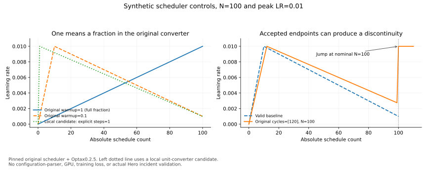

# 学习率配置：数字合法，不代表计划符合意图

V134，2026-10-08。执行固定源码scheduler，16项CPU控制检查数值单位、取整与周期端点；配套曲线来自原方法的人工输入。**`warmup=1`在这里表示整个周期，而不是一步，整数1也不例外。** 更危险的情况是：错误周期端点可以构造出有限曲线，因此只检查“能运行、lr有限”还不够。

[16项控制与原值](analysis/schedule_config_cpu.json) · [复现脚本](scripts/probe_schedule_config_cpu.py) · [完整曲线SVG](assets/schedule_config.svg)。没有完整配置解析、GPU、语言loss或Hero故障复现。

## 原码怎样解释单位

[固定config.py](https://github.com/marin-community/marin/blob/84869ae8c91ffe64e9f761c5bd714542eb1876e0/lib/levanter/src/levanter/optim/config.py) 的 `_convert_frac_or_steps` 按数值大小判断，不按Python int/float判断：

```python
if frac_or_steps <= 1.0:
    return int(frac_or_steps * num_train_steps)
return int(frac_or_steps)
```

前面另有负值与大于1的非整数检查。因而0.1是10%，1是100%，2是两步；`True`也会进入数值1的分支。这里证明的是直接调用原helper的行为，尚未证明真实配置parser会允许bool进入warmup字段。

warmup与decay在每个周期内换算：同一个比例不保证各规模有相同的绝对步数，甚至不保证有至少一步。把小模型试跑的计划与大模型主训练称为“同样的warmup配置”，需要补充实际换算后的边界。

## 逐项结果与原因

|人工输入|执行结果|源码原因与应检查的合同|
|---|---|---|
|N100，warmup为int1、float1或True|三者均转换为100步warmup|按数值大小解释；不能将int1当作steps1；bool解析是否可达另验|
|N100，warmup=2|两步warmup，count2达到peak|大于1的整数才按绝对步数处理|
|warmup=.001，N100／N1000|前者换算0步且count0已有peak；后者1步且count0为0|int向下取整改变了warmup是否存在|
|cycle_length=.01，N50／N200|前者ZeroDivisionError；后者构造成功|N50将周期长度取整为0，随后total//cycle_length除零；N200得到2步周期|
|cycles=0或−2|被接受，得到[0,100]，曲线与一周期基线相同|range(cycles−1)为空，之后补入起点与终点；没有正周期数保护|
|cycles=[80,20]，N100|被接受，周期点为[0,80,20,100]|列表被直接拷贝，没有检查严格递增；出现倒走的中间区间|
|cycles=[120]，N100|被接受，周期点为[0,120,100]|末尾追加N，形成倒走末区间；原曲线count100出现跳变|
|cycle_length=[]／N=0|两者均在后续索引操作报IndexError|空列表或无周期没有在入口得到有解释的拒绝|
|min_lr_ratio=−.1|构造成功，count100的lr为−.001|本线性构造没有拒绝负minimum；若接入scale(−lr)，更新符号也会受影响|

这里不能把所有反例称为真实生产bug。warmup=1可能是有意配置，只是语义容易误读；负minimum若用于特殊算法，也需要另一份明确合同。本章候选preflight针对常规、非负、从peak衰减的预训练计划。未排序端点与取整后零周期则具体暴露了缺少几何验收的路径。

## 两张曲线怎样读



左图共同N100、peak0.01。蓝线为原warmup=1，整个周期都在升温；橙线为原warmup=.1；绿点线是本地候选的显式steps1。候选只改变单位转换入口，后面的原scheduler仍执行。不要把这三条线解释为哪个计划训练效果更好：它们只说明不同配置意图会得到不同函数。

右图橙线为原 `cycles=[120]` 配合N100，蓝线为合法基线。橙线count99约0.00275，count100突然回到0.01。这是原join逻辑对非单调端点的可复现响应。**若训练只使用count0至99并在N停止，这个count100跳变不会被该段训练使用。** 继续优化、重规划或计数错位是否会触达它，需要实际执行轨迹；不能直接把图上的跳变写成Hero的loss spike原因。

## 回到已经归档的Hero声明

为避免把人工反例混成现有配方问题，本轮另外检查了10月7日归档的运行配置：N390251、warmup=.01、linear、min_lr_ratio=.05，cycles与cycle_length均为None。用本轮固定helper换算，warmup为3902步。它没有使用本章的warmup1、非法周期端点或负minimum反例。

这是归档声明与固定helper的对照，不是当前实时训练配置，也没有证明该运行实际导入了这份源码。运行身份与具体字段保存在结果JSON的 `archived_recipe_control`，原始证据见 [10月7日meta](sources/live_2026_10_07/meta.json)。

## 本地候选怎样改，实际验证到哪里

脚本中实现一个独立的显式单位转换候选：`{"unit":"steps","value":1}`得到一步；`{"unit":"fraction","value":1}`得到完整周期。候选保留旧数值1的原语义，避免把所有现有配置悄悄改成一步。bool作为quantity被拒绝。没有改归档源码，也没有实现或验证上游配置parser接受这套表示。

候选preflight对8个几何/数值域反例在构造前抛出明确ValueError：零周期取整、非正cycles、非单调或越界端点、空周期长度、零总步数、负minimum。原方法对其中两个场景报ZeroDivisionError/IndexError，候选在之前拦截。合法基线的选定schedule值逐点完全保持，显式一步候选也实际执行原scheduler并在count1达到peak。

这份候选仅覆盖所测合同，明确拒绝cooldown非None；不是完整配置验证器。尚未覆盖所有LR家族、周期list组合、分布式环境、配置序列化与生产迁移。不能因为8个反例都被拦住就宣称所有schedule输入已安全。

## 把单位与几何检查接进实验管线

1. **配置落盘前写单位。** 保存原值、意图单位与解析后的类型。旧数值API里的一步需求不能仅凭int1表达；采用新接口需要显式迁移和解析验证。
2. **按真实预算展开。** 在小规模、主规模及恢复后的新N上分别导出周期点、warmup/stable/decay步数、每组peak/min。单位相同不等于实际几何相同。
3. **检查端点与函数。** 验证总步数为正、周期严格递增、长度至少一步；再看0、边界前后、恢复count与预算末端。有限性检查之外，还需符合事先声明的非负性、连续性或允许跳变合同。
4. **接到实际update。** 记录究竟使用哪个schedule count，是否会调用N及N之后，是否由新闭包重新求值。V133已证明缓存lr与outer count不能代替这些证据。
5. **再解释数据收益。** 若同一次配比试验无意改变warmup长度、周期顺序或实际LR，应修正对照或将其标为组合干预。重新跑同状态同batch检查后，才讨论loss与数据配比关系。

新增科学图已检查PNG可读性；HTML只做结构与链接核对，未做本轮浏览器操作验收。本章所有曲线均为人工配置函数，未增加模型训练结果。复现：`make schedule-config-cpu CPU_PYTHON=/tmp/marin-loss-mass-v109/bin/python`，随后 `make schedule-config-figure`。
