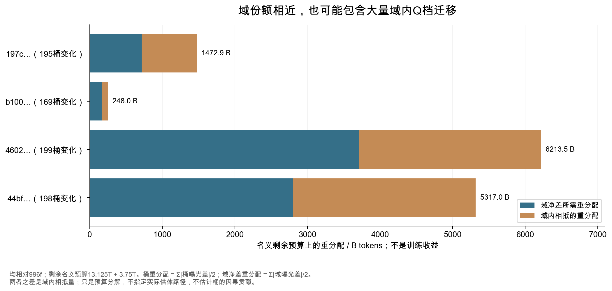

# 候选为什么更好：先拆预算，再设计交换实验

197c在几项BPB上优于996f，但不能据此说“数学加量有效”或“把数学提前有效”。本轮核对发现，两者有195个桶的阶段权重不同，40个域的累计份额全部改变。我们需要先弄清哪些东西一起变化，再把其中一个问题改写成有明确供体的实验。

以下计算使用原固定HF快照，没有刷新生产曲线。候选终点都是d512、seed0的公开观测；数学四臂方案是本报告编制的未执行草案。网页前部的“从候选差值走到供体交换”可切换候选、预算口径、语义域和供体，查看原值并导出方案。

## 1. 比较域份额，会漏掉多少变化

比较对象固定为996f。取恢复后两个阶段的名义模拟预算：13.125T和3.75T，共16.875T。它们是配比研究中的模拟量，不能写成代理或535B实际读取量。对一个桶，累计预算是两个阶段的“阶段预算 × 桶权重”之和；候选预算减基准预算，得到该桶差值。

| 候选简称 | 任一阶段权重变化的桶数 | 桶级重分配/B | 域净差重分配/B | 域内相抵/B |
|---|---:|---:|---:|---:|
| 197c | 195 / 200 | 1472.893 | 714.226 | 758.667 |
| b100 | 169 / 200 | 247.955 | 169.754 | 78.201 |
| 4602 | 199 / 200 | 6213.493 | 3708.420 | 2505.074 |
| 44bf | 198 / 200 | 5317.001 | 2801.285 | 2515.717 |



“重分配”怎样定义？如果一个桶扣掉10B，另一个桶加上10B，绝对差合计为20B。除以2，才得到不重复计数的10B。因此：

```text
桶累计预算 E[k] = Σ阶段 T[p] × w[p,k]
桶差值 Δ[k] = E候选[k] − E基准[k]
桶级重分配 = Σ桶 |Δ[k]| / 2
域净差 D[c] = Σ该域五档 Δ[k]
域净差重分配 = Σ域 |D[c]| / 2
域内相抵 = 桶级重分配 − 域净差重分配
```

例如一个域Q3减少30B、Q4增加25B，域净差只有−5B；只看域表会漏掉25B域内相抵的变化。197c的域内相抵约占桶级重分配的51.5%。所以“数学域多了多少”“代码域少了多少”只是第一层问题，下一层要看同域内部各Q档的变化。

这些量是权重账本的分解，没有指定唯一的供体路径。跨域净差相同，可以有多种实际交换安排；域内差值也不能证明Q4那部分造成了Loss收益。若要识别某个桶的作用，仍需控制其他变化。

[1600行逐桶差值](analysis/transfer_cell_differences.csv)保存四候选、两种预算口径、200桶的基准/候选/差值；[320行域差值](analysis/transfer_domain_differences.csv)保留相应40域结果。网页的另一口径按已核对的2727/810代理更新、1024序列和4096长度折算，共14.835253248B。这是预算对照演示，没有逐一确认这四个候选真实的读取量。两口径相差三个数量级，不能混用。

## 2. 累计量相同，也可能先后不同

还可以分别算两个阶段的半L1，再求和。197c得到1540.413B，比累计桶差的1472.893B多67.520B。这部分差异来自同一个桶在不同阶段增减相抵。若只看最终累计量，就会把这种时序变化消掉。

数学域c39是一个直观例子。197c前段数学份额从1.782227%升到1.967367%，后段从1.403809%降到1.312256%。两件事同时发生：数学累计增加了20.866B，而且一部分数学预算被前移。

| 阶段 | 197c数学预算变化/B | 相同累计增量、每阶段恒定增量/B | 两者的时序余量/B |
|---|---:|---:|---:|
| 前段13.125T | +24.300 | +16.229 | +8.070 |
| 后段3.75T | −3.433 | +4.637 | −8.070 |
| 累计 | +20.866 | +20.866 | 0 |

第二列是原候选变化。第三列构造一个参照：两个阶段都加同样的权重百分点，累计加量与197c一致。最后一列相减后表示，除了累计加量，原候选还将约8.070B名义数学预算从后段移到了前段。

这是一种解释账本的方法，不是顺序效果估计。可以换别的时序参照，得到别的分解；也没有实际token ID证明模型更早见到了哪些题目。不过它足以推翻一个常见说法：**197c与996f的数学差异不是只有总量变化，也不是只有顺序变化。** [完整时序原值](analysis/transfer_audit.json)

## 3. 下一步先问哪个问题

适合先问一个局部问题：在相同总预算下，数学累计加量与数学内部Q档安排，是否分别改善目标能力？供体是哪一个域，扣掉它以后会损失什么？

先不复制197c的整套权重。195桶、40域一起改变，即使得到更好结果，也很难解释原因。本轮草案只允许数学c39和一个声明供体改变；其余38域保持原预算。供体候选分别是c26议会/董事会、c37法律/法院/监管、c14软件开发/Web代码。选择它们是为了让供体成本可见，不是判断这些域“没用”或推荐删除。

先确定自己的需求，再挑供体。法律场景需要法律能力保底；代码场景不能为了数学牺牲代码指标；通用场景要保留多个任务和比例基线。公开删域结果可以产生线索，不能替自己项目的供体成本做决定。[删域实验的边界](PRACTICAL_ZH.md)

## 4. 把“加量”和“换Q档”做成四个条件

M表示数学累计量；Q表示数学域内部五档的**累计比例**，不是一个通用的质量分数。M0取996f的数学量286.560B，M1取197c的307.426B。Q0取996f条件比例，Q1取197c条件比例。

| 条件 | 数学累计量 | 数学累计Q档比例 | 供体变化 |
|---|---|---|---|
| M0Q0 | 996f量 | 996f比例 | 无 |
| M1Q0 | 197c量 | 996f比例 | 扣除20.866B |
| M0Q1 | 996f量 | 197c比例 | 无 |
| M1Q1 | 197c量 | 197c比例 | 扣除20.866B |

Q1并非“全部搬到Q4”。c39的累计五档比例从约0.985%/5.085%/42.159%/40.509%/11.262%，变到1.266%/3.785%/38.094%/43.653%/13.203%。这是一个五档联合干预，不能把以后可能出现的收益全部归给Q4。

有了四个条件，才能区分：加量在Q0安排下是否有用；换Q档在M0总量下是否有用；同时改变两者是否存在额外作用。对每项固定评估Y，记录：

```text
在Q0安排下的加量差 = Y(M1Q0) − Y(M0Q0)
在M0总量下的换档差 = Y(M0Q1) − Y(M0Q0)
交互差 = Y(M1Q1) − Y(M1Q0) − Y(M0Q1) + Y(M0Q0)
```

BPB越低越好，准确率越高越好，要分别解释符号。若某个供体下加量有收益，含义仍是“从该供体转给数学的收益”，不是“数学多20.866B的无成本收益”。不同供体下结果不同，也可能反映供体损失，而非数学本身效用改变。

三个供体、四个条件共有12条记录，但M0Q0和M0Q1在各供体间重复。整数配方只有8套不同的两阶段计数方案。相同配方共用结果与另跑独立重复是不同设计，不能把重复条目当作12份独立证据。若未来按配方×续训重复执行，先明确共享对照与配对估计方式；三个重复是起步设计，不能保证统计充分。

## 5. 怎样保持阶段规则一致

先按上述累计目标算每个数学桶的目标预算，再减996f预算，除以总预算16.875T。得到每桶权重增量δ[k]，两个阶段都加相同δ[k]。加量部分从供体扣除，供体各档按基准累计条件比例分担。

```text
数学桶目标 = 目标数学累计量 × 目标累计Q档比例
数学桶δ[k] = (数学桶目标 − 基准桶累计量) / 总预算
供体桶δ[k] = −数学加量 / 总预算 × 供体基准累计条件比例
两阶段新权重 = 各阶段996f权重 + 同一个δ[k]
```

数学累计加量对应每阶段+0.123653个百分点。这样不复制197c前增后减的时序；两个阶段仍继承996f不同的基础权重，数学的阶段内条件比例也未被强行设成相同。因此准确的陈述是“采用共同的阶段增量规则，研究累计量与累计Q档安排”，不能声称把全部时间分布完全固定。

脚本检查200桶归一、非负、数学累计目标、供体守恒、其他38域不变，以及同桶两阶段增量相同。若供体不足，立即拒绝；不会悄悄裁掉负值后重新归一。当前三个供体在连续权重算术上可行，尚未查实际库存、历史重复、恢复状态和能力限制。

## 6. 为什么看起来局部的设计会改到额外桶

Marin归档的MixtureDataset在每个混合块固定各数据集样本数：先把“归一权重 × block_size”写进整数数组，再把所有余数给计数最大的桶。这里以49152个序列/块审计。**块单位是序列，不是token；后面的B误差是有效计数比例乘名义预算的折算。** [归档实现](sources/deepening_2026_10_04/mixture_production.py)

连续权重守恒，不保证取整后每个未声明桶也保持原计数。数学和供体改变了向下取整的尾数，总余数也随之改变；最大桶会收到不同的补足量。原草案的非基准条件因此额外改到了c28q4和c30q4。三个供体中，M1Q0的累计L1折算误差达到3.433B；M0Q1约0.687B，M1Q1约2.747B。

这里的L1**不除以2**：它衡量整数有效预算与连续目标的全部绝对偏差，包括数学、供体和余数桶，不能与前面的重分配量直接相加。它也不是3.433B实际重复数据，而是把完整块比例外推到名义预算的误差。

这个例子给R14一个具体检查点：只读配置，局部交换可以通过；执行计数一算，就发现额外干预。完整原取整误差保存在[逐桶表](analysis/transfer_plan_quantization.csv)，不会在修正后删除。

## 7. 修正到整数块，仍然保留误差

本轮修正先固定996f的整块计数，只在数学与供体之间转移61个序列/块。域内按连续目标比例分配整数余数，其余38域计数逐项保持不变。然后用很小的区间内偏移编码为权重，使归档的取整方法读回目标整数计数。

这段权重编码是本报告编制的适配方法，适用范围是当前固定块大小与已测运行时；不是Marin官方更改。不能无检查地换block_size、浮点类型、Python版本、归一顺序或加载器实现。目标整数计数是主核对物；编码权重只是让当前方法返回这些计数的输入。

在Python3.12.13、numpy2.0.2中，实际执行归档的 `_normalize_weights` 和 `_compute_expected_counts_per_block` 两个方法。12条记录×2阶段共24次结果全部匹配目标。修正后的非声明域额外变动桶为空。[原方法探针](analysis/transfer_loader_probe_python312.json)

原连续草案也另做24次原方法计数，确认额外桶和原误差不是本地改写取整公式造成的假象。两组共48次都是计数方法调用，不是48次训练；探针保留代码和两组输入权重摘要，重建时检查没有沿用过期输入。

整数精度仍有代价。M1数学累计量变成307.503B，而非连续目标307.426B；加量约20.943B，比目标多0.076B。三个供体的M1Q0累计L1误差约0.844—1.188B，Q1条件也保留五档取整误差。修正解决的是“改到未声明域”，没有让所有连续因子精确落地。若要估计效果，应以最终整数配方定义干预，报告实际因素水平；必要时再提高块精度或选更接近的可执行目标，而不是继续把连续公式当作执行事实。

探针只运行两段计数方法，没有构建token store、恢复checkpoint、重放游标、验证阶段尾块或内部shuffle。归档代码也不能证明每个历史代理运行用了这一精确版本。完整流审计通过以后，才可以把整数块结果推进为真实数据曝光结论。

## 8. 规则这次挡住了哪些错误

| 规则 | 容易写出的主张 | 本轮核对与处理 |
|---|---|---|
| R05 预算口径 | “197c重新分配了1.47T实际训练数据” | 明确是名义剩余预算折算；另列14.835B代理步数演示，不代替真实候选读取量 |
| R08 每次加量都写供体 | “数学加量的收益来自数学本身” | 195桶、40域同时变化；转成声明供体的四臂草案，保留域内相抵与200桶原值 |
| R09 库存与历史 | “连续权重非负，所以可直接训练” | 库存、历史、能力保底仍空；launchable=false |
| R10 顺序总量 | “数学前置让GSM8K变好” | 累计加量与8.070B时序余量并存，还混有其他域变化；先拆因素 |
| R14 执行一致 | “只改数学与供体” | 原取整额外改c28q4/c30q4；修正整数支持范围，原方法核对24次，有限流仍未知 |

规则数量和锚点仍为1.0，本轮补充执行案例。不能因为修了整块计数，就把R09/R10/R14在完整训练范围统统勾成证据齐全。每项通过判断要写明它究竟覆盖连续公式、整块计数，还是实际token流。[规则与判断锚点](RUBRICS_ZH.md)

## 9. 真正执行前还差什么

草案JSON提供三份完整四臂配方：[c26供体](templates/math_factorial_donor_c26.json)、[c37供体](templates/math_factorial_donor_c37.json)、[c14供体](templates/math_factorial_donor_c14.json)。它们包含连续权重、原取整误差、修正权重与目标计数；执行/结果字段保持空值。

需要填实际训练预算与阶段边界、共同恢复内容摘要、代码版本、有效库存和已有曝光、每域保底及重复上限、独立评估清单、续训随机性、解码设置和停止条件。再检查阶段边界对齐与有限token ID流，确认同一条件的记录能被重放。最后冻结[未来选择契约](templates/selection_contract.json)，公开结果已经看过，不能把这些草案追认为原搜索的预先注册。

结果出来后要同时回答三件事：数学目标是否改善；供体能力是否受损；独立重复是否支持方向。不能只展示四臂里最好的一个终点，或看结果后把退步项排出主表。若不同供体下结论不同，下一轮问题是替代成本；若Q1独立有效，下一轮再拆具体Q档；若数学总量有效但过曝风险高，下一轮改变加量幅度；只有累计配方确认后，才比较匹配总量的时序。

## 10. 本轮结论与下一步

公开候选的差异比域份额表更复杂。197c的优势同时伴随广泛的域间变化、域内Q档变化和时间重分配，现有终点不能识别哪个因素有效。最值得迁移到自己的训练的是这套检查顺序：先查参照与风险，再做逐桶预算账本；声明供体与因素；把连续设计编译到加载器计数；最后核对真实历史并做独立能力确认。

本轮已经把前半段做成可复算的图、交互和配方，同时发现并修正了整数余数造成的额外干预。下一项本地可做的改进，是把“同累计量、不同顺序”也编译成带阶段边界与计数残差的合同，检查顺序实验有没有再次混进预算差。真正的训练收益、读者理解和完整数据流仍需要各自的验证，不能用更多报告页面填补。
